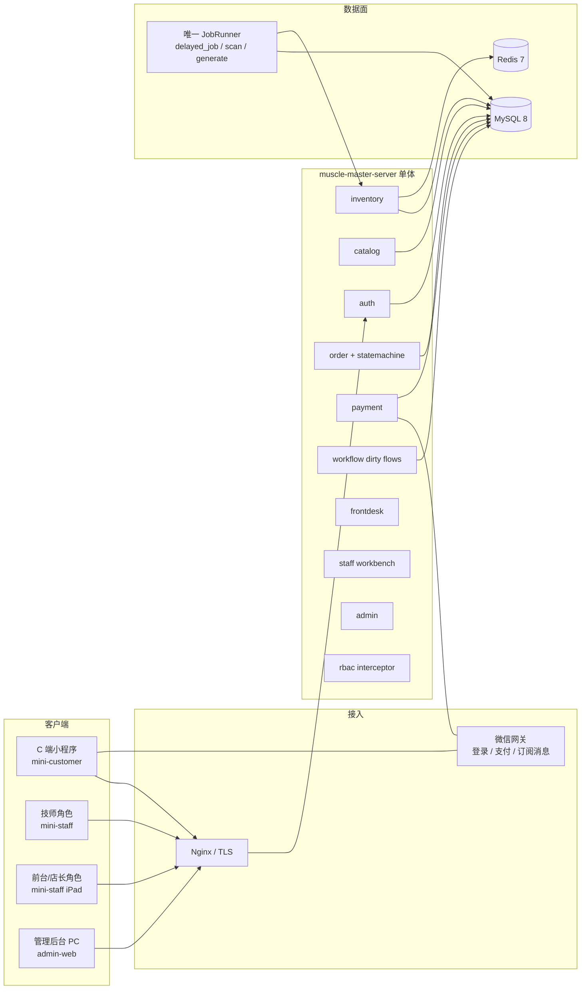
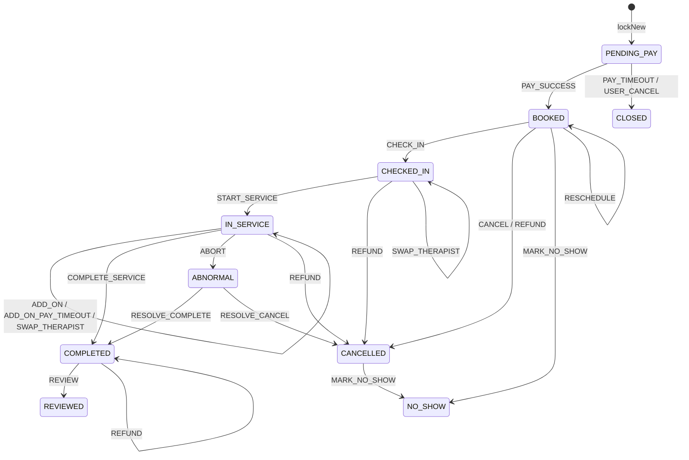

# 肌松大师 · P0 技术设计 + 数据模型（slot / 订单 / 状态机）

| 项 | 值 |
| --- | --- |
| 文档标题 | 肌松大师 P0 技术设计 + 数据模型 |
| 作者 | TBD |
| 日期 | 2026-08-13 |
| 状态 | Draft（用户决策已写入 2026-08-13） |
| 对应产品 | 《肌松大师小程序 · 产品需求文档（PRD）》v1.0（2026-08-13） |
| 仓库 | `git@github.com:cswanghan/muscle-master-wechat.git`（绿场，当前仅有 PRD） |
| 范围 | 完整 P0：C1–C4/C6、T1/T2、iPad 前台（含收款码）、PC 后台、M1 满班率+待办。脏流程 **P0-min（快乐路径 + human_task）**。1～2 店灰度。 |
| 编制假设 | **按完整 P0 排人，不因编制裁剪**。两微信 AppID + 直连单商户号需在支付 PR 前开通。 |

---

## Overview

肌松大师是「连锁门店 + 技师 + 预付卡」的到店推拿业务，不是通用预约工具。P0 **功能面全部交付**（用户 2026-08-13 决策）：**自建微信登录 → 目录三入口（C1–C4/C6）→ 双资源锁库存 → C 端微信支付 → 前台核销 / 现金+微信收款码散客 → 技师 T1/T2 → M1 满班率+待办 → PC 后台**。北极星是满班率；交易主战场在门店前台。不对接集团 CRM；首发只收微信与现金，**不做储值**。

脏流程（改约 / 加钟 / 换技师 / 退款）算法深度保持 **P0-min**：快乐路径 + `human_task`，不做四套完整补偿 saga。C 端自助改约、补偿编排仍不进 P0。不因编制砍收款码或 M1。

规模（PRD §1.3）首年 20 店、三年 200 店，峰值读 800 QPS / 写 80 QPS。低并发、高一致性。储值/礼卡/券/提成/订阅消息发送不进 P0；schema 预留 `slot.store_id` 与 `therapist.home_store_id`。

---

## Background & Motivation

### 当前状态

仓库 `muscle-master-wechat` 为空仓，唯一事实源是：

- `/Users/hanwang/Documents/workspaces/muscle-master/prd/PRD/肌松大师小程序-PRD.html`

没有历史代码、没有既有会员中台。一切从零实现。

### 痛点（来自 PRD，不是臆造）

1. **同一份库存、三种切片。** 首页症状 / 门店 / 技师入口必须打到同一套「技师 × 床位 × 15 分钟 slot」，否则会出现「C 端能约、前台甘特对不上」。
2. **只锁技师会超卖。** 「3 位技师有空、店里只剩 2 张床」是同类系统的经典事故。必须双资源同时占用。
3. **延时消息会丢。** 锁定 15 分钟不支付必须释放；只有 MQ 延时不够，必须有 5 分钟扫描兜底。卡死的 slot 就是收入损失。
4. **脏流程占 80% 复杂度。** 改约 / 加钟 / 换技师 / 退款在 PRD 里各一行。P0 **必须写出可运行的占用算法**（`lockNew` / `extendOwn` / `reschedule`），但灰度只验收快乐路径 + 人工队列，不验收四套完整补偿 saga。
5. **跨店支援是一等公民。** slot 所属门店 ≠ 技师归属店：满班率/营收按 slot 门店，提成（P1）按技师归属店。P0 schema 必须拆开，否则 P1 要翻表。

### 容量锚点

| 指标 | 首年 | 三年 |
| --- | --- | --- |
| 门店 | 20 | 200 |
| 单店技师 / 床 | 15～25 / 8～15 | 同左 |
| 单店日单 | 60～120 | 同左 |
| 全国日单峰值 | ~2,000 | 20,000 |
| 峰值 QPS | 读 800 / 写 80 | 同量级，垂直扩容 |

结论与 PRD 一致：不必上分布式事务、不必按端拆服务。可靠性靠 **InnoDB 行锁 + 唯一索引 + Redis 互斥 + 幂等键 + 三条释放路径**。

---

## Goals & Non-Goals

### Goals（完整 P0，必须可灰度；不因编制裁剪）

- 自建微信登录（C 端客户、员工端技师/前台/店长）。不对接集团 CRM。
- 门店 / 技师 / 项目 / 症状浏览；三入口收敛到同一张选时段页。C6 **仅**进行中预约 + 订单入口（无资金总览）。
- 预约下单 + 微信支付 JSAPI；支付回调按 `payment_no` 幂等；「已关单但微信已扣款」走自动退款。
- 双资源库存：技师 1 × 床 1 × N 个 15 分钟 slot；`lockNew` / `extendOwn` / `reschedule` 三条写路径；15 分钟锁 + 三条未支付释放路径。
- 显式、闭合的订单状态机（含退款、异常单出度、加钟未支付超时）。
- 技师工作台 T1/T2：下一单、开始/结束服务、只增不改的理疗记录（敏感个信，非病历）。员工端 **15px / 48px 为灰度验收项**。
- 前台（同一员工端 iPad）：到店核销、散客 **现金 + 微信收款码轮询**、加钟/换技师/改约/退款的 **P0-min 快乐路径**（失败 → `human_task`）。
- 基础后台：门店 / 技师 / 项目 / 排班模板 / 订单（`view=abnormal_first` 与 `view=all` 两套）。
- 店长 M1：**完整满班率**（全日 + `byHour`）+ 待办（审批请假 / ¥500 退款 / 人工队列），不做 BI。
- RBAC = 功能权限 × 门店域，与下单/前台 **同一周** 上线。
- 可观测：支付成功率、锁定超 30 分钟、门店 2 小时无单、occupancy↔status 漂移。

### 仍不进 P0（算法深度 / P1 产品）

- 四脏流程逐步补偿 saga、C 端自助改约。

### Non-Goals（P1+，禁止在 P0 实现运行时）

- 券规则引擎、储值本金/赠金、礼卡、组合支付。
- 提成结算、评价体系、好礼商城、**订阅消息发送**（outbox 可落库，worker 不得调微信订阅接口）。
- 技师空档营销 / 特惠动态定价（首页特惠卡是 P2）。
- BI 看板、智能排班、多区域组织、上门服务、美团核销。
- 原生 PAD App、完整离线收银、分库分表、微服务、独立 MQ。

P0 允许：schema 预留 `price_override_fen`、资金账户表**不建**；`REVIEWED` 枚举预留但无评价 API。

---

## Key Decisions

| # | 决策 | 选择 | 理由 |
| --- | --- | --- | --- |
| D1 | 后端形态 | **模块化单体**（一个 Spring Boot 进程） | 写 80 QPS、一致性优先；分布式事务成本远高于收益。模块按限界上下文拆包，禁止循环依赖。 |
| D2 | 技术栈 | Java 21 + Spring Boot 3.3 + MyBatis-Plus + Flyway；MySQL 8.0；Redis 7 | 微信官方支付 SDK、`@Transactional` + 行锁心智与国内支付系统一致；招聘与排障成本低。 |
| D3 | 延时与消息 | P0 **不用独立 MQ**。`delayed_job` 表为主；Redis ZSET 可选加速；5 min 扫描为权威兜底 | 扫描保证正确性。对比「MQ+扫描」见 Alternatives E：P0 少一个中间件。 |
| D4 | 库存表 | **双表预生成** + `slot_occupancy(hold_id)` INSERT 唯一约束 | 可约查询吃预生成行；超卖防线是 occupancy。`hold_id` 区分首锁 / 加钟尾锁 / 改约新持有。 |
| D5 | 锁 | **技师日 Redis 锁（有意不含床）+ 按 slot_no 排序的 `SELECT … FOR UPDATE` + CAS + occupancy** | Redis 只降「同技师同日」冲突。床安全在 DB。禁止再加床 Redis 除非压测证明死锁过多。 |
| D6 | 前台形态 | **员工微信小程序 + iPad 横屏**。一个员工端覆盖技师/前台/店长。P0 断网禁开单。 | 用户 2026-08-13 已确认。 |
| D7 | 端与 API | `/api/v1/c` `/t` `/f` `/a` 同一进程 | 库存只允许 `SlotOccupyService` 入口。 |
| D8 | 订单状态 | 表驱动；拆出 `CHECKED_IN`；异常单有出度 | 见 §3 闭合转移表。 |
| D9 | 脏流程 | **P0-min = 快乐路径 + `human_task`**；算法按 `lockNew/extendOwn/reschedule` 写死 | 不在 8 周内做四套生产级补偿 saga。 |
| D10 | 金额与时间 | `BIGINT` 分；`Asia/Shanghai`；`slot_no = hour*4 + minute/15` | 禁止 `DECIMAL` 金额。 |
| D11 | 软删 | 主数据软删；slot / 流水 / 理疗 / 审计硬保留 | 审计 3 年。 |
| D12 | 跨店与快照 | `slot.store_id` ≠ `home_store_id`。下单写入 `order.therapist_home_store_id`。**换人**（SWAP）把该字段改成新技师当前归属店；**换籍**（人事调店）禁止回写历史单。 | 提成争议靠 `order_change_log`。 |
| D13 | 定价 | `priceFen = coalesce(slot.price_override_fen, store_project.price_fen, project.price_fen)`。P0 `override` 恒空。 | 可约接口必须用此函数，禁止各写各的。 |
| D14 | 储值 | P0 **不做储值/礼卡**。首发只收微信支付 + 现金散客。资金账本留 P1。 | 禁止 `customer.balance_fen`。用户已确认。 |
| D15 | 订单与锁同事务 | 先雪花分配 `order_id`+`hold_id`，**同一 TX** 内占格 → 选床 → `INSERT booking_order`（此时 `bed_id` 已知） | 禁止「先锁再另事务插单」。孤儿 hold 由扫描 `ReleaseLock` 按 `hold_id` 释放。 |
| D16 | Job 基数 | **P0 一个 job runner**。领取：`PENDING∧run_at<=now` **或** `RUNNING∧lease_until<now`；抢回 `retry_count++`。**`40904` / 非法转移视为成功**（`delayed_job.status=DONE`），禁止标 `FAILED`。 | outbox **不同构**（无 lease 列，P0 不发送）。 |
| D17 | 支付主体 | **直连单商户号**；`store.wx_mchid` 可空，空则平台默认。 | 服务商模式放到分店独立结算时。 |
| D18 | 取消窗口 | C 端 `BOOKED` 开始前 **120 分钟**可免费取消（全额退）；之内 40904，转前台。P0 **不收取消费**。 | 产品若改窗口只改配置 `booking.cancel.free-minutes`。 |
| D19 | 用户中心 | **自建** `customer` + `CustomerMerge`。不对接集团 CRM。散客必须 11 位手机。`wx_openid` 可空 UNIQUE。禁止伪 openid。 | 用户 2026-08-13 已确认。 |
| D20 | 雪花 worker | Compose 单节点 `SNOWFLAKE_WORKER_ID=1`。禁止无配置起第二实例。 | 双节点必须先改配置再水平扩。 |
| D21 | 幂等 | `(scope, request_id)` 唯一 24h。`idempotency_record` 与 `lockNew` **同 TX** `SELECT … FOR UPDATE` 持有到 COMMIT。`finishIdempotent` 必须 `WHERE status='PROCESSING' AND version=?`，**禁止覆盖 DONE**。 | 见 §2.4.1。 |
| D22 | C6 / 消息 | C6 = 预约+订单。outbox **只落库不发送**订阅消息。 | 对齐 PRD 订阅消息在 P1。 |
| D23 | 前台收款 | P0 散客支持 **现金 + 微信 Native 收款码 + `GET /f/payments/{paymentNo}` 轮询**。C 端 JSAPI 保留。 | 用户要求完整 P0，不再砍码牌。 |
| D24 | V1 分区 | 两张 slot 表 **V1 均不分区**；注释预留按月 RANGE。上量后同一迁移同时改两张表。 | 避免 `bed_slot` 与 `therapist_slot` 分区不一致。 |
| D25 | 状态机 vs 释放 | **Law A**：Job/API **只** `fire(EVENT)`。`Release*` **禁止** `fire`。`PAY_SUCCESS` 同 TX 把 `RELEASE_LOCK` 标 `DONE`；加钟支付同理标 `RELEASE_ADDON`。迟到的 `fire(PAY_TIMEOUT)` 从 `BOOKED` 得 `40904`，Job 按 D16 记 `DONE`。 | 消除递归，并避免已支付单 15 分钟后刷失败任务。 |
| D26 | 缓冲格 | P0 **`buffer_slots = 1`**（`buffer_minutes` ∈ (0,15]）。项目 CRUD 拒绝 `>15`。加钟最短 15 分钟，故恒有 `M ≥ B`。 | 避免 `M < B` 时 BUFFER 分类错误。 |
| D27 | 理疗记录 | **敏感个人信息**：首次写记录前单独同意（`treatment_consent_at`）；每次读取写 `audit_log`。**不按病历管理**（无医疗机构执业许可）。 | 用户 2026-08-13 已确认。 |
| D28 | 范围 | **完整 P0 交付，不因编制裁剪**。收款码、M1 完整满班率、四端页面、无障碍 15px/48px 均为必做。 | 用户选「全部做完」。 |

---

## Proposed Design

### 1. 总体架构



#### 1.1 推荐栈

| 层 | 选型 | 说明 |
| --- | --- | --- |
| C 端 | 微信原生小程序（独立 AppID） | C1–C4、C6 必做。C6 = 进行中预约 + 订单入口，**无**储值/礼卡/券总览。C5/C7 不做入口。 |
| 员工端 | 微信原生小程序（独立 AppID），角色：技师 / 前台 / 店长 | T1/T2 必做。前台 iPad 横屏 1024。M1 = 完整满班率（全日+分时）+ 待办。15px/48px 灰度门禁。T3/T4 P1/P2。 |
| 管理 PC | Vue 3 + Vite + TS + Element Plus | A3 双视图订单 + 门店/技师/项目/排班模板 CRUD。A1/A2/A4 不做。 |
| 后端 | Java 21、Spring Boot 3.3、MyBatis-Plus 3.5、Flyway、MapStruct | 单 JAR。`app.jobs.enabled` 仅一份为 true。 |
| DB | MySQL 8.0，`utf8mb4`，`innodb_lock_wait_timeout=5` | 单主。V1 slot **不分区**（D24）。 |
| 缓存/锁 | Redis 7 | 目录 5 min、可约 30 s、技师日锁 5 s。幂等权威在表（24h）。 |
| 对象存储 | 阿里云 OSS（或等价） | P0 仅技师头像/项目封面；理疗照片不做。 |
| 可观测 | Micrometer + Prometheus + Grafana；日志 JSON 到 stdout | 业务告警推企业微信机器人。 |
| 部署 | Docker Compose（灰度店可单机）；配置中心用环境变量即可 | 不引入 K8s 作为 P0 前置。 |

**前台形态决策（D6）**：PRD 写「PAD/收银机」并要求离线查单。P0 选择**微信小程序跑在门店 iPad**，原因：

- 8 周要同时交付库存与脏流程，原生 PAD + 应用市场发布链不现实。
- 前台账号就是员工微信，登录链路与技师复用。
- 离线降级：打开时拉取「本店今日 `BOOKED/CHECKED_IN/IN_SERVICE`」最多 500 单进 `wx.storage`；网络失败展示缓存并禁止新开单（避免本地超卖）。真正离线开单放到 P1。

收银机原生壳不在 P0（Q6 已决策）。

#### 1.2 为何单体（相对拆服务）

| 维度 | 单体 | 拆 inventory / order / pay |
| --- | --- | --- |
| 一致性 | 一事务锁技师 slot + 床 slot + 写订单 | 需要 TCC / 本地消息表，P0 无法验证 |
| 延迟 | 一次 RTT | 锁跨服务放大超时窗口 |
| 团队 | 按完整 P0 排人即可端到端改状态机 | 接口版本与发布耦合 |
| 容量 | 800/80 QPS 单实例有余量 | 过早优化 |

内部按包拆分，**库存占用只允许 `inventory.SlotOccupyService` 三个方法**：`lockNew` / `extendOwn` / `reschedule`（另加 `ReleaseLock` / `ReleaseUnconsumed` / `ReleaseAddOnHold`）。order / frontdesk / workflow 禁止直接 `UPDATE therapist_slot`。

**JobRunner（D16）**：`job` 包内单一调度器领取 `delayed_job`、slot 扫描、日生成、outbox（只标 SENT、不调订阅号）、`ForceReleaseJob`。领取 SQL：

```sql
SELECT id FROM delayed_job
 WHERE (status = 'PENDING' AND run_at <= NOW(3))
    OR (status = 'RUNNING' AND lease_until < NOW(3))
 ORDER BY run_at
 LIMIT 50
 FOR UPDATE SKIP LOCKED;

UPDATE delayed_job
   SET status = 'RUNNING',
       locked_by = #{instanceId},
       locked_at = NOW(3),
       lease_until = NOW(3) + INTERVAL 60 SECOND,
       retry_count = retry_count + IF(status = 'RUNNING', 1, 0)
 WHERE id IN (/* 上句结果 */);
```

lease 过期的 `RUNNING` 由下一轮按上行抢回并 `retry_count++`。`outbox_event` **不是**同构表：无 `locked_by` / `lease_until`，P0 worker 只把状态翻成 SENT 占位、**不发送**。即使误启第二副本，`delayed_job` 也不会双投同一 job。

执行完一条 job 的收尾（D16）：

```
function completeJob(job, fireResult):
  if fireResult.code == 0 or fireResult.code == 40904:
    UPDATE delayed_job SET status='DONE' WHERE id=job.id
    return
  UPDATE delayed_job SET status='FAILED', last_error=… WHERE id=job.id
```

`40904`（非法转移，例如 `BOOKED + PAY_TIMEOUT`）**是成功**，不是失败。禁止因此把 job 标 `FAILED` 再被 lease 抢回刷屏。

#### 1.3 仓库布局（对齐空仓 `muscle-master-wechat`）

```
muscle-master-wechat/
  apps/
    mini-customer/          # C 端微信小程序
    mini-staff/             # 技师 + 前台 + 店长
    admin-web/              # PC
  server/
    pom.xml
    src/main/java/com/jisuodashi/
      MuscleMasterApplication.java
      common/               # 错误码、雪花 ID、加解密、时钟、分页
      auth/                 # 微信登录、JWT
      catalog/              # 门店/技师/项目/症状
      inventory/            # 排班生成、双资源锁、释放、可约查询
      order/                # 订单、状态机、改约编排入口
      payment/              # 预下单、回调、退款
      workflow/             # 脏流程编排 + human_task
      staff/                # 技师工作台、理疗记录
      frontdesk/            # 核销、散客、加钟、换人
      admin/                # CRUD、订单列表
      rbac/
      notify/               # outbox 落库；P0 worker 不发送订阅消息
      job/                  # 唯一 JobRunner：delay / scan / generate / ForceReleaseJob
    src/main/resources/
      db/migration/         # V1__init.sql …
      application.yml
    src/test/               # 含超卖并发闸门测试
  deploy/
    docker-compose.yml      # mysql + redis + server + admin
  docs/
  README.md
```

前端不与后端同构语言。小程序用原生以降低基础库兼容成本；若团队强依赖 uni-app，可以替换 `apps/*`，**API 契约不变**。

#### 1.4 四端如何共用 API

```
Authorization: Bearer <jwt>
X-Request-Id: <client uuid>
X-Client: C | T | F | A
```

| 前缀 | 身份 | 数据域 |
| --- | --- | --- |
| `/api/v1/c/**` | `customer_id` | 仅本人订单/资料 |
| `/api/v1/t/**` | `staff_user` + 角色技师 | 强制 `therapist_id = 自己`；客户手机号脱敏 |
| `/api/v1/f/**` | 前台 / 店长 | `store_id IN data_scope` |
| `/api/v1/a/**` | 任意后台角色 | 功能权限 × 数据域；SQL 拦截器注入 `store_id IN (...)` |
| `/api/v1/pay/wechat/notify` | 微信支付公钥验签 | 无 JWT |

同一 `SlotOccupyService`、同一 `OrderStateMachine.fire(...)`。C 端下单与前台散客只是 `order.source` 与支付渠道不同。

---

### 2. 双资源库存（核心）

```
一次服务 = 技师(1) × 床位(1) × 连续 N 个 15 分钟 slot
N = ceil((duration_minutes + buffer_minutes) / 15)
```

例：60 分钟项目、`buffer_minutes=15` → N=5。19:30 开始占用 `slot_no` 78,79,80,81（服务）+ 82（缓冲）。`end_slot_no` 采用**左闭右开** = 83。

缓冲同时占用技师与床：技师洗手/换床、床位清消，下一单都不能用这段。

#### 2.1 时间表示

- 业务日：`DATE`，时区固定 `Asia/Shanghai`。
- `slot_no SMALLINT`：从 00:00 起每 15 分钟一格。`10:00 → 40`，`19:30 → 78`，`22:00 → 88`。
- 门店营业 `[business_start, business_end)`，生成 slot 只覆盖营业时间。
- 转换：

```java
public static int toSlotNo(LocalTime t) {
  return t.getHour() * 4 + t.getMinute() / 15; // 要求分钟为 0/15/30/45
}
public static LocalTime toTime(int slotNo) {
  return LocalTime.of(slotNo / 4, (slotNo % 4) * 15);
}
```

项目时长必须是 15 的倍数；`buffer_minutes` 允许 10，计算时仍 `ceil` 到整格（10 → 占用 1 格）。**不支持跨日服务**（P0 营业结束前 N 格不可作起点）。

#### 2.2 表职责

| 表 | 行的含义 | 唯一键作用 |
| --- | --- | --- |
| `therapist_slot` | 某技师某日某格的日历（预生成） | 防止生成任务写出行重复 |
| `bed_slot` | 某床某日某格的日历（预生成） | 同上 |
| `slot_occupancy` | 占用账本。每格至多一行。`hold_id` 标记是哪一次持有（首锁 / 加钟尾 / 改约新持有） | `uk_occ (resource_type, resource_id, slot_date, slot_no)` **超卖最后防线** |

`hold_id` 是一等列：`booking_order.hold_id`（当前主持有）、`booking_order.add_on_hold_id`（未支付加钟尾，可空）。`delayed_job.biz_key = 'hold:{holdId}'`，因此同一订单可以同时存在 `RELEASE_LOCK`（主锁）与 `RELEASE_ADDON`（加钟尾）两行。

读路径一致性：一格视为**忙**当且仅当 `status ≠ FREE` **或** 存在 occupancy。写路径必须在同一事务里同时改两处。漂移由 `inventory.drift` 巡检。

释放 = 按 `hold_id` 或 `(order_id, slot_no≥from)` 删 occupancy + 把**同一批** slot 拨回 `FREE`（请假格拨回 `REST` 见生成）。

状态枚举（两张 slot 表共用）：

| status | 含义 | C 端色块 |
| --- | --- | --- |
| `FREE` | 可约 | 玉底「可约」 |
| `LOCKED` | 15 分钟锁 | 暖铜「锁定中」 |
| `BOOKED` | 已支付占用（服务格） | 玉墨「已预约」 |
| `BUFFER` | 缓冲占用 | 与不可约相同（虚线灰） |
| `REST` | 请假/休 | 不可约 |

查询可约起点：从 `i` 起连续 N 格对他人均为闲（`status=FREE` 且无 occupancy）。`LOCKED` 不是可约起点，不进入 `starts[]`（C3 色块由日历接口另给，见 §2.8）。

#### 2.3 排班模板 → 日任务生成 day+15

```
02:15 Asia/Shanghai（仅 JobRunner）
  1. D = today + 15
  2. 对每个在职技师，计算 planned[slot_no] = (store_id, status FREE|REST)：
       模板：weekday(D) 命中且 effective_from<=D<=effective_to
       APPROVED LEAVE：覆盖 [start_time, end_time) 对应 slot_no（时间为空 = 全日）→ REST
       SUPPORT：store_id = exception.store_id，时段用 exception
       否则 store_id = template.store_id
       若同一 (therapist_id, D, slot_no) 算出两个不同 store_id
         → INSERT human_task GENERATION_STORE_CONFLICT，该格不写
       若库中已有该格且 store_id 与 planned 不同
         → 同样 human_task，禁止 INSERT IGNORE 静默保留旧店
       否则 INSERT IGNORE therapist_slot
  3. 在用床：按所属店营业时间 INSERT IGNORE bed_slot(FREE)
  4. 回补 today..today+14 缺失格（规则同 2）
```

**请假审批（含部分时段）：**

```
fromNo = toSlotNo(start_time ?? business_start)
toNo   = toSlotNo(end_time   ?? business_end)   // 左闭右开
SELECT COUNT(*) FROM therapist_slot
 WHERE therapist_id=? AND slot_date=? AND slot_no >= fromNo AND slot_no < toNo
   AND status IN ('LOCKED','BOOKED','BUFFER')
```

`>0` → 拒绝 `40906`。通过后仅把该区间 `FREE → REST`，不写 occupancy。

**请假审批只有一个实现**：`ScheduleExceptionService.approve(exceptionId)`（冲突计数 → `40906` / `FREE→REST`）。

- 创建 `schedule_exception(type=LEAVE, status=PENDING)` 时 **同事务** `INSERT human_task(task_type='LEAVE_APPROVE', biz_key='leave:'+exceptionId, detail.exceptionId)`。
- `POST /f/human-tasks/{id}/approve`：读 `detail.exceptionId`，调用同一 `approve`。
- `POST /a/schedule-exceptions/{id}/approve`：调用同一 `approve`，不是第二套状态机。任务行一并标 `DONE`。

#### 2.4 占用写路径（权威算法）

PRD 只锁 `lock:slot:{技师ID}:{日期}`。**这是有意保留的**：Redis 只串行化同技师同日。两技师抢同一床靠下面的排序行锁 + occupancy，不再加床 Redis 键。

库存写入口只有三个占用方法 + 三个释放方法。实现类名 `SlotOccupyService`。

死锁策略：所有 `SELECT … FOR UPDATE` 按 `(resource_type, resource_id, slot_date, slot_no)` 升序。捕获 MySQL 1213 则整事务重试最多 3 次，仍失败返回 `40903`。

##### 2.4.1 幂等（24h 唯一 + 同 TX 持有 + 禁止覆盖 DONE）

`booking_order.request_id` UNIQUE NULL。`idempotency_record.uk (scope, request_id)` 保留 24h。`expire_at` 只约束 PROCESSING 接管，**不是遗忘**。`beginIdempotent` / `finishIdempotent` **必须在 `lockNew` 的同一事务内**，对幂等行 `SELECT … FOR UPDATE` 持有到 COMMIT，第二请求阻塞到第一笔提交后看到 `DONE` 或已有订单。

```
function beginIdempotent(scope, requestId):          // 已在 lockNew 的 TX 内
  try INSERT idempotency_record
        (scope, request_id, status='PROCESSING',
         expire_at=now+30s, updated_at=now, version=0, locked_by=instanceId)
  catch Duplicate:
    rec = SELECT … WHERE scope=? AND request_id=? FOR UPDATE
    if rec.status == 'DONE':
      return REPLAY(rec.response_body)              // 永不改 DONE
    if rec.status == 'PROCESSING' AND rec.expire_at > now:
      return 40903
    n = UPDATE idempotency_record
           SET expire_at=now+30s, updated_at=now, version=version+1,
               locked_by=instanceId
         WHERE scope=? AND request_id=?
           AND status='PROCESSING' AND expire_at<=now AND version=rec.version
    if n == 0: return 40903
    existing = SELECT booking_order WHERE request_id=?
    if existing != null:
      finishIdempotent(toBookingResp(existing), rec.version+1)
      return REPLAY
    return PROCEED                                  // 无单：继续 lockNew
  return PROCEED

function finishIdempotent(body, version):
  n = UPDATE idempotency_record
         SET status='DONE', response_body=body, updated_at=now
       WHERE scope=? AND request_id=?
         AND status='PROCESSING' AND version=?
  // n==0：已是 DONE 或 version 变了 → 禁止覆盖，丢弃本进程失败体
```

日任务：`DELETE FROM idempotency_record WHERE created_at < now-24h AND status='DONE'`。禁止删除 PROCESSING 行。

##### 2.4.2 `lockNew`（首次预约，权威顺序）

以下顺序是法律：**Redis 技师日锁 → BEGIN → 幂等行 FOR UPDATE → 雪花 orderId/holdId → 排序锁技师格 → 逐床只锁 FREE → 同 TX INSERT 订单/明细/延时任务 → finishIdempotent → COMMIT → 预下单（TX 外）**。

```
function lockNew(cmd):
  if not SET NX EX 5 redis lock:slot:{therapistId}:{date}: return 40903
  try:
    BEGIN
      idem = beginIdempotent('booking', cmd.requestId)   // 同 TX 持有
      if idem is REPLAY: COMMIT; return idem.body

      N, B = occupySpec(project)   // P0: B=1；N=ceil((dur+buf)/15)
      slotNos = [start, start+N)
      expireAt = now + 15min
      orderId = snowflake(); holdId = snowflake()

      trows = SELECT * FROM therapist_slot
               WHERE therapist_id=? AND slot_date=? AND slot_no IN slotNos
                 AND status='FREE'
               ORDER BY slot_no
               FOR UPDATE
      if len(trows)!=N or any occupancy exists: ROLLBACK; 40901

      UPDATE therapist_slot
         SET status='LOCKED', order_id=orderId, hold_id=holdId, lock_expire_at=expireAt
       WHERE therapist_id=? AND slot_date=? AND slot_no IN slotNos AND status='FREE'
      if affected != N: ROLLBACK; 40901
      INSERT slot_occupancy (THERAPIST, therapistId, date, each slot_no, orderId, holdId)

      chosen = null
      for bed in beds(storeId) ORDER BY sort_no:
        brows = SELECT * FROM bed_slot
                 WHERE bed_id=bed.id AND slot_date=? AND slot_no IN slotNos
                   AND status='FREE'
                 ORDER BY slot_no FOR UPDATE
        if len(brows)!=N: continue          // 未锁到 BOOKED/LOCKED 行
        UPDATE bed_slot SET status='LOCKED', order_id=orderId, hold_id=holdId,
                            lock_expire_at=expireAt
         WHERE bed_id=? AND slot_date=? AND slot_no IN slotNos AND status='FREE'
        if affected != N: continue
        try INSERT occupancy BED
        catch DuplicateKey:
          UPDATE bed_slot SET status='FREE', order_id=NULL, hold_id=NULL, lock_expire_at=NULL
           WHERE bed_id=? AND hold_id=holdId
          continue
        chosen = bed; break
      if chosen == null: ROLLBACK; 40902

      INSERT booking_order (id=orderId, hold_id=holdId, add_on_hold_id=NULL,
                            request_id=cmd.requestId, bed_id=chosen.id, room_id=chosen.roomId,
                            status='PENDING_PAY', lock_expire_at=expireAt, …)
      INSERT order_item (PROJECT, …)
      INSERT delayed_job (job_type='RELEASE_LOCK', biz_key='hold:'+holdId,
                          run_at=expireAt, payload={orderId, holdId}, status='PENDING')
      finishIdempotent(bookingResp, idem.version)
      COMMIT
    catch Deadlock: retry up to 3 else 40903
  finally: DEL redis lock; DEL cache:avail:{storeId}:{date}:*

  // TX 外：若 source 需微信，创建/复用 payment 并 prepay；失败不回滚锁
  return bookingResp
```

CAS SQL（技师与床同构，必须带 `status='FREE'`）：

```sql
UPDATE therapist_slot
   SET status='LOCKED', order_id=?, hold_id=?, lock_expire_at=?, updated_at=NOW(3)
 WHERE therapist_id=? AND slot_date=? AND slot_no IN (…) AND status='FREE';
```

##### 2.4.3 `extendOwn`（加钟：动自己的 BUFFER + 只 INSERT 新尾）

P0：`buffer_slots = B = 1`，`durationMinutes` 必须是 15 的倍数且 ≥ 15，故 `M ≥ 1 = B`。项目 CRUD 拒绝 `buffer_minutes > 15`。

加钟单位 = **15 分钟一格**。`M = ceil(durationMinutes / 15)`。
`oldEnd = order.end_slot_no`（左闭右开，含原缓冲）。
`oldBuffer = [oldEnd-B, oldEnd)`。
`newFree = [oldEnd, oldEnd+M)`。
`newEnd = oldEnd+M`。分类：**`s >= newEnd - B` → BUFFER，其余服务格**（含原缓冲里被加钟「吃掉」的格）。P0 因 `B=1` 且 `M≥1`，等价于「原 1 格缓冲变服务 + 新尾最后 1 格缓冲」。若将来放开 `B>1` 且出现 `M<B`，仍用同一分类式，禁止「无脑把整个 oldBuffer 标成服务」。

**禁止**对原 BUFFER 走 `WHERE status='FREE'` 的 `lockNew`。**禁止**对已有 occupancy 再 INSERT。

```
function extendOwn(orderId, M, cash):
  BEGIN
    order = SELECT * FROM booking_order WHERE id=? FOR UPDATE
    if order.status != 'IN_SERVICE': 40904
    if order.add_on_hold_id != null: 40904          // 已有未支付加钟
    B = order.buffer_slots
    oldEnd = order.end_slot_no
    oldBuffer = [oldEnd-B, oldEnd)
    newFree = [oldEnd, oldEnd+M)
    addHold = snowflake()
    expireAt = now+15min
    dest = (s) => cash
      ? (s >= newEnd - B ? 'BUFFER' : 'BOOKED')
      : 'LOCKED'

    // 1) 自己的缓冲：必须是本单 BUFFER
    for table in (therapist_slot by order.therapist_id, bed_slot by order.bed_id):
      rows = SELECT * … slot_no IN oldBuffer ORDER BY slot_no FOR UPDATE
      if any not (status='BUFFER' AND order_id=order.id): ROLLBACK; 40907
      UPDATE … SET status=dest(slot_no), hold_id=addHold,
                   lock_expire_at = cash ? NULL : expireAt
       WHERE slot_no IN oldBuffer AND status='BUFFER' AND order_id=order.id
    UPDATE slot_occupancy SET hold_id=addHold
     WHERE order_id=order.id AND slot_no IN oldBuffer   -- 不 INSERT

    // 2) 新尾：只锁 FREE，避免钉住邻单 BOOKED 行
    for table in (therapist, bed) 同一技师+同一床:
      rows = SELECT * … slot_no IN newFree AND status='FREE'
             ORDER BY slot_no FOR UPDATE
      if len!=M or occupancy exists: ROLLBACK; 40907
      UPDATE SET status=dest(slot_no), order_id=order.id, hold_id=addHold,
                 lock_expire_at = cash ? NULL : expireAt
       WHERE slot_no IN newFree AND status='FREE'
      INSERT occupancy only for newFree

    INSERT order_item (ADD_ON, start=oldEnd-B, end=oldEnd+M, amount=addOnPrice(M), …)
    if cash:
      INSERT payment (CASH, SUCCESS, amount=addOnPrice)
      UPDATE booking_order SET end_slot_no=oldEnd+M, payable_fen+=, paid_fen+=
      -- 不 fire；调用方 API 随后 fire(ADD_ON)
    else:
      UPDATE booking_order SET add_on_hold_id=addHold
      INSERT delayed_job (RELEASE_ADDON, biz_key='hold:'+addHold, run_at=expireAt)
      -- 不改 end_slot_no，直到加钟支付成功
    COMMIT
  // TX 外：非现金则 prepay（1:1 新 payment 行）
```

加钟价：`addOnPrice(M) = project.add_on_price_fen != null ? add_on_price_fen * M : project.price_fen * M / (duration_minutes/15)`。`add_on_price_fen` 的单位是 **每 15 分钟**。

##### 2.4.4 `reschedule`（集合差：同事务，不二次占用同一格）

P0 限制：`status=BOOKED`，同店、同项目、同价。C 端不做此 API。

```
function reschedule(orderId, newDate, newStart, newTherapistId):
  BEGIN
    order = SELECT * FROM booking_order WHERE id=? FOR UPDATE
    if order.status != 'BOOKED': 40904
    oldT = {(THERAPIST, order.therapist_id, order.service_date, s) | s in oldSlotNos}
    oldB = {(BED, order.bed_id, order.service_date, s) | s in oldSlotNos}
    // 新床：同 lockNew 逐床选；无冲突则优先原床
    newT, newB = planned sets
    acquire = (newT∪newB) - (oldT∪oldB)
    release = (oldT∪oldB) - (newT∪newB)
    keep    = (newT∪newB) ∩ (oldT∪oldB)
    newHold = snowflake()

    SELECT … FOR UPDATE 所有 acquire∪release∪keep 的 slot 行
      ORDER BY resource_type, resource_id, slot_date, slot_no

    if any acquire row status!='FREE': ROLLBACK; 40901/40902
    if any release/keep row order_id!=order.id: ROLLBACK; 40904

    UPDATE acquire rows SET status=BOOKED或BUFFER(按新序列位置),
                            order_id=order.id, hold_id=newHold, lock_expire_at=NULL
    INSERT occupancy for acquire only
    DELETE occupancy WHERE (type,id,date,slot_no) IN release AND order_id=order.id
    UPDATE release rows SET FREE, order_id=NULL, hold_id=NULL, lock_expire_at=NULL
    UPDATE keep occupancy/slots SET hold_id=newHold

    UPDATE booking_order SET hold_id=newHold, therapist_id=newTherapistId,
           therapist_home_store_id = (newTherapistId!=old ? new.home_store_id : 原值),
           service_date, start_slot_no, end_slot_no, bed_id, room_id
    INSERT order_change_log (RESCHEDULE)
    COMMIT
```

重叠改约不会碰到 `uk_occ`：交集只 UPDATE `hold_id`。已支付单不建 `RELEASE_LOCK`。

##### 2.4.5 换技师（从不用 `lockNew` 锁自己的床）

```
function swapTherapist(orderId, newTherapistId):
  BEGIN
    order = SELECT … FOR UPDATE
    if status not in (CHECKED_IN, IN_SERVICE): 40904
    fromNo = status==IN_SERVICE ? currentSlotNo(now) : order.start_slot_no
    remain = [fromNo, order.end_slot_no)
    // 只锁新技师 remain 格，床一行都不改
    trows = SELECT therapist_slot WHERE therapist_id=new AND date=order.service_date
             AND slot_no IN remain ORDER BY slot_no FOR UPDATE
    if any status!='FREE': 40901
    UPDATE new therapist rows SET status = 与旧技师对应格相同, order_id, hold_id=order.hold_id
    INSERT occupancy THERAPIST new remain
    DELETE occupancy THERAPIST old remain
    UPDATE old therapist remain SET FREE, order_id=NULL, hold_id=NULL
    UPDATE booking_order SET therapist_id=new,
           therapist_home_store_id = new.home_store_id   -- 换人，不是换籍
    if IN_SERVICE:
      UPDATE current service_record SET ended_at=now WHERE ended_at IS NULL
      INSERT service_record (new therapist)            -- 允许多段，无 uk_svc_order
    INSERT treatment_note 系统「中途换师」
    COMMIT
```

新技师格必须空；床已是本单占用，**禁止**再 CAS 床。

#### 2.5 支付成功占格（必须清空 `lock_expire_at`）

```
function confirmPaidSlots(order):
  serviceEnd = order.start_slot_no + (end - start - buffer_slots)
  UPDATE therapist_slot
     SET status = CASE WHEN slot_no < serviceEnd THEN 'BOOKED' ELSE 'BUFFER' END,
         lock_expire_at = NULL
   WHERE order_id=order.id AND hold_id=order.hold_id AND status='LOCKED'
  -- bed_slot 同句
  UPDATE delayed_job SET status='DONE', updated_at=NOW(3)
   WHERE job_type='RELEASE_LOCK' AND biz_key='hold:'+order.hold_id
     AND status IN ('PENDING','RUNNING')
```

`PAY_SUCCESS` 与 `confirmPaidSlots` 同 TX：支付成功后 **必须** 把主锁延时任务标 `DONE`，避免 15 分钟后 `fire(PAY_TIMEOUT)`。即便漏标，Job 遇到 `40904` 仍按 D16 记 `DONE`（双保险）。

加钟支付成功（同 TX）：对 `hold_id=add_on_hold_id` 的 LOCKED 格按新序列标 BOOKED/BUFFER 并 `lock_expire_at=NULL`，`end_slot_no=oldEnd+M`，`add_on_hold_id=NULL`，并

```
UPDATE delayed_job SET status='DONE'
 WHERE job_type='RELEASE_ADDON' AND biz_key='hold:'+addOnHold
   AND status IN ('PENDING','RUNNING')
```

然后调用方 `fire(ADD_ON)`。

outbox 只 INSERT 事件行。P0 worker **不得**调用订阅消息接口。

#### 2.6 释放：拆成三个函数

**Law A（D25）**：Job / API **只**调用 `fire(EVENT)`。`fire` 先写目标状态，再在**同一事务**里调 `Release*`。`Release*` **禁止**再 `fire`。一句话：**`Release*` 与 `fire` 不得互调。** 无订单的孤儿只走 `forceFreeByHold`（不是状态机事件）。`Release*` 加入调用方事务，自己不再 `BEGIN/COMMIT`。

**`ReleaseLock(holdId)`** — 只清 `LOCKED` 格。假定 `fire(PAY_TIMEOUT|USER_CANCEL)` 已把订单写成 `CLOSED`，或订单不存在。

```
function ReleaseLock(holdId):                 // 禁止 fire
  order = SELECT * FROM booking_order WHERE hold_id=? FOR UPDATE
  if order == null:
    forceFreeByHold(holdId); return
  // 只动 LOCKED：已 BOOKED 的 occupancy 不得删
  DELETE slot_occupancy WHERE hold_id=? AND (resource, date, slot_no) IN
    (LOCKED 行 of therapist_slot ∪ bed_slot WHERE hold_id=?)
  UPDATE therapist_slot SET status='FREE', order_id=NULL, hold_id=NULL, lock_expire_at=NULL
   WHERE hold_id=? AND status='LOCKED'
  UPDATE bed_slot 同谓词
```

**`ReleaseUnconsumed(orderId, fromSlotNo)`** — 退款 / 爽约 / 中止。已消费格（`slot_no < fromSlotNo`）保持 `BOOKED` 供审计。

```
function ReleaseUnconsumed(orderId, fromSlotNo):  // 禁止 fire
  SELECT booking_order WHERE id=? FOR UPDATE
  DELETE slot_occupancy WHERE order_id=? AND slot_no >= fromSlotNo
  UPDATE therapist_slot
     SET status='FREE', order_id=NULL, hold_id=NULL, lock_expire_at=NULL
   WHERE order_id=? AND slot_no >= fromSlotNo
     AND status IN ('LOCKED','BOOKED','BUFFER')
  UPDATE bed_slot 同谓词
```

`fromSlotNo`：`BOOKED` 退款/取消/爽约 = `order.start_slot_no`；`IN_SERVICE` 中止/退款 = `currentSlotNo(now)`。

**`ReleaseAddOnHold(addHold)`** — 加钟未支付超时。假定 `fire(ADD_ON_PAY_TIMEOUT)` 已发生（订单仍 `IN_SERVICE`）。

```
function ReleaseAddOnHold(addHold):            // 禁止 fire
  order = SELECT * FROM booking_order WHERE add_on_hold_id=? FOR UPDATE
  if order==null or add_on_hold_id is null: return
  oldEnd = order.end_slot_no
  B = order.buffer_slots                       // P0 = 1
  DELETE occupancy WHERE hold_id=addHold AND slot_no >= oldEnd
  UPDATE both slot tables
     SET FREE, order_id=NULL, hold_id=NULL, lock_expire_at=NULL
   WHERE hold_id=addHold AND slot_no >= oldEnd
  UPDATE both slot tables
     SET status='BUFFER', hold_id=order.hold_id, lock_expire_at=NULL
   WHERE order_id=order.id AND slot_no IN [oldEnd-B, oldEnd)
  UPDATE occupancy SET hold_id=order.hold_id
   WHERE order_id=? AND slot_no IN [oldEnd-B, oldEnd)
  UPDATE booking_order SET add_on_hold_id=NULL
  DELETE unpaid ADD_ON order_item WHERE 对应 payment 非 SUCCESS
```

三条未支付主锁路径（全部只 `fire`）：

| 路径 | 触发 | 调用 |
| --- | --- | --- |
| A | `delayed_job` `RELEASE_LOCK` 到期 | `fire(PAY_TIMEOUT)` → 副作用 `ReleaseLock` |
| B | 用户取消 `PENDING_PAY` | `fire(USER_CANCEL)` → 副作用 `ReleaseLock` |
| C | 每 5 分钟扫描 | 见下 |

```
function SlotScanJob():
  holds = SELECT hold_id FROM therapist_slot
           WHERE status='LOCKED' AND lock_expire_at < NOW(3)
          UNION
          SELECT hold_id FROM bed_slot
           WHERE status='LOCKED' AND lock_expire_at < NOW(3)
          ORDER BY 1 LIMIT 500
  for holdId in holds:
    o = SELECT * FROM booking_order WHERE hold_id=holdId OR add_on_hold_id=holdId
    if o == null: forceFreeByHold(holdId)
    else if o.add_on_hold_id == holdId: fire(ADD_ON_PAY_TIMEOUT)  // → ReleaseAddOnHold
    else if o.status == 'PENDING_PAY': fire(PAY_TIMEOUT)         // → ReleaseLock
    else:
      inc metric slot.locked.stale_paid
```

`delayed_job` `RELEASE_ADDON` 到期同样只 `fire(ADD_ON_PAY_TIMEOUT)`。`forceFreeByHold`：`DELETE occupancy WHERE hold_id=?` + 两表 `LOCKED → FREE`。路径 A 丢了最多 5 分钟；告警 `LOCKED AND lock_expire_at < now-30min` > 10。

#### 2.7 60 分钟 + buffer 的占用图

```
slot_no     78      79      80      81      82      83
clock     19:30   19:45   20:00   20:15   20:30   20:45
技师        BOOKED  BOOKED  BOOKED  BOOKED  BUFFER  FREE
床          BOOKED  BOOKED  BOOKED  BOOKED  BUFFER  FREE
项目        |------- 60 min service -------|--15--|
```

下一单最早起点 = 20:45（slot 83）。加钟 = 在 82 格及之后继续占用（见 §3.3）。

#### 2.8 可约查询（最高 QPS）

```
GET /api/v1/c/stores/{storeId}/availability?date=YYYY-MM-DD&projectId=&therapistId=
缓存键 cache:avail:{storeId}:{date}:{projectId}  TTL 30s
任何 lock / pay / release / leave / 改约 / 加钟 / 换人 写成功后 DEL 该店该日所有 project 键
```

一格闲 ⇔ `status='FREE'` **且** 不存在 occupancy。任一为忙则忙。

算法（缓存未命中）：

1. `N = ceil((duration_minutes + buffer_minutes) / 15)`。
2. 读该店该日全部 `therapist_slot` + `bed_slot` + 当日 occupancy（单店一天 ~2k 行）。
3. 床侧：起点 `i` 若存在至少 1 张床连续 N 格闲 → `bedOk[i]=true`。
4. 技师侧：该技师从 `i` 连续 N 格闲且 `bedOk[i]` → **可约起点**。
5. `starts[]` **只返回可约起点**（`state` 恒为 `FREE`）。不可约 / 锁定中不进数组。C3 四态色块用 `GET …/calendar`（可选，P0 可用同一接口加 `includeBusy=1` 返回 `blocks[]`，仍不是 starts）。
6. `priceFen = coalesce(slot.price_override_fen, store_project.price_fen, project.price_fen)`（D13）。

目录缓存 5 分钟，后台写主动 `DEL`。

#### 2.9 并发 / 超卖测试（发布闸门）

CI 起真实 MySQL + Redis，失败则阻断：

| 用例 | 期望 |
| --- | --- |
| 200 线程同时锁同一技师同一起点 | 恰好 1 成功，其余 `40901/40903` |
| 3 技师 × 2 床，同一时段 | 恰好 2 成功，第 3 个 `40902` |
| **重叠** 60 分钟窗（技师 A 19:30、技师 B 20:00）抢 1 床 | 至多 1 成功；死锁须重试后落成 40902/成功，禁止 500 |
| `extendOwn` 在本单 BUFFER 上 | 成功；occupancy 行数只增加 M；原缓冲不再 FREE |
| 同技师相邻改约（缓冲重叠） | 成功；无 `uk_occ` 冲突 |
| 支付回调重放 10 次 | 仍 `BOOKED`，不重复占用 |
| 锁到期 vs 支付回调 | 终态只能是 `BOOKED`+占用 或 `CLOSED`+占用清+自动退款 |
| **先支付再到期原 `RELEASE_LOCK`** | 订单仍 `BOOKED`；occupancy 仍在；`delayed_job.status=DONE`（不是 FAILED）；未调用 `ReleaseLock` |
| 请假 vs 下单 | 无 `REST`∩occupancy |
| 释放路径 A/B/C 乱序 | occupancy 与 slot 对同一 `(resource,date,slot)` 一致 |
| 仅 `bed_slot=LOCKED` 孤儿 | 扫描 1 个周期内释放 |

### 3. 订单状态机

禁止在 Controller / Service 里散落 `if (status==)`。Job / API **唯一入口**：

```java
orderStateMachine.fire(orderId, OrderEvent.X, ctx);
```

`fire` 先 CAS 写目标状态，再执行副作用列里的 `Release*`。**`Release*` 与 `fire` 不得互调**（D25 / Law A）。

转移表是闭合的：每个 PRD 需要的终态都有出度或明确「P1 才走」。单测必须穷举下表，未列出的 `(from,event)` → `40904`。

#### 3.1 状态图



`REVIEW` P0 不开放 API。`NO_SHOW` 从 `CANCELLED` 进入时**只**加信用分，不再释放格子。

#### 3.2 闭合转移表

| from | event | to | guard | 副作用 |
| --- | --- | --- | --- | --- |
| PENDING_PAY | PAY_SUCCESS | BOOKED | payment SUCCESS 且金额匹配 | `confirmPaidSlots`（**null `lock_expire_at`**） |
| PENDING_PAY | PAY_TIMEOUT | CLOSED | 锁到期或扫描 | `ReleaseLock(hold_id)` |
| PENDING_PAY | USER_CANCEL | CLOSED | 本人或前台 | `ReleaseLock` |
| BOOKED | CHECK_IN | CHECKED_IN | 数据域含本店；服务日=今天 | `checked_in_at` |
| BOOKED | CANCEL | CANCELLED | 距开始 ≥ `cancel.free-minutes`（默认 120） | 退款编排 + `ReleaseUnconsumed(start)` |
| BOOKED | REFUND | CANCELLED | 前台/店长；或 C 端走 CANCEL | 同上 |
| BOOKED | RESCHEDULE | BOOKED | `reschedule()` 成功 | 见 §2.4.4 |
| BOOKED | MARK_NO_SHOW | NO_SHOW | `now > 开始+15min` 且未到店 | `ReleaseUnconsumed(start)`；`no_show_count++` |
| CHECKED_IN | START_SERVICE | IN_SERVICE | 操作者=订单技师 | INSERT `service_record` |
| CHECKED_IN | SWAP_THERAPIST | CHECKED_IN | `swapTherapist()` | §2.4.5 |
| CHECKED_IN | REFUND | CANCELLED | 前台/店长 | 退款 + `ReleaseUnconsumed(start)` |
| IN_SERVICE | COMPLETE_SERVICE | COMPLETED | 操作者=当前段技师 | `ended_at`；格子保持到原 end |
| IN_SERVICE | ADD_ON | IN_SERVICE | 加钟已收款 | `extendOwn` 已改 `end_slot_no` |
| IN_SERVICE | ADD_ON_PAY_TIMEOUT | IN_SERVICE | 加钟 hold 到期 | `ReleaseAddOnHold`；**不改**订单主状态 |
| IN_SERVICE | SWAP_THERAPIST | IN_SERVICE | `swapTherapist()` | 新 `service_record` 段 |
| IN_SERVICE | ABORT | ABNORMAL | 前台/店长 | `ReleaseUnconsumed(nowSlot)`；`human_task` |
| IN_SERVICE | REFUND | CANCELLED | `refund:after_start` | N 张退款单 + `ReleaseUnconsumed(nowSlot)` |
| ABNORMAL | RESOLVE_COMPLETE | COMPLETED | 店长 `POST /f/human-tasks/{id}/resolve` | 不再动格子 |
| ABNORMAL | RESOLVE_CANCEL | CANCELLED | 同上 | 若仍有未消费格则 `ReleaseUnconsumed(nowSlot)` |
| COMPLETED | REVIEW | REVIEWED | P1 | |
| COMPLETED | REFUND | COMPLETED | `refund:after_start`；仅退款不释放（服务已完成） | N 张退款单 |
| CANCELLED | MARK_NO_SHOW | NO_SHOW | 前台补记 | **只** `no_show_count++`，禁止再调释放 |

非法转移 → `40904`，写审计。乐观锁：`booking_order.version`。

散客现金：`lockNew` 后当场 `PAY_SUCCESS`；`alreadyInStore=true` 则同事务再 `CHECK_IN`。

微信支付成功但订单已是 `CLOSED`/`CANCELLED`：**不要** `fire(PAY_SUCCESS)`，走 §3.5 自动退款。

#### 3.3 脏流程（P0-min）

P0-min：库存变更走 §2.4 算法（同 TX，失败整单回滚）。跨微信的步骤失败 → `workflow.status=MANUAL` + `human_task`，**不**实现逐步 compensate 代码（补偿 saga 不进 P0）。

**加钟未支付**：`extendOwn(..., cash=false)` 占尾 15 分钟；`delayed_job RELEASE_ADDON` 到期只 `fire(ADD_ON_PAY_TIMEOUT)`，副作用 `ReleaseAddOnHold`。订单保持 `IN_SERVICE`，下一客不会被钉死超过 15+5 分钟。

**退款（多支付单）**：一个 `workflow_instance type=REFUND`，对每张 `payment status=SUCCESS` 且未退尽的行生成一张 `refund`（`refund_no` 对应该 `payment_id`）。P0 全额 = `SUM(payment.amount_fen WHERE SUCCESS)` − 已退。主单 + 加钟 = 两张微信退款。现金支付只记账不调微信。

¥500（50000 分）及以上：先 `WAIT_APPROVAL`，`POST /f/human-tasks/{id}/approve` 后再调微信。

**改约 / 换人** 失败（格子不够）直接 409，不建 workflow。只有「微信已退但释放失败」这类跨系统半成功才进人工。

#### 3.4 跨店字段

| 字段 | 用途 |
| --- | --- |
| `therapist.home_store_id` | 人事归属；P1 提成键 |
| `therapist_slot.store_id` | 格子所属店；满班率按此 |
| `booking_order.store_id` | 履约店 |
| `booking_order.therapist_home_store_id` | 下单快照。换人时更新为新技师归属店；换籍不回写历史单 |

禁止用 `home_store_id` 过滤当天排班。

#### 3.5 支付回调权威算法

`payment` 与一次微信 prepay **1:1**。一单同时最多一张 `PENDING`。

```
function repay(orderId):
  p = 唯一 PENDING payment of order
  if p!=null and prepay 未过期: 用原 prepay_id 重签返回
  if p!=null and 已过期: p.status=CLOSED; INSERT 新 payment + 新 prepay
  if p==null: INSERT payment + prepay

function onWechatNotify(n):          // 验签之后
  BEGIN
    p = SELECT * FROM payment WHERE payment_no=n.out_trade_no FOR UPDATE
    if p==null:
      INSERT human_task (task_type='UNKNOWN_PAYMENT',
                         biz_key='unknown_pay:'+n.out_trade_no, …)
        ON DUPLICATE KEY UPDATE id=id     // 一单号一行，禁止重试刷任务
      COMMIT
      return SUCCESS                      // 钱不在本账本；重试无益
    if p.status == 'SUCCESS': COMMIT; return SUCCESS
    if n.amount_fen != p.amount_fen:
      UPDATE p SET status='FAILED', notify_raw=n
      INSERT human_task (AMOUNT_MISMATCH, biz_key='amt:'+p.payment_no)
        ON DUPLICATE KEY UPDATE id=id
      COMMIT
      return SUCCESS
    o = SELECT * FROM booking_order WHERE id=p.order_id FOR UPDATE
    UPDATE p SET wx_transaction_id=n.txn, notify_raw=n

    if o.status in ('CLOSED','CANCELLED'):
      UPDATE p SET status='SUCCESS', paid_at=now
      INSERT workflow_instance (type=REFUND, order_id=o.id, status='RUNNING',
                                context={paymentId:p.id})
      INSERT refund (refund_no=snowflakeNo('R'), payment_id=p.id, order_id=o.id,
                     amount_fen=p.amount_fen, status='PENDING')
      COMMIT                               // 退款行已在库，JobRunner 领取
      return SUCCESS                       // 禁止 fire(PAY_SUCCESS)

    if o.status == 'PENDING_PAY':
      UPDATE p SET status='SUCCESS', paid_at=now
      fire(PAY_SUCCESS)                    // confirmPaidSlots
      COMMIT
      return SUCCESS

    if o.add_on_hold_id != null and p 对应加钟:
      UPDATE p SET status='SUCCESS'
      confirm add-on slots; end_slot_no+=M; add_on_hold_id=NULL
      UPDATE delayed_job SET status='DONE'
       WHERE job_type='RELEASE_ADDON' AND biz_key='hold:'+addOnHold
      fire(ADD_ON)
      COMMIT
      return SUCCESS

    UPDATE p SET status='SUCCESS'
    COMMIT; return SUCCESS
```

### 4. 模块内对象

```
catalog: Store, Room, Bed, Therapist, Project, Symptom
inventory: SlotOccupyService (lockNew/extendOwn/reschedule/Release*), ScheduleExceptionService.approve, ScheduleTemplate, ScheduleException, TherapistSlot, BedSlot, SlotOccupancy
order: BookingOrder, OrderItem, OrderStateMachine, OrderChangeLog
payment: Payment, Refund
staff: ServiceRecord, TreatmentNote
identity: Customer, CustomerMerge, StaffUser, Role, Permission, DataScope
infra: IdempotencyRecord, DelayedJob, OutboxEvent, AuditLog, Workflow*
```

#### 4.1 `CustomerMerge`（散客与 C 端唯一入口）

`wx.login`、绑手机、`POST /f/walk-ins` **必须**调用此函数，禁止直接 `UPDATE customer.phone_hash`。

```
function CustomerMerge(openid /*nullable*/, phoneHash /*nullable*/, phoneCipher):
  A = openid    ? SELECT … WHERE wx_openid=openid    AND deleted_at IS NULL : null
  B = phoneHash ? SELECT … WHERE phone_hash=phoneHash AND deleted_at IS NULL : null
  SELECT … FOR UPDATE 已命中的行

  if A==null and B==null:
    INSERT customer(wx_openid=openid, phone_hash=phoneHash, phone_cipher)
    return new

  if A!=null and B==null:
    if phoneHash!=null: UPDATE A SET phone_hash=phoneHash, phone_cipher
    return A

  if A==null and B!=null:
    if B.wx_openid IS NULL:
      if openid!=null: UPDATE B SET wx_openid=openid
      return B
    if openid==null or B.wx_openid==openid: return B
    INSERT human_task (CUSTOMER_COLLISION, biz_key='collide:'+phoneHash); throw 40908

  // A、B 都在
  if A.id == B.id: return A

  // C 先登录（A: openid, phone 空）+ 散客（B: phone, openid 空）再绑手机
  if B.wx_openid IS NULL:
    UPDATE A SET wx_openid=NULL          -- 释放 uk_customer_openid
    UPDATE B SET wx_openid = 原A.openid
    UPDATE booking_order     SET customer_id=B.id WHERE customer_id=A.id
    UPDATE auth_session      SET subject_id=B.id
     WHERE subject_type='CUSTOMER' AND subject_id=A.id
    UPDATE service_record    SET customer_id=B.id WHERE customer_id=A.id
    UPDATE A SET deleted_at=now
    INSERT order_change_log / audit_log (CUSTOMER_MERGE, from=A.id, to=B.id)
    return B                             -- 存活行是带手机号的 B

  // B 已有不同 openid
  INSERT human_task (CUSTOMER_COLLISION, biz_key='collide:'+phoneHash); throw 40908
```

调用约定：

| 入口 | 参数 |
| --- | --- |
| `wx.login` 无手机 | `(openid, null)` |
| `wx.login` + `phoneCode` / 补绑手机 | `(openid, phoneHash)` |
| 前台散客 | `(null, phoneHash)` |

禁止合成 `walkin:{phone}`。合并后 JWT 的 `sub` 用存活行 id（B）。

ID：雪花 `BIGINT`。对外单号：

- 订单 `JS` + `yyyyMMdd` + 8 位序列，例 `JS2026081300012345`
- 支付 `P` + 同结构；退款 `R` + 同结构

---

## API / Interface Changes

基址：`https://{host}/api/v1`  
统一响应：

```json
{
  "code": 0,
  "message": "ok",
  "requestId": "7c2e…",
  "data": {}
}
```

### 错误码

| code | HTTP | 含义 |
| --- | --- | --- |
| 0 | 200 | 成功（幂等回放也是 200 + 首次 `data`，不另设业务码） |
| 40001 | 400 | 参数错误 |
| 40101 | 401 | 未登录 |
| 40102 | 401 | Token 过期 |
| 40301 | 403 | 无功能权限 |
| 40302 | 403 | 数据域拒绝 |
| 40401 | 404 | 资源不存在 |
| 40901 | 409 | 技师时段不可用 |
| 40902 | 409 | 无空闲床位 |
| 40903 | 409 | 锁冲突，请重试 |
| 40904 | 409 | 状态机拒绝（Job 侧视为成功，见 D16） |
| 40908 | 409 | 客户身份冲突（手机号已绑其他 openid） |
| 40905 | 409 | 待支付已过期 |
| 40906 | 409 | 请假与占用冲突 |
| 40907 | 409 | 加钟后续格被占 |
| 40201 | 402 | 预支付失败 |
| 42901 | 429 | 频控（下单 1 次/2s/用户；可约 5 次/s/用户） |
| 50001 | 500 | 内部错误 |
| 50002 | 502 | 支付渠道错误 |

下单/支付类写接口必须带 `X-Request-Id`（或 body `requestId`），缺省则 40001。`POST /c/bookings` 经过 `CaptchaFilter`：接口预留（header `X-Captcha-Token`），P0 默认 `booking.captcha.enabled=false`。

---

### C / M 目录、定价与满班率

#### 定价函数（所有返回价的接口必须调用）

```
priceFen(storeId, projectId, therapistId, date, startSlotNo) =
  coalesce(
    therapist_slot.price_override_fen,   -- P0 恒 NULL
    store_project.price_fen,             -- 门店覆盖，可空
    project.price_fen
  )
```

#### 目录

`GET /c/stores?lng=&lat=&cursor=&limit=20`

```json
{ "items": [
  { "storeId": "1", "name": "湖滨店", "distanceM": 420, "near": true,
    "businessStart": "10:00", "businessEnd": "22:00", "open": true }
]}
```

`near = distanceM <= 1500`（P0 阈值写配置）。无经纬度按 `id` 升序。缓存 5 min。

`GET /c/stores/{id}` → 店详情 + 上架项目摘要。

`GET /c/therapists?storeId=&symptomId=&cursor=` → 该店当天有班技师（`therapist_slot.store_id`）。

`GET /c/projects?storeId=&symptomId=` → 上架项目，含 `durationMinutes, bufferMinutes, priceFen`。

`GET /c/symptoms` → `{ id, parentId, type: BODY_PART|DISCOMFORT, name }[]`。

`GET /c/symptoms/{id}/projects` → C2 症状路由到 SKU；空则返回文案「面诊后调整」。

员工/后台目录走 `/a/*` CRUD（见后），只读列表可复用上述字段。

#### 满班率（M1 / 前台顶栏）

```
utilization(storeId, date, hour?) =
  count(therapist_slot
        where store_id=? and slot_date=?
          and slot_no in hourSlots
          and status in ('BOOKED','BUFFER','LOCKED'))
  /
  count(therapist_slot
        where store_id=? and slot_date=?
          and slot_no in hourSlots
          and status != 'REST')
```

- 分母不含 `REST`（未排班/请假不进产能）。
- `BUFFER` 算占用（缓冲卖不掉）。
- 跨店支援按 `therapist_slot.store_id`，不用 `home_store_id`。
- `hour` 空则全日。0 分母返回 `null`。

`GET /f/metrics/utilization?date=今天` → `{ storeId, date, rateX10000, byHour: [{hour, rateX10000}] }`  
`GET /f/human-tasks?status=OPEN` → 待办。  
`POST /f/human-tasks/{id}/approve` body `{ requestId }`：
- `task_type=LEAVE_APPROVE` → `ScheduleExceptionService.approve(detail.exceptionId)`（与 `/a/schedule-exceptions/{id}/approve` **同一方法**）。
- `task_type=REFUND_APPROVE`（¥500）→ 把对应 `workflow` 从 `WAIT_APPROVAL` 推去调微信。  
`POST /f/human-tasks/{id}/resolve` body `{ requestId, action: "RESOLVE_COMPLETE"|"RESOLVE_CANCEL"|"IGNORE", note }` — 异常单出度。

### C 端

#### 微信登录

`POST /c/auth/wechat`

```json
// req
{ "code": "wx_login_code", "phoneCode": "optional_getphonenumber" }
// resp
{ "token": "jwt", "expiresIn": 7200, "customerId": "1001", "needPhone": false }
```

JWT claims：`sub=customerId, typ=C, exp=2h`。员工端 `typ=T|F|A`，`exp=8h`。登录 / 绑手机 / 散客一律走 **`CustomerMerge`（§4.1）**，禁止手写 `UPDATE phone_hash`。禁止伪 openid。

#### 可约时段（最高 QPS）

`GET /c/stores/{storeId}/availability?date=2026-08-20&projectId=88&therapistId=12`

`therapistId` 可空（门店切片返回该店当天有班技师）。

```json
{
  "storeId": "1",
  "date": "2026-08-20",
  "projectId": "88",
  "slotMinutes": 15,
  "occupySlots": 5,
  "therapists": [
    {
      "therapistId": "12",
      "name": "郑世明",
      "level": "SENIOR",
      "ratingX100": 480,
      "starts": [
        { "slotNo": 40, "start": "10:00", "priceFen": 19800 }
      ]
    }
  ]
}
```

`starts` 仅可约起点。不暴露床、不暴露他人订单。缓存 30s。四态色块见 `?includeBusy=1` 的 `blocks[]`，其中 `LOCKED` 不可点。

#### 创建预约 / 锁库存

`POST /c/bookings`

```json
// req
{
  "requestId": "uuid",
  "storeId": "1",
  "therapistId": "12",
  "projectId": "88",
  "date": "2026-08-20",
  "startSlotNo": 78
}
// resp 201
{
  "orderId": "9001",
  "orderNo": "JS2026082000009001",
  "status": "PENDING_PAY",
  "lockExpireAt": "2026-08-13T19:16:00.000+08:00",
  "payableFen": 19800,
  "payParams": {
    "timeStamp": "...",
    "nonceStr": "...",
    "package": "prepay_id=...",
    "signType": "RSA",
    "paySign": "..."
  }
}
```

失败：`40901/40902/40903`。

#### 重新拉起支付

`POST /c/bookings/{orderId}/pay`  body `{ "requestId" }`  
订单非 `PENDING_PAY` → 40904；已过期 → 40905。实现 = §3.5 `repay`：复用未过期 prepay，过期则关闭旧 `payment` 再开新单。一单最多一张 `PENDING`。

#### 支付回调（微信）

`POST /pay/wechat/notify`  
验签后 `out_trade_no = payment_no`。算法见 **§3.5**（含已关单自动退款、金额不符、`SELECT … FOR UPDATE`）。成功回 `{ "code": "SUCCESS" }`。

#### 取消 / 过期

`POST /c/bookings/{orderId}/cancel` `{ "requestId", "reason" }`

- `PENDING_PAY` → 只 `fire(USER_CANCEL)`（副作用 `ReleaseLock`；不依赖微信支付）。
- `BOOKED` 且距开始 ≥ `booking.cancel.free-minutes`（默认 120）→ 退款 + `ReleaseUnconsumed(start)` → `CANCELLED`。
- 距开始 < 窗口 → 40904，转前台。P0 不收取消费。

过期由 `RELEASE_LOCK` job / 扫描只 `fire(PAY_TIMEOUT)`。

#### 我的订单

`GET /c/bookings?cursor=&limit=20` 游标 `{created_at,id}` 降序。

---

### 前台 `/f`

权限：`frontdesk:order:*`，数据域本店。

#### 到店核销

`POST /f/orders/{orderId}/check-in`

```json
// req
{ "requestId": "uuid", "verify": "ORDER_NO|PHONE", "keyword": "JS2026… 或 11 位手机" }
// 也可路径已带 orderId，keyword 用于二次确认
// resp
{ "orderId": "9001", "status": "CHECKED_IN", "roomName": "2号房", "bedName": "A", "customerMask": "186****7752" }
```

按手机查：`phone_hash`。展示给前台的手机号**可以明文**（前台要外呼），技师端不可。

#### 散客开单

`POST /f/walk-ins`

```json
{
  "requestId": "uuid",
  "phone": "18600001111",
  "customerName": "王先生",
  "therapistId": "12",
  "projectId": "88",
  "date": "2026-08-13",
  "startSlotNo": 64,
  "alreadyInStore": true,
  "payChannel": "WECHAT",
  "remark": ""
}
```

`phone` 必填（D19）。`CustomerMerge(openid=null, phoneHash)`：已有手机行则复用，否则建 `wx_openid=NULL` 行。`payChannel`：
- `CASH`：当场 `PAY_SUCCESS`。
- `WECHAT`：Native 收款码；前端轮询 `GET /f/payments/{paymentNo}` 至 `SUCCESS` 或超时。
`alreadyInStore=true` 且已支付 → 同事务 `CHECK_IN`（现金）或轮询成功后再 `CHECK_IN`。

#### 支付单查询（前台收款码轮询，P0 必做）

`GET /f/payments/{paymentNo}` → `{ paymentNo, status, amountFen, orderId }`。Native 扫码后每 1～2s 拉一次，直到 `SUCCESS` / `CLOSED` / `FAILED`。

#### 加钟

`POST /f/orders/{orderId}/add-on`

```json
{ "requestId": "uuid", "projectId": "88", "durationMinutes": 30, "payChannel": "WECHAT" }
```

`payChannel=CASH` → `extendOwn(..., cash=true)`。`payChannel=WECHAT` → `extendOwn(..., cash=false)` + 收款码 + 轮询（15 min TTL，超时 `ADD_ON_PAY_TIMEOUT`）。`durationMinutes` 必须是 15 的倍数。后续格冲突：`40907`。算法仍是 P0-min 快乐路径，失败进 `human_task`。

#### 换技师

`POST /f/orders/{orderId}/swap-therapist`

```json
{ "requestId": "uuid", "newTherapistId": "15", "reason": "指定技师请假" }
```

#### 改约

`POST /f/orders/{orderId}/reschedule`

```json
{
  "requestId": "uuid",
  "date": "2026-08-21",
  "startSlotNo": 44,
  "therapistId": "12"
}
```

P0 **不**提供 C 端改约。实现 = `reschedule()`（§2.4.4）。

#### 退款

`POST /f/orders/{orderId}/refund`

```json
{ "requestId": "uuid", "amountFen": 19800, "reason": "客户改期无法改约" }
```

状态机见 §3.2。P0 全额 = 全部 SUCCESS `payment` 之和。一 workflow + 每张 payment 一张 `refund`。`IN_SERVICE/COMPLETED` 需 `refund:after_start`。≥ 50000 分先 `WAIT_APPROVAL`，`POST /f/human-tasks/{id}/approve` 后再调微信。`PENDING_PAY` 取消走 `ReleaseLock`，不走退款。

---

### 技师 `/t`

#### 今日工作台

`GET /t/me/today`

```json
{
  "next": {
    "orderId": "9001",
    "start": "19:30",
    "end": "20:30",
    "projectName": "深层肌筋膜 60",
    "roomName": "2号房",
    "bedName": "A",
    "customerName": "王先生",
    "isNewCustomer": true,
    "minutesToStart": 26
  },
  "timeline": [
    { "slotNo": 40, "state": "FREE" },
    { "slotNo": 78, "state": "BOOKED", "orderId": "9001" }
  ]
}
```

客户手机号字段不返回。

#### 开始 / 完成

`POST /t/orders/{orderId}/start` `{ "requestId" }` → `IN_SERVICE`  
`POST /t/orders/{orderId}/complete` `{ "requestId" }` → `COMPLETED`

#### 追加理疗记录

`POST /t/orders/{orderId}/notes`

```json
{ "content": "腰段张力高，本次以放松为主。禁忌：孕。" }
```

无更新、无删除 API。`GET /t/orders/{orderId}/notes` 仅本人服务过的订单；**每次 GET 写 `audit_log action=NOTE_READ`**。记录保留 3 年，P0 无导出接口（合规导出走人工 + 审计）。

---

### 后台 `/a`

#### 订单列表（两套视图，禁止混用一个 cursor）

`GET /a/orders?view=abnormal_first|all&storeId=&status=&from=&to=&cursor=&limit=20`

**`view=abnormal_first`（默认，店长打开订单中心）**  
不是游标分页。查询：

```sql
SELECT … FROM booking_order o
 WHERE o.store_id IN (:scope)
   AND (o.status = 'ABNORMAL'
        OR EXISTS (SELECT 1 FROM workflow_instance w
                    WHERE w.order_id=o.id AND w.status='MANUAL'))
 ORDER BY o.id DESC
 LIMIT 200
```

异常集合小，一次返回；无 `nextCursor`。`highlight` 恒 true。

**`view=all`**  
稳定游标 `(id)` 降序（或 `(created_at,id)`），可叠加 `status/from/to`。`nextCursor` 仅此视图出现。新变成异常的单会出现在 `abnormal_first`，不会插入 `all` 的已翻页中间。

导出 P0 同步限 5000 行；超出 40001 提示分日期。

#### 资源 CRUD（摘要）

| 方法 | 路径 | 权限 |
| --- | --- | --- |
| CRUD | `/a/stores` `/a/rooms` `/a/beds` | `catalog:store` |
| CRUD | `/a/therapists` | `catalog:therapist` |
| CRUD | `/a/projects` `/a/symptoms` | `catalog:project`；`buffer_minutes>15` → 40001 |
| CRUD | `/a/schedule-templates` | `schedule:write` |
| POST | `/a/schedule-exceptions/{id}/approve` | `schedule:approve`；与 `/f/human-tasks/{id}/approve` 同调 `ScheduleExceptionService.approve` |
| POST | `/a/orders/{id}/force-release` | `inventory:force_release` 超管；灰度回滚用 |

`force-release`：仅 `LOCKED` 或确认的卡死占用；写审计。`ForceReleaseJob` 与扫描共用 `forceFreeByHold`，在库存 PR 落地，不依赖 admin Vue。

---

## Data Model Changes

全新库 `muscle_master`，字符集 `utf8mb4`，引擎 InnoDB。金额单位：**分**。时间：`DATETIME(3)` 存北京时间（连接 `time_zone=+08:00`），日期 `DATE`。布尔用 `TINYINT(1)`。

软删策略：

- `store/room/bed/therapist/project/customer/staff_user`：`deleted_at`。唯一键用**永不复用**的 `code` / `employee_no` / `wx_openid`，删除后 code 仍占用。
- `therapist_slot` / `bed_slot`：不软删，状态机。
- `payment` / `refund` / `audit_log` / `treatment_note` / `slot_occupancy` 历史：禁止 DELETE（occupancy 仅在释放时删当前占用，同时写可选 `slot_occupancy_log` 若要审计；P0 释放审计走 `audit_log` + `order_change_log`）。

### DDL

```sql
-- ============================================================
-- V1__init.sql  （Flyway；以下为 P0 全量）
-- ============================================================

CREATE TABLE store (
  id              BIGINT       NOT NULL PRIMARY KEY,
  code            VARCHAR(32)  NOT NULL COMMENT '门店编码，删除后不复用',
  name            VARCHAR(64)  NOT NULL,
  phone_cipher    VARBINARY(256) NULL,
  address_cipher  VARBINARY(512) NULL,
  lng             DECIMAL(10,7) NULL,
  lat             DECIMAL(10,7) NULL,
  business_start  TIME         NOT NULL DEFAULT '10:00:00',
  business_end    TIME         NOT NULL DEFAULT '22:00:00',
  timezone        VARCHAR(32)  NOT NULL DEFAULT 'Asia/Shanghai',
  wx_mchid        VARCHAR(32)  NULL COMMENT '空则用平台默认商户号',
  status          TINYINT      NOT NULL DEFAULT 1 COMMENT '1营业 0停业',
  created_at      DATETIME(3)  NOT NULL,
  updated_at      DATETIME(3)  NOT NULL,
  deleted_at      DATETIME(3)  NULL,
  UNIQUE KEY uk_store_code (code)
) COMMENT='门店';

CREATE TABLE room (
  id          BIGINT      NOT NULL PRIMARY KEY,
  store_id    BIGINT      NOT NULL,
  name        VARCHAR(32) NOT NULL,
  sort_no     INT         NOT NULL DEFAULT 0,
  status      TINYINT     NOT NULL DEFAULT 1,
  created_at  DATETIME(3) NOT NULL,
  updated_at  DATETIME(3) NOT NULL,
  deleted_at  DATETIME(3) NULL,
  KEY idx_room_store (store_id)
) COMMENT='房间';

CREATE TABLE bed (
  id          BIGINT      NOT NULL PRIMARY KEY,
  store_id    BIGINT      NOT NULL,
  room_id     BIGINT      NOT NULL,
  name        VARCHAR(32) NOT NULL,
  sort_no     INT         NOT NULL DEFAULT 0,
  status      TINYINT     NOT NULL DEFAULT 1,
  created_at  DATETIME(3) NOT NULL,
  updated_at  DATETIME(3) NOT NULL,
  deleted_at  DATETIME(3) NULL,
  KEY idx_bed_store (store_id),
  KEY idx_bed_room (room_id)
) COMMENT='床位';

CREATE TABLE therapist (
  id              BIGINT      NOT NULL PRIMARY KEY,
  staff_user_id   BIGINT      NULL,
  employee_no     VARCHAR(32) NOT NULL,
  name            VARCHAR(32) NOT NULL,
  home_store_id   BIGINT      NOT NULL COMMENT '人事归属店，P1 提成用',
  level           VARCHAR(16) NOT NULL COMMENT 'JUNIOR/MIDDLE/SENIOR/CHIEF',
  gender          TINYINT     NULL,
  avatar_url      VARCHAR(512) NULL,
  intro           VARCHAR(512) NULL,
  rating_x100     INT         NOT NULL DEFAULT 500,
  service_count   INT         NOT NULL DEFAULT 0,
  status          TINYINT     NOT NULL DEFAULT 1 COMMENT '1在职 0停用',
  created_at      DATETIME(3) NOT NULL,
  updated_at      DATETIME(3) NOT NULL,
  deleted_at      DATETIME(3) NULL,
  UNIQUE KEY uk_therapist_emp (employee_no),
  KEY idx_therapist_home_store (home_store_id),
  KEY idx_therapist_staff (staff_user_id)
) COMMENT='技师';

CREATE TABLE project (
  id                BIGINT       NOT NULL PRIMARY KEY,
  code              VARCHAR(32)  NOT NULL,
  name              VARCHAR(64)  NOT NULL,
  duration_minutes  SMALLINT     NOT NULL,
  buffer_minutes    SMALLINT     NOT NULL DEFAULT 15 COMMENT 'P0 必须 1–15，对应 buffer_slots=1',
  price_fen         BIGINT       NOT NULL,
  add_on_price_fen  BIGINT       NULL COMMENT '加钟每单位价，空则按时长比例',
  description       TEXT         NULL,
  cover_url         VARCHAR(512) NULL,
  status            TINYINT      NOT NULL DEFAULT 1,
  created_at        DATETIME(3)  NOT NULL,
  updated_at        DATETIME(3)  NOT NULL,
  deleted_at        DATETIME(3)  NULL,
  UNIQUE KEY uk_project_code (code)
) COMMENT='项目 SKU';

CREATE TABLE store_project (
  id          BIGINT      NOT NULL PRIMARY KEY,
  store_id    BIGINT      NOT NULL,
  project_id  BIGINT      NOT NULL,
  price_fen   BIGINT      NULL COMMENT '门店覆盖价',
  status      TINYINT     NOT NULL DEFAULT 1,
  UNIQUE KEY uk_store_project (store_id, project_id)
) COMMENT='门店上架项目';

CREATE TABLE symptom (
  id          BIGINT      NOT NULL PRIMARY KEY,
  parent_id   BIGINT      NULL,
  type        VARCHAR(16) NOT NULL COMMENT 'BODY_PART / DISCOMFORT',
  name        VARCHAR(32) NOT NULL,
  sort_no     INT         NOT NULL DEFAULT 0,
  status      TINYINT     NOT NULL DEFAULT 1,
  KEY idx_symptom_parent (parent_id)
) COMMENT='症状';

CREATE TABLE symptom_project (
  symptom_id  BIGINT NOT NULL,
  project_id  BIGINT NOT NULL,
  PRIMARY KEY (symptom_id, project_id)
) COMMENT='症状-项目';

CREATE TABLE therapist_project (
  therapist_id  BIGINT NOT NULL,
  project_id    BIGINT NOT NULL,
  PRIMARY KEY (therapist_id, project_id)
) COMMENT='技师可接项目';

CREATE TABLE therapist_symptom (
  therapist_id  BIGINT NOT NULL,
  symptom_id    BIGINT NOT NULL,
  PRIMARY KEY (therapist_id, symptom_id)
) COMMENT='技师擅长症状';

CREATE TABLE schedule_template (
  id              BIGINT      NOT NULL PRIMARY KEY,
  therapist_id    BIGINT      NOT NULL,
  store_id        BIGINT      NOT NULL COMMENT '当班门店，可≠归属店',
  weekday         TINYINT     NOT NULL COMMENT '1=周一 … 7=周日',
  start_time      TIME        NOT NULL,
  end_time        TIME        NOT NULL,
  effective_from  DATE        NOT NULL,
  effective_to    DATE        NULL,
  status          TINYINT     NOT NULL DEFAULT 1,
  created_at      DATETIME(3) NOT NULL,
  updated_at      DATETIME(3) NOT NULL,
  KEY idx_tpl_therapist (therapist_id),
  KEY idx_tpl_store (store_id)
) COMMENT='周排班模板';

CREATE TABLE schedule_exception (
  id           BIGINT       NOT NULL PRIMARY KEY,
  therapist_id BIGINT       NOT NULL,
  store_id     BIGINT       NULL COMMENT 'SUPPORT 时的当班店',
  except_date  DATE         NOT NULL,
  type         VARCHAR(16)  NOT NULL COMMENT 'LEAVE / ADJUST / SUPPORT',
  start_time   TIME         NULL,
  end_time     TIME         NULL,
  reason       VARCHAR(255) NULL,
  status       VARCHAR(16)  NOT NULL COMMENT 'PENDING / APPROVED / REJECTED',
  created_by   BIGINT       NULL,
  created_at   DATETIME(3)  NOT NULL,
  updated_at   DATETIME(3)  NOT NULL,
  KEY idx_ex_therapist_date (therapist_id, except_date)
) COMMENT='请假/调班/跨店支援';

CREATE TABLE therapist_slot (
  id              BIGINT      NOT NULL,
  therapist_id    BIGINT      NOT NULL,
  store_id        BIGINT      NOT NULL COMMENT '格子所属门店，报表用',
  slot_date       DATE        NOT NULL,
  slot_no         SMALLINT    NOT NULL COMMENT '0=00:00，40=10:00，78=19:30',
  status          VARCHAR(16) NOT NULL COMMENT 'FREE/LOCKED/BOOKED/BUFFER/REST',
  order_id        BIGINT      NULL,
  hold_id         BIGINT      NULL,
  lock_expire_at  DATETIME(3) NULL,
  price_override_fen BIGINT   NULL COMMENT 'P2 特惠预留',
  created_at      DATETIME(3) NOT NULL,
  updated_at      DATETIME(3) NOT NULL,
  PRIMARY KEY (id),
  UNIQUE KEY uk_therapist_slot (therapist_id, slot_date, slot_no),
  KEY idx_ts_store_date (store_id, slot_date, status),
  KEY idx_ts_order (order_id),
  KEY idx_ts_hold (hold_id),
  KEY idx_ts_lock (status, lock_expire_at)
) COMMENT='技师日历格；V1 不分区';

CREATE TABLE bed_slot (
  id              BIGINT      NOT NULL,
  bed_id          BIGINT      NOT NULL,
  store_id        BIGINT      NOT NULL,
  slot_date       DATE        NOT NULL,
  slot_no         SMALLINT    NOT NULL,
  status          VARCHAR(16) NOT NULL,
  order_id        BIGINT      NULL,
  hold_id         BIGINT      NULL,
  lock_expire_at  DATETIME(3) NULL,
  created_at      DATETIME(3) NOT NULL,
  updated_at      DATETIME(3) NOT NULL,
  PRIMARY KEY (id),
  UNIQUE KEY uk_bed_slot (bed_id, slot_date, slot_no),
  KEY idx_bs_store_date (store_id, slot_date, status),
  KEY idx_bs_order (order_id),
  KEY idx_bs_hold (hold_id),
  KEY idx_bs_lock (status, lock_expire_at)
) COMMENT='床位日历格；V1 不分区';

CREATE TABLE slot_occupancy (
  id             BIGINT      NOT NULL PRIMARY KEY,
  resource_type  VARCHAR(16) NOT NULL COMMENT 'THERAPIST / BED',
  resource_id    BIGINT      NOT NULL,
  slot_date      DATE        NOT NULL,
  slot_no        SMALLINT    NOT NULL,
  order_id       BIGINT      NOT NULL,
  hold_id        BIGINT      NOT NULL COMMENT '首锁 / 加钟尾 / 改约新持有',
  created_at     DATETIME(3) NOT NULL,
  UNIQUE KEY uk_occ (resource_type, resource_id, slot_date, slot_no),
  KEY idx_occ_order (order_id),
  KEY idx_occ_hold (hold_id)
) COMMENT='占用账本，INSERT 唯一键防超卖';

CREATE TABLE customer (
  id                   BIGINT        NOT NULL PRIMARY KEY,
  wx_openid            VARCHAR(64)   NULL COMMENT '散客为空；C 端登录按 phone_hash 合并',
  wx_unionid           VARCHAR(64)   NULL,
  phone_cipher         VARBINARY(256) NULL,
  phone_hash           CHAR(64)      NULL COMMENT 'HMAC-SHA256(phone, pepper)',
  nickname             VARCHAR(64)   NULL,
  avatar_url           VARCHAR(512)  NULL,
  no_show_count        INT           NOT NULL DEFAULT 0,
  treatment_consent_at DATETIME(3)   NULL COMMENT '理疗记录知情同意时间',
  created_at           DATETIME(3)   NOT NULL,
  updated_at           DATETIME(3)   NOT NULL,
  deleted_at           DATETIME(3)   NULL,
  UNIQUE KEY uk_customer_openid (wx_openid),
  UNIQUE KEY uk_customer_phone_hash (phone_hash),
  KEY idx_customer_unionid (wx_unionid)
) COMMENT='C 端客户';

CREATE TABLE auth_session (
  id           BIGINT      NOT NULL PRIMARY KEY,
  subject_type VARCHAR(16) NOT NULL COMMENT 'CUSTOMER / STAFF',
  subject_id   BIGINT      NOT NULL,
  token_hash   CHAR(64)    NOT NULL,
  expire_at    DATETIME(3) NOT NULL,
  created_at   DATETIME(3) NOT NULL,
  UNIQUE KEY uk_sess_token (token_hash),
  KEY idx_sess_subject (subject_type, subject_id)
) COMMENT='会话';

CREATE TABLE booking_order (
  id                       BIGINT       NOT NULL PRIMARY KEY,
  order_no                 VARCHAR(32)  NOT NULL,
  request_id               VARCHAR(64)  NULL COMMENT 'C 端下单幂等键',
  hold_id                  BIGINT       NOT NULL COMMENT '当前主持有',
  add_on_hold_id           BIGINT       NULL COMMENT '未支付加钟尾',
  customer_id              BIGINT       NOT NULL,
  store_id                 BIGINT       NOT NULL COMMENT '履约门店=slot 门店',
  therapist_id             BIGINT       NOT NULL,
  therapist_home_store_id  BIGINT       NOT NULL COMMENT '下单时技师归属店快照',
  bed_id                   BIGINT       NOT NULL,
  room_id                  BIGINT       NOT NULL,
  status                   VARCHAR(32)  NOT NULL,
  source                   VARCHAR(16)  NOT NULL COMMENT 'MINI_C / WALK_IN / FRONTDESK',
  service_date             DATE         NOT NULL,
  start_slot_no            SMALLINT     NOT NULL,
  end_slot_no              SMALLINT     NOT NULL COMMENT '左闭右开，含 buffer',
  buffer_slots             SMALLINT     NOT NULL DEFAULT 1,
  origin_price_fen         BIGINT       NOT NULL,
  payable_fen              BIGINT       NOT NULL,
  paid_fen                 BIGINT       NOT NULL DEFAULT 0,
  lock_expire_at           DATETIME(3)  NULL,
  paid_at                  DATETIME(3)  NULL,
  checked_in_at            DATETIME(3)  NULL,
  service_started_at       DATETIME(3)  NULL,
  service_ended_at         DATETIME(3)  NULL,
  cancel_reason            VARCHAR(255) NULL,
  version                  INT          NOT NULL DEFAULT 0,
  remark                   VARCHAR(255) NULL,
  created_at               DATETIME(3)  NOT NULL,
  updated_at               DATETIME(3)  NOT NULL,
  UNIQUE KEY uk_order_no (order_no),
  UNIQUE KEY uk_order_request (request_id),
  KEY idx_order_hold (hold_id),
  KEY idx_order_addon_hold (add_on_hold_id),
  KEY idx_order_customer (customer_id, created_at),
  KEY idx_order_store_status (store_id, status, created_at),
  KEY idx_order_therapist_date (therapist_id, service_date),
  KEY idx_order_date (service_date, store_id),
  KEY idx_order_pending (status, lock_expire_at)
) COMMENT='预约单';

CREATE TABLE order_item (
  id                BIGINT      NOT NULL PRIMARY KEY,
  order_id          BIGINT      NOT NULL,
  item_type         VARCHAR(16) NOT NULL COMMENT 'PROJECT / ADD_ON',
  project_id        BIGINT      NOT NULL,
  project_name      VARCHAR(64) NOT NULL,
  duration_minutes  SMALLINT    NOT NULL,
  buffer_minutes    SMALLINT    NOT NULL,
  quantity          SMALLINT    NOT NULL DEFAULT 1,
  unit_price_fen    BIGINT      NOT NULL,
  amount_fen        BIGINT      NOT NULL,
  start_slot_no     SMALLINT    NOT NULL,
  end_slot_no       SMALLINT    NOT NULL,
  created_at        DATETIME(3) NOT NULL,
  KEY idx_item_order (order_id)
) COMMENT='订单行';

CREATE TABLE payment (
  id                 BIGINT       NOT NULL PRIMARY KEY,
  payment_no         VARCHAR(64)  NOT NULL,
  order_id           BIGINT       NOT NULL,
  channel            VARCHAR(16)  NOT NULL COMMENT 'WECHAT / CASH',
  amount_fen         BIGINT       NOT NULL,
  status             VARCHAR(16)  NOT NULL COMMENT 'PENDING / SUCCESS / FAILED / CLOSED',
  wx_prepay_id       VARCHAR(64)  NULL,
  wx_transaction_id  VARCHAR(64)  NULL,
  paid_at            DATETIME(3)  NULL,
  notify_raw         JSON         NULL,
  created_at         DATETIME(3)  NOT NULL,
  updated_at         DATETIME(3)  NOT NULL,
  UNIQUE KEY uk_payment_no (payment_no),
  UNIQUE KEY uk_wx_txn (wx_transaction_id),
  KEY idx_pay_order (order_id)
) COMMENT='支付单；回调按 payment_no 幂等';

CREATE TABLE refund (
  id            BIGINT       NOT NULL PRIMARY KEY,
  refund_no     VARCHAR(64)  NOT NULL,
  payment_id    BIGINT       NOT NULL,
  order_id      BIGINT       NOT NULL,
  amount_fen    BIGINT       NOT NULL,
  reason        VARCHAR(255) NULL,
  status        VARCHAR(16)  NOT NULL COMMENT 'PENDING / SUCCESS / FAILED / MANUAL / WAIT_APPROVAL',
  wx_refund_id  VARCHAR(64)  NULL,
  operator_id   BIGINT       NULL,
  created_at    DATETIME(3)  NOT NULL,
  updated_at    DATETIME(3)  NOT NULL,
  UNIQUE KEY uk_refund_no (refund_no),
  KEY idx_refund_order (order_id)
) COMMENT='退款单';

CREATE TABLE service_record (
  id            BIGINT      NOT NULL PRIMARY KEY,
  order_id      BIGINT      NOT NULL,
  therapist_id  BIGINT      NOT NULL,
  customer_id   BIGINT      NOT NULL,
  store_id      BIGINT      NOT NULL,
  started_at    DATETIME(3) NULL,
  ended_at      DATETIME(3) NULL,
  created_at    DATETIME(3) NOT NULL,
  KEY idx_svc_order (order_id),
  KEY idx_svc_therapist (therapist_id, started_at),
  KEY idx_svc_customer (customer_id)
) COMMENT='服务段；一单可多行（换师）';

CREATE TABLE treatment_note (
  id                 BIGINT      NOT NULL PRIMARY KEY,
  service_record_id  BIGINT      NOT NULL,
  order_id           BIGINT      NOT NULL,
  author_staff_id    BIGINT      NOT NULL,
  content            TEXT        NOT NULL,
  created_at         DATETIME(3) NOT NULL,
  KEY idx_note_svc (service_record_id),
  KEY idx_note_order (order_id)
) COMMENT='理疗记录，只增不改不删；保留 3 年';

CREATE TABLE staff_user (
  id             BIGINT        NOT NULL PRIMARY KEY,
  username       VARCHAR(32)   NOT NULL,
  password_hash  VARCHAR(128)  NULL COMMENT 'PC 登录；小程序可空',
  name           VARCHAR(32)   NOT NULL,
  phone_cipher   VARBINARY(256) NULL,
  phone_hash     CHAR(64)      NULL,
  wx_openid      VARCHAR(64)   NULL,
  status         TINYINT       NOT NULL DEFAULT 1,
  created_at     DATETIME(3)   NOT NULL,
  updated_at     DATETIME(3)   NOT NULL,
  deleted_at     DATETIME(3)   NULL,
  UNIQUE KEY uk_staff_username (username),
  UNIQUE KEY uk_staff_phone_hash (phone_hash),
  UNIQUE KEY uk_staff_openid (wx_openid)
) COMMENT='员工账号';

CREATE TABLE role (
  id    BIGINT      NOT NULL PRIMARY KEY,
  code  VARCHAR(32) NOT NULL,
  name  VARCHAR(32) NOT NULL,
  UNIQUE KEY uk_role_code (code)
) COMMENT='角色';

CREATE TABLE permission (
  id    BIGINT      NOT NULL PRIMARY KEY,
  code  VARCHAR(64) NOT NULL,
  name  VARCHAR(64) NOT NULL,
  UNIQUE KEY uk_perm_code (code)
) COMMENT='功能权限';

CREATE TABLE role_permission (
  role_id        BIGINT NOT NULL,
  permission_id  BIGINT NOT NULL,
  PRIMARY KEY (role_id, permission_id)
);

CREATE TABLE staff_role (
  staff_user_id  BIGINT NOT NULL,
  role_id        BIGINT NOT NULL,
  PRIMARY KEY (staff_user_id, role_id)
);

CREATE TABLE data_scope (
  id             BIGINT      NOT NULL PRIMARY KEY,
  staff_user_id  BIGINT      NOT NULL,
  scope_type     VARCHAR(16) NOT NULL COMMENT 'ALL / STORE / SELF',
  store_id       BIGINT      NULL,
  KEY idx_scope_staff (staff_user_id)
) COMMENT='数据域；P0 不做 REGION';

CREATE TABLE audit_log (
  id             BIGINT       NOT NULL PRIMARY KEY,
  actor_id       BIGINT       NULL,
  actor_type     VARCHAR(16)  NOT NULL COMMENT 'STAFF / CUSTOMER / SYSTEM',
  action         VARCHAR(64)  NOT NULL,
  resource_type  VARCHAR(32)  NOT NULL,
  resource_id    BIGINT       NULL,
  store_id       BIGINT       NULL,
  ip             VARCHAR(64)  NULL,
  user_agent     VARCHAR(255) NULL,
  request_id     VARCHAR(64)  NULL,
  before_json    JSON         NULL,
  after_json     JSON         NULL,
  created_at     DATETIME(3)  NOT NULL,
  KEY idx_audit_actor (actor_id, created_at),
  KEY idx_audit_resource (resource_type, resource_id),
  KEY idx_audit_store (store_id, created_at)
) COMMENT='审计，不可删，保留 3 年';

CREATE TABLE idempotency_record (
  id             BIGINT      NOT NULL PRIMARY KEY,
  scope          VARCHAR(32) NOT NULL,
  request_id     VARCHAR(64) NOT NULL,
  status         VARCHAR(16) NOT NULL COMMENT 'PROCESSING / DONE',
  version        INT         NOT NULL DEFAULT 0,
  locked_by      VARCHAR(64) NULL,
  response_code  INT         NULL,
  response_body  JSON        NULL,
  created_at     DATETIME(3) NOT NULL,
  updated_at     DATETIME(3) NOT NULL,
  expire_at      DATETIME(3) NOT NULL COMMENT '仅 PROCESSING 接管窗',
  UNIQUE KEY uk_idem (scope, request_id)
) COMMENT='写接口幂等；唯一键保留 24h';

CREATE TABLE delayed_job (
  id           BIGINT       NOT NULL PRIMARY KEY,
  job_type     VARCHAR(32)  NOT NULL COMMENT 'RELEASE_LOCK / RELEASE_ADDON',
  biz_key      VARCHAR(64)  NOT NULL COMMENT 'hold:{holdId}',
  payload      JSON         NOT NULL,
  run_at       DATETIME(3)  NOT NULL,
  status       VARCHAR(16)  NOT NULL COMMENT 'PENDING / RUNNING / DONE / FAILED',
  locked_by    VARCHAR(64)  NULL,
  locked_at    DATETIME(3)  NULL,
  lease_until  DATETIME(3)  NULL,
  retry_count  INT          NOT NULL DEFAULT 0,
  last_error   VARCHAR(512) NULL,
  created_at   DATETIME(3)  NOT NULL,
  updated_at   DATETIME(3)  NOT NULL,
  UNIQUE KEY uk_job_biz (job_type, biz_key),
  KEY idx_job_due (status, run_at)
) COMMENT='延时任务；SKIP LOCKED 领取';

CREATE TABLE outbox_event (
  id           BIGINT      NOT NULL PRIMARY KEY,
  topic        VARCHAR(64) NOT NULL,
  payload      JSON        NOT NULL,
  status       VARCHAR(16) NOT NULL COMMENT 'NEW / SENT / FAILED',
  retry_count  INT         NOT NULL DEFAULT 0,
  created_at   DATETIME(3) NOT NULL,
  sent_at      DATETIME(3) NULL,
  KEY idx_outbox_status (status, id)
) COMMENT='本地消息落库；P0 不发送订阅消息';

CREATE TABLE workflow_instance (
  id             BIGINT      NOT NULL PRIMARY KEY,
  workflow_type  VARCHAR(32) NOT NULL COMMENT 'RESCHEDULE / ADD_ON / SWAP_THERAPIST / REFUND',
  order_id       BIGINT      NOT NULL,
  status         VARCHAR(16) NOT NULL COMMENT 'RUNNING / SUCCESS / COMPENSATING / FAILED / MANUAL / WAIT_APPROVAL',
  context_json   JSON        NOT NULL,
  created_by     BIGINT      NULL,
  created_at     DATETIME(3) NOT NULL,
  updated_at     DATETIME(3) NOT NULL,
  KEY idx_wf_order (order_id),
  KEY idx_wf_status (status)
) COMMENT='脏流程实例';

CREATE TABLE workflow_step (
  id           BIGINT       NOT NULL PRIMARY KEY,
  instance_id  BIGINT       NOT NULL,
  step_no      SMALLINT     NOT NULL,
  step_name    VARCHAR(64)  NOT NULL,
  status       VARCHAR(16)  NOT NULL COMMENT 'PENDING / DONE / COMPENSATED / FAILED',
  request_json JSON         NULL,
  result_json  JSON         NULL,
  error_msg    VARCHAR(512) NULL,
  created_at   DATETIME(3)  NOT NULL,
  updated_at   DATETIME(3)  NOT NULL,
  KEY idx_wfs_inst (instance_id)
);

CREATE TABLE human_task (
  id                    BIGINT       NOT NULL PRIMARY KEY,
  workflow_instance_id  BIGINT       NULL,
  order_id              BIGINT       NULL,
  task_type             VARCHAR(32)  NOT NULL,
  biz_key               VARCHAR(64)  NULL COMMENT 'leave:{exId} / unknown_pay:{no} 幂等',
  title                 VARCHAR(128) NOT NULL,
  detail                JSON         NULL,
  status                VARCHAR(16)  NOT NULL COMMENT 'OPEN / DONE / IGNORED',
  assignee_role         VARCHAR(32)  NULL,
  store_id              BIGINT       NULL,
  created_at            DATETIME(3)  NOT NULL,
  resolved_at           DATETIME(3)  NULL,
  resolved_by           BIGINT       NULL,
  UNIQUE KEY uk_ht_biz (biz_key),
  KEY idx_ht_status (status, store_id)
) COMMENT='人工介入队列';

CREATE TABLE order_change_log (
  id           BIGINT      NOT NULL PRIMARY KEY,
  order_id     BIGINT      NOT NULL,
  change_type  VARCHAR(32) NOT NULL,
  before_json  JSON        NULL,
  after_json   JSON        NULL,
  operator_id  BIGINT      NULL,
  created_at   DATETIME(3) NOT NULL,
  KEY idx_ocl_order (order_id)
) COMMENT='改约/换人/加钟痕迹';
```

V1 **两张 slot 表均不分区**（D24）。上量后用同一 Flyway 给两表加按月 RANGE，禁止只改一张。

种子角色（`V2__rbac_seed.sql`）：`SUPER_ADMIN` / `FINANCE` / `OPS` / `STORE_MANAGER` / `FRONTDESK` / `THERAPIST`。P0 不做区域经理数据域。

权限码最小集：`catalog:*`、`schedule:write`、`schedule:approve`、`order:list`、`frontdesk:order:*`、`refund:create`、`refund:after_start`、`refund:approve`、`inventory:force_release`、`staff:self`。

### 存储估算

假设：单店 20 技师、12 床、营业 12h → 48 格/日；slot 行宽约 120B；订单行宽约 400B。

| 对象 | 首年 20 店 | 三年 200 店 |
| --- | --- | --- |
| `therapist_slot` | 20×20×48×365 ≈ **700 万行 / ~1.0 GB** | **7000 万行 / ~10 GB** |
| `bed_slot` | 20×12×48×365 ≈ **420 万 / ~0.6 GB** | **4200 万 / ~6 GB** |
| `slot_occupancy` 峰值在途 | 日单 2k × 10 格 × 2 ≈ 4 万行（释放即删） | 日单 2 万 × 20 ≈ 40 万 |
| `booking_order` | 20×90×365 ≈ **66 万 / ~0.3 GB** | **660 万 / ~3 GB** |
| `audit_log` 3 年 | ~2～5 GB | ~20 GB |
| Redis | 可约缓存 20 店×16 天×数项目 < 100 MB | < 1 GB |

单机 MySQL（8c16g + SSD）首年轻松；三年建议 slot 按月分区 + 冷分区归档到 OSS，不必分库。

---

## Alternatives Considered

### A. 单 slot 表 vs 双 slot 表

| | 单表 `resource_slot(type, id, date, no)` | **双表（采用）** |
| --- | --- | --- |
| 查询可约 | 自关联或两次读，床与技师条件不同易写错 | SQL 直观，索引独立 |
| 超卖防御 | 一个唯一键覆盖两类资源 | 两类资源各自唯一 + occupancy |
| 演进 | 上门/设备第三资源要改枚举 | 可再加 `room_slot` 而不翻历史 |
| 代价 | 少一张表 | 多一张表、生成任务写两遍 |

未采用「只存技师、床位用计数器」：计数器无法表达「哪张床被哪单占用」，换床/加钟不可做。

### B. 只 Redis 锁 vs 只 DB 唯一键 vs 两者（+CAS）

| | 只 Redis | 只唯一键/CAS | **两者 + occupancy（采用）** |
| --- | --- | --- | --- |
| Redis 宕机 | 全面超卖或全面不可下单 | 仍正确，冲突变多 | 降级为只 DB，正确性在 |
| 错误 SQL 漏 WHERE | — | UPDATE 可能双写同一行 | INSERT occupancy 直接炸 |
| 延迟 | 低 | 行锁等待 | 锁 5s 快速失败 |
| 复杂度 | 低但不可信 | 中 | 略高，换正确性 |

拒绝「只靠应用层检查再 UPDATE」。

### C. 单体 vs 拆服务

| | **单体（采用）** | order / inventory / pay 三服务 |
| --- | --- | --- |
| P0 工期 | 8 周可测脏流程 | 联调与分布式事务吃掉灰度窗口 |
| 一致性 | 本地事务 | 必须 outbox + 重试，与支付两套 |
| 三年 200 店 | 仍可垂直扩容；读缓存已按 PRD 设计 | 等写 QPS 持续 > 500 再拆 |

预留拆分缝：`inventory` 包无对 `admin` 的依赖；支付回调只调 `OrderAppService`。

### D. 前台微信小程序 vs 原生 PAD

| | **微信小程序 + iPad（采用）** | 原生 PAD / 收银机 App |
| --- | --- | --- |
| 工期 | 与技师端同仓 | 多一套发布、推送、热更新 |
| 离线 | 弱（当日缓存） | 可做本地 SQLite 真离线开单 |
| 门店网络 | PRD 风险仍在，P0 用「断网禁开单」降级 | 更贴 PRD「离线查单+补同步」 |
| 结论 | P0 可接受；真离线是 P1 且接口已按店域隔离 | 若门店 Wi-Fi 实测不可用，再壳化同一 API |

### E. 预生成日历 vs 仅占用账本（按下单 INSERT）

| | **预生成 + occupancy（采用）** | 不下预生成、忙才 INSERT |
| --- | --- | --- |
| 可约查询 | 扫当日日历 2k 行 + 缓存 30s | 要用营业时间生成虚拟格再 left join 占用，CPU 换 IO |
| 唯一键 | 日历防重复生成；occupancy 防超卖 | occupancy 唯一键同时是库存 |
| 请假/排班 | 格已在，标 REST | 要另建「不可用」行，和占用混在一起 |
| P0 成本 | 日生成任务 + 回补 | 少一张表，改约/请假更绕 |

拒绝「只 occupancy」：满班率分母（`status≠REST`）和四态色块都依赖日历行。

### F. `delayed_job`+扫描 vs MQ 延时+扫描

| | **表 + 扫描（采用）** | RocketMQ/Redis delay + 同一 5 min 扫描 |
| --- | --- | --- |
| 正确性 | 扫描是权威 | 扫描仍必须存在（PRD：延时会丢） |
| 延迟 | 到期最多 1s（runner poll）～5 min（扫描） | 更接近准时 |
| 运维 | 少中间件、少权限/监控面 | 国内支付系统常「MQ+扫描」 |
| P0 | 1～2 店、15 min 锁，准时度足够 | 上第二可用区或锁改 5 min 再引入 |

不是「MQ 不够」，是「MQ 不能替代扫描，P0 不必两个都上」。

### G. 床也加 Redis 锁 vs 纯 DB

| | 每格/每店时 `lock:bed:…` | **纯 DB 排序行锁（采用）** |
| --- | --- | --- |
| 双技师抢床 | 少死锁 | 靠 `ORDER BY slot_no` + 1213 重试 |
| Redis 宕机 | 床路径降级语义难 | 正确性仍在 |
| 复杂度 | 与技师锁组成锁序问题 | 一层互斥 |

仅当重叠窗压测死锁率不可接受时再加店日级 `lock:store:{id}:{date}`（一把，不是每格）。

---

## Security & Privacy Considerations

### 威胁模型（P0）

| 威胁 | 严重度 | 缓解 |
| --- | --- | --- |
| 超卖 / 恶意并发锁库存 | P0 高 | 频控 + `CaptchaFilter`（默认关，PR5 预留）+ 三层锁 |
| 支付回调伪造 | 高 | APIv3 平台证书验签；金额比对；`payment_no` 幂等 |
| 越权看他店订单 | 高 | RBAC 拦截器强制 `store_id IN scope`；单测覆盖漏注 |
| 技师飞单拖客 | 中 | `/t/**` 手机号脱敏 `186****7752`；无门店客户列表 API |
| 理疗记录泄露 | 高 | 健康敏感个人信息：首次写记录前检查 `treatment_consent_at`；访问写 `audit_log`；最小化字段 |
| 日志带手机号 | 中 | 统一反序列化脱敏；cipher 不上日志 |
| 退款盗用 | 高 | ¥500 审批；`refund_no` 幂等；审计不可删 |
| JWT 窃取 | 中 | C 端 2h；员工端 **8h**（覆盖一班）；HTTPS only |

### 认证

- C 端：`wx.login` / 绑手机 / 散客一律 `CustomerMerge`（§4.1）。
- 员工端：后台预建 `staff_user`，首次用手机号快速验证组件绑定 `wx_openid`。
- PC：用户名密码 + 可选微信扫码；密码 BCrypt。
- 密钥：AES-256-GCM 手机号/地址；pepper 与 DEK 来自环境变量/KMS，**不入库**。`phone_hash = HMAC-SHA256(e164, pepper)` 供查找。

### 授权

```
@RequirePerm("order:list")
@StoreScoped          // MyBatis 拦截器追加 store_id IN (:scopeStoreIds)
```

`scope_type=SELF`（技师）再追加 `therapist_id=:me`。超管 `ALL` 跳过。禁止业务代码手写过滤作为唯一手段。

### 数据

- 理疗记录：无 UPDATE/DELETE Mapper；**每次读取写 `audit_log`**；保留 3 年；P0 无自助导出。
- 审计：无删除 API；保留 3 年。
- P0 无储值。理疗记录按敏感个信（D27），用户协议单独告知同意；**不按病历**。

---

## Observability

对齐 PRD §6：业务告警优先于 CPU。

### 日志

JSON：`ts, level, requestId, storeId, orderId, actorId, action, latencyMs, code`。支付/锁库存打 `info`；状态机拒绝打 `warn`；occupancy 唯一键冲突打 `warn`（预期竞争）。

### 指标（Micrometer）

| 指标 | 类型 | 告警 |
| --- | --- | --- |
| `pay.success.rate` = success / (success+fail) 5min | gauge | 下跌 > 5% |
| `slot.locked.stale` count `status=LOCKED AND lock_expire_at<now-30m` | gauge | > 10 |
| `store.order.silence` 某营业中门店 2h 无新单 | gauge | > 0 |
| `slot.lock.fail` by reason `SLOT_NOT_FREE/BED_EXHAUSTED/LOCK_CONFLICT` | counter | 冲突骤增 |
| `workflow.manual.open` | gauge | > 0 超 15min 通知店长 |
| `availability.cache.hit` | ratio | — |
| `api.latency` p99 `/c/stores/*/availability` | timer | p99 > 200ms |
| `job.release.lag.ms` | gauge | > 6min（扫描也停了） |
| `inventory.drift` occupancy 有而 slot=`FREE`，或反之（`LOCKED/BOOKED/BUFFER` 无 occupancy） | gauge | > 0 |
| `slot.locked.stale_paid` 已支付但仍有 `lock_expire_at` | counter | > 0 |

`slot.locked.stale` 与 `inventory.drift` **每 60s** 用 SQL 刮一次（禁止 15s 打热表）。满班率 API 按请求算，不进这个刮取。

**落地位置**（`com.jisuodashi.observability`，只读、不进任何事务）：

| 指标 | 采样点 |
| --- | --- |
| `pay.success.rate` | `PayOutcomeMetrics`，5×1min 桶；`PaymentService` 在 `doNotify` 落 SUCCESS / FAILED、现金收银、预下单失败处打点。无流量返回 `1.0`，避免夜间误报 |
| `slot.locked.stale` / `store.order.silence` / `workflow.manual.open` | `BusinessMetrics`，三个 `ScrapedGauge` 走 60s 节流 |
| `availability.cache.hit` / `job.release.lag.ms` | `BusinessMetrics`，内存读，不节流 |
| `job.release.lag.ms` 的心跳 | `ReleaseScanHeartbeat`，构造即打一次 → "扫描没起来"和"扫描卡住"同样让 lag 涨 |
| `slot.lock.fail` | `SlotOccupyService` 的四个占用入口（`lockNew` / `extendOwn` / `swapTherapist` / `reschedule`）统一拦 `ApiException` 映射 reason，不散在各 `throw` 点 |
| `inventory.drift` / `slot.locked.stale_paid` | 保持原位（`InventoryDriftGauge` / `SlotOccupyService`） |

计数器留在产生它的模块里，只有"要打 DB 才能算出来"的 gauge 才进 `observability` 包。

### 追踪

P0：`X-Request-Id` 贯穿即可。不强制上 SkyWalking。

### 对账（支付，非储值）

T+1 拉微信账单 vs `payment` SUCCESS。差额 → `human_task` + 告警。P0 可用人工下载对账；接口预留 `job/WechatBillJob`。

---

## Rollout Plan

### 灰度

- 配置 `app.gray.store-ids=1,2`。过滤键只有 `therapist_slot.store_id` / `booking_order.store_id` / `store.id`。归属店不在灰度、支援格在灰度店的技师：**该格可见**（按 slot 店）。C 端门店列表只返回灰度店；非灰度店 ID 一律 40401。
- 功能开关（环境变量 / 简单 `feature_flag` 内存 + 5s 刷新，不必上配置中心）：

| flag | 默认 | 作用 |
| --- | --- | --- |
| `booking.enabled` | true | false 时浏览可用、下单 403 |
| `booking.lock.enabled` | true | 紧急停锁 |
| `pay.wechat.enabled` | true | 切现金/停收 |
| `workflow.reschedule.enabled` 等 | true | 单关脏流程 |

### 1～2 店灰度节奏

不要把「真实营业 3 天」压在第 8 周最后 2 天。建议：第 6 周内部白名单跑通 **gray slice**（登录、浏览、下单支付、核销、现金散客、未支付取消）；第 7 周 P0-min 加钟/换人/改约/退款快乐路径各 10 单；第 8 周 1 店真实营业 3 天。若 slice 未绿，**滑动灰度到第 10–11 周**，而不是压缩脏流程 saga。

每天对：`inventory.drift=0`、支付 SUCCESS vs 微信、`human_task OPEN`。

### 坏锁回滚

症状：超卖、大面积 `LOCKED` 不释放、床被错误占用。

1. `booking.lock.enabled=false`，C 端停售，前台停散客。
2. 跑 `ForceReleaseJob`：所有 `PENDING_PAY` 超时单释放；列出仍 `LOCKED` 且无订单的格，超管 `force-release`。
3. 回滚 server 镜像到上一版本；**不要回滚 Flyway**（只加不改列）。
4. 5 min 扫描在旧版本必须仍存在（向前兼容）。
5. 修复后先在灰度店开 `booking.lock.enabled`，跑并发测试套件再开第二家。

### 数据迁移

绿场无历史。生成任务上线日补 `today..today+15`。

---

## Open Questions

1. **既有 CRM / 会员体系？** **已决策（D19）**：自建微信登录。不对接集团 CRM。`customer` + `CustomerMerge` 按本文落地。
2. **上门服务？** P0 **不做**。按纯到店实现，不预埋行程 slot。
3. **医疗资质边界？** **已决策（D27）**：不涉及医疗机构执业许可。理疗记录按敏感个人信息（单独同意 + 访问留痕），**不按病历管理**。
4. **实体礼卡印刷 / 激活 / 防伪谁承担？** P0 **不做**礼卡。不要用订单表冒充卡状态机。
5. **美团 / 点评团购核销？** P0 **不做**。若以后接，不得绕过双资源锁。
6. **前台形态？** **已决策（D6）**：微信小程序 + iPad 横屏；断网禁开单；一个员工端覆盖技师/前台/店长。
7. **首发是否强塞储值？** **已决策（D14）**：P0 不做储值。首发只收微信支付 + 现金散客。禁止 `customer.balance_fen`。资金账本留 P1。
8. **C 端改约窗口与取消费？** **已决策（D18）**：开始前 120 分钟免费取消，**不收取消费**；C 端不做改约。
9. **微信支付主体？** **已决策（D17）**：直连单商户号。商户号/证书**到位日仍待工程排期**。
10. **技师端无障碍？** **已决策**：员工端 15px / 48px 热区为 **灰度验收项**（不再允许「缺人力债」）。
11. **编制？** **已决策（D28）**：全部做完，**不因编制裁剪**。按完整 P0 排人。

---

## References

- 产品事实源：[肌松大师小程序-PRD.html](/Users/hanwang/Documents/workspaces/muscle-master/prd/PRD/肌松大师小程序-PRD.html) v1.0（2026-08-13）§1 规模、§4.1–4.4 库存与状态机、§4.7–4.8 权限与可见性、§6 非功能、§7 路线图、§9 待确认。
- 《单用途商业预付卡管理办法（试行）》—— P1 储值/礼卡约束，P0 不实施但禁止用余额字段糊弄。
- 微信支付 APIv3 回调验签与退款幂等官方文档。
- 仓库：`git@github.com:cswanghan/muscle-master-wechat.git`。

---

## 风险清单（实现时必须盯）

| 风险 | 严重度 | 缓解 |
| --- | --- | --- |
| 双技师抢一床 | 高 | 技师 Redis 有意不含床；排序 `FOR UPDATE` + occupancy + 重叠窗 CI |
| 延时任务丢失导致锁死 | 高 | 5 min 扫描为权威；告警 30min 残留 |
| 支付成功 vs 锁过期竞态 | 高 | §3.5：已关单禁止 `PAY_SUCCESS`，enqueue 退款 |
| 改约半成功（新旧都空或都占） | 高 | RUNNING 占位 + 补偿 + 人工队列 |
| 状态机 if-else 回潮 | 中 | 单测穷举转移表；code review 禁直接 setStatus |
| 拦截器漏店 | 中 | 未标注 `@StoreScoped` 的 `/a` `/f` 写接口 CI 失败 |
| 门店断网无法开单 | 中 | P0 明确降级；非静默丢单 |

---

## PR Plan

按 **完整 P0** 排人（D28），不因编制裁剪收款码、M1 或四端页面。每个 PR 可独立评审合并。库存闸门从 PR3b 起必须绿；状态机穷举从 PR6 起必须绿。脏流程算法保持 **P0-min 快乐路径 + human_task**。员工端 15px/48px 为灰度门禁。

### 微信开通检查单（PR8 的合并门禁，不是代码 PR）

在打微信支付 PR 之前必须齐：C 端 AppID、员工端 AppID、小程序类目/主体、直连商户号、APIv3 证书与平台证书、支付目录、JSAPI 授权目录。审核日历单独排，**不要假设第 6 周一定过审**。

### PR1 — 仓库骨架

- **标题**：`chore: bootstrap monorepo, Spring Boot, compose`
- **影响**：`server/pom.xml`、`MuscleMasterApplication`、`deploy/docker-compose.yml`（`SNOWFLAKE_WORKER_ID=1`，`app.jobs.enabled=true` 仅一份）、`apps/*` 空工程、CI
- **依赖**：无
- **说明**：可启动；`/actuator/health`。附微信检查单模板。

### PR2 — Schema + RBAC 种子 + 排班模板夹具

- **标题**：`feat(db): P0 schema, RBAC seed, schedule template fixtures`
- **影响**：`V1__init.sql`、`V2__rbac_seed.sql`、`V3__demo_store.sql`（1 店、3 技师、2 床、周模板）
- **依赖**：PR1
- **说明**：V1 **不分区**。含 `hold_id` / `request_id`。`customer.wx_openid` 可空。生成任务第 1 天就有数据。

### PR3a — 日历生成

- **标题**：`feat(inventory): slot generation and leave/support`
- **影响**：`SlotGenerateJob`、部分日 LEAVE、store_id 冲突 → `human_task`
- **依赖**：PR2
- **说明**：不写占用。

### PR3b — `lockNew` + occupancy

- **标题**：`feat(inventory): lockNew with ordered FOR UPDATE`
- **影响**：`SlotOccupyService.lockNew`、幂等 24h、技师日 Redis
- **依赖**：PR3a
- **说明**：订单行在同 TX 插入。测试夹具 API。闸门：200 线程 / 3×2 床 / 重叠窗死锁重试。

### PR3c — 释放与扫描

- **标题**：`feat(inventory): ReleaseLock, dual-table scan, ForceReleaseJob`
- **影响**：`ReleaseLock` / `forceFreeByHold` / `SlotScanJob` / JobRunner SKIP LOCKED
- **依赖**：PR3b
- **说明**：`force-release` HTTP 可先挂内部端点。坏锁回滚不依赖 admin Vue。

### PR3d — 可约查询

- **标题**：`feat(inventory): availability cache and busy-or-occupancy`
- **影响**：availability 计算、30s 缓存失效、定价函数
- **依赖**：PR3b
- **说明**：`starts` 只含可约。

### PR4 — 登录与目录 API

- **标题**：`feat(auth,catalog): WeChat login and C catalog`
- **影响**：`auth/*`、`GET /c/stores|therapists|projects|symptoms`
- **依赖**：PR2
- **说明**：可与 PR3* 并行。手机加密。JWT：C 2h / 员工 8h。落地 `CustomerMerge`（含 C 先登录再绑散客手机）。

### PR5 — 门店域拦截器 + 审计 + 验证码桩（前移）

- **标题**：`feat(rbac): store-scope interceptor, audit, captcha stub`
- **影响**：`@StoreScoped`、`audit_log` 切面、`CaptchaFilter`（默认关）
- **依赖**：PR4
- **说明**：`/f` `/a` 写接口无注解则 CI 失败。必须在前台 PR 之前合并。

### PR6 — 状态机 + `lockNew` 下单

- **标题**：`feat(order): closed state machine and POST /c/bookings`
- **影响**：`OrderStateMachine`、`POST /c/bookings`、转移表穷举测试
- **依赖**：PR3b、PR3c、PR4、PR5
- **门禁**：未列出的 `(from,event)` 必须 40904；禁止 `setStatus`。

### PR7 — 未支付取消 / 超时（不依赖微信）

- **标题**：`feat(order): pending cancel and ReleaseLock on real orders`
- **影响**：`POST /c/bookings/{id}/cancel`（仅 PENDING_PAY）、扫描接通订单
- **依赖**：PR6
- **说明**：**不要**等支付 PR。Job/API 只 `fire`；`Release*` 不得回调 `fire`。三条未支付释放路径在此闭环。

### PR8 — 微信支付

- **标题**：`feat(payment): JSAPI, notify, closed-order auto-refund`
- **影响**：`payment/*`、`repay`、`onWechatNotify`、现金 `payment`
- **依赖**：PR6、微信检查单
- **门禁**：回调重放；金额不符；`CLOSED`+已扣款 → 入退款队列且不 `PAY_SUCCESS`。**先支付再跑原 `RELEASE_LOCK` → 订单仍 BOOKED、job DONE。**

### PR9 — C 端页面列车

- **标题**：`feat(mini-customer): C1-C4 and C6 (orders only)`
- **影响**：`apps/mini-customer` C1 三入口、C2 症状、C3 选时、C4 支付倒计时、C6 预约+订单
- **依赖**：PR4、PR6、PR8（支付页）
- **说明**：无资金总览、无券包。可与员工端并行。

### PR10 — 技师端 T1/T2

- **标题**：`feat(mini-staff): today board, start/complete, notes`
- **影响**：`staff/*`、`apps/mini-staff` 技师页、NOTE_READ 审计
- **依赖**：PR6、PR8
- **说明**：15px / 48px 为员工端灰度验收项。

### PR11 — 前台核销与散客（现金 + 收款码）

- **标题**：`feat(frontdesk): check-in, cash and WeChat Native walk-in`
- **影响**：`/f/orders/{id}/check-in`、`/f/walk-ins`、`GET /f/payments/{paymentNo}`、iPad 核销/收款码页
- **依赖**：PR7、PR8、PR5
- **说明**：手机号必填。`payChannel=CASH|WECHAT`。微信走 Native 码 + 轮询，P0 必做。

### PR12 — 后台 PC 列车

- **标题**：`feat(admin-web): catalog CRUD and dual-view orders`
- **影响**：`apps/admin-web`、`/a/orders?view=`、模板 CRUD
- **依赖**：PR2、PR5、PR6
- **说明**：`abnormal_first` 非游标；`all` 才是游标。可与 PR9–11 并行。

### PR13 — P0-min 加钟

- **标题**：`feat(inventory,frontdesk): extendOwn cash add-on`
- **影响**：`extendOwn`、`ReleaseAddOnHold`、`POST /f/orders/{id}/add-on`
- **依赖**：PR3b、PR11
- **说明**：现金或微信收款码（`extendOwn` + 轮询）。失败 → `human_task`。含 ADD_ON 超时单测。

### PR14 — P0-min 换技师

- **标题**：`feat(inventory,frontdesk): swapTherapist`
- **影响**：`swapTherapist`、多段 `service_record`
- **依赖**：PR13 或 PR3b+PR11
- **说明**：不重锁本单床。与改约拆开。

### PR15 — P0-min 前台改约

- **标题**：`feat(inventory,frontdesk): reschedule set-difference`
- **影响**：`reschedule()`、仅 `/f` 
- **依赖**：PR3b、PR11
- **说明**：同 TX 集合差。无 C 端改约。

### PR16 — 退款快乐路径

- **标题**：`feat(payment): refund per payment and ¥500 approve`
- **影响**：`refund`、`POST /f/orders/{id}/refund`、`/f/human-tasks/{id}/approve`
- **依赖**：PR8、PR11
- **门禁**：同一 `refund_no` 重放；双 payment（主+加钟）出两张退款。失败进 `human_task`，不做完整补偿器。

### PR17 — 满班率、漂移指标、灰度开关

- **标题**：`feat(ops): utilization, drift gauge, gray store-ids`
- **影响**：`GET /f/metrics/utilization`、Prometheus、`app.gray.store-ids`
- **依赖**：PR5、PR6
- **说明**：M1 全日 + `byHour` 完整满班率（不缩成单数字）。刮取间隔 60s。

### PR18 — 灰度切片演练

- **标题**：`test: gray-slice e2e and lock-rollback drill`
- **影响**：e2e、回滚 runbook
- **依赖**：**gray slice** = PR7+PR8+PR9+PR11（不必等 PR13–16）
- **说明**：脏流程未齐也可先 1 店售卖；加钟/换人/改约/退款随后用开关打开。

合并顺序：

```
PR1 → PR2 → (PR3a→PR3b→PR3c→PR3d ∥ PR4 → PR5)
    → PR6 → PR7 → PR8
    → (PR9 ∥ PR10 ∥ PR11 ∥ PR12)
    → (PR13 ∥ PR14 ∥ PR15 ∥ PR16)
    → PR17 → PR18（可在 slice 绿后提前）
```

## 收口（PR19–PR21）

上面 18 个 PR 全部合并后，逐条对齐本文档与代码，补掉三处"文档写了、代码没落"的缺口。都不改既有接口契约。

### PR19 — 请假审批闭环 + 异常单出度

- **标题**：`feat: leave approval closed loop and abnormal order resolve`
- **影响**：`ScheduleExceptionService`、`POST /f/human-tasks/{id}/resolve`、`V5__order_resolve_perm.sql`
- **说明**：请假从"只落单"变成"审批后真扣格"（`FREE → REST`，撞上已售时段回 40906），走同一张 `human_task`（`biz_key = leave:{id}`）；`ABNORMAL` 此前是死状态，补 `RESOLVE_COMPLETE / RESOLVE_CANCEL / IGNORE` 出度。新增 `order:resolve` 只发给店长及以上——前台能中止，不能自己把异常单结掉。

### PR20 — Observability 指标表补齐

- **标题**：`feat(observability): fill the metrics table`
- **影响**：新包 `com.jisuodashi.observability`、`SlotOccupyService` / `SlotScanJob` / `PaymentService` 采样点
- **说明**：§Observability 的 9 个指标此前只落了 2 个。打热表的 gauge 统一走 `ScrapedGauge` 60s 节流（文档禁止 15s 打热表）；`slot.locked.stuck_30m` 并入文档命名的 `slot.locked.stale`。

### PR21 — 店长 M1（满班率 + 待办）

- **标题**：`feat(mini-staff): manager M1 board`
- **影响**：`apps/mini-staff/pages/manager/*`
- **说明**：后端三条链路（`/f/metrics/utilization`、`/f/human-tasks` 的 approve/deny/resolve）齐了但没有页面把它们拼成一屏。`HumanTaskView` 不带分组字段，**分组在客户端做**：`leave / refund / abnormal / queue`，未知任务类型兜底进「人工队列」（只读），新增类型不会从店长台上消失。分组 key 用语义英文不用数字编号；正文 ≥ 30rpx(15px)、主操作 96rpx(48px) 由报告测试静态扫 wxss/js/wxml 守住。

