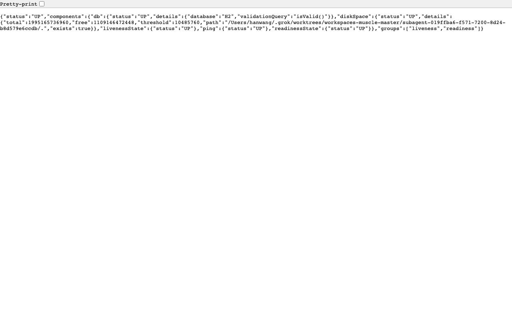
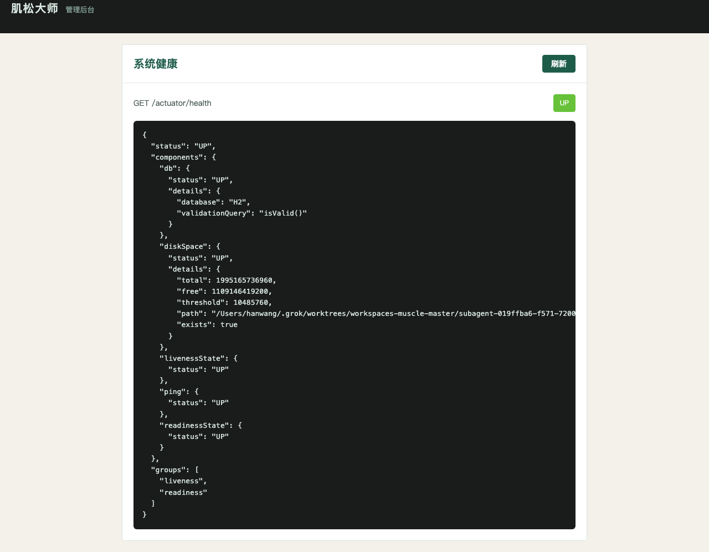

# PR1 测试用例 — chore: bootstrap monorepo, Spring Boot, compose

环境：macOS aarch64，`JAVA_HOME=/opt/homebrew/opt/openjdk@21`（21.0.12），Maven 3.9.16，Node v26.0.0。无 Docker。`dev` profile 用 H2，不连 MySQL/Redis。本机 Surge 会劫持 127.0.0.1，HTTP 探活使用 `curl --noproxy '*'`。

## TC-1-01 server context loads

- **步骤**
  1. `export JAVA_HOME=/opt/homebrew/opt/openjdk@21; export PATH="$JAVA_HOME/bin:$PATH"`
  2. `mvn -f server/pom.xml -q test`
- **预期**：`MuscleMasterApplicationTests.contextLoadsOnDevProfile` 通过；`dev` profile 启动，`app.jobs.enabled=false`，默认时区 `Asia/Shanghai`。
- **实际结果**：PASS。Surefire：`Tests run: 2, Failures: 0, Errors: 0, Skipped: 0, Time elapsed: 1.542 s`。日志：`The following 1 profile is active: "dev"`，Hikari 连上 `jdbc:h2:mem:muscle_master`。

## TC-1-02 GET /actuator/health returns UP

- **步骤**
  1. `mvn -f server/pom.xml -q -DskipTests package`
  2. `java -jar server/target/muscle-master-server-0.0.1-SNAPSHOT.jar --spring.profiles.active=dev`
  3. `curl --noproxy '*' -sS http://127.0.0.1:8080/actuator/health`
  4. Playwright 打开同一 URL 截图。
- **预期**：HTTP 200，JSON `status=UP`，包含 H2 `db`、`ping`、liveness/readiness。
- **实际结果**：PASS。响应：

```json
{"status":"UP","components":{"db":{"status":"UP","details":{"database":"H2","validationQuery":"isValid()"}},"diskSpace":{"status":"UP"},"livenessState":{"status":"UP"},"ping":{"status":"UP"},"readinessState":{"status":"UP"}},"groups":["liveness","readiness"]}
```

单测 `actuatorHealthIsUp` 同样通过。截图：



## TC-1-03 admin-web builds

- **步骤**：`cd apps/admin-web && npm ci && npm run build`（本机已 `npm install`，执行 `npm run build`）。
- **预期**：`vue-tsc -b && vite build` 退出码 0，产出 `dist/`。
- **实际结果**：PASS。`vite v8.2.1` 构建成功，`dist/index.html` + CSS/JS 产出。CI 同样跑 `npm ci && npm run build`。

## TC-1-04 admin-web Health page shows UP

- **步骤**
  1. 保持 server `dev` 在 8080。
  2. `cd apps/admin-web && npm run preview -- --host 127.0.0.1 --port 4173`（preview 代理 `/actuator` → 8080）。
  3. 浏览器打开 `http://127.0.0.1:4173/health`。
  4. Playwright 等待 `#health-status` 文本为 `UP` 后截图。
- **预期**：页面标题「系统健康」，绿色标签 `UP`，JSON 与 actuator 一致。
- **实际结果**：PASS。页面显示 `GET /actuator/health` + 绿色 `UP`，payload `database: H2`。截图：



## TC-1-05 mini-customer / mini-staff app.json valid

- **步骤**：`python3` `json.load` 解析 `apps/mini-customer/app.json` 与 `apps/mini-staff/app.json`。
- **预期**：合法 JSON；含 `pages`、玉色导航栏 `#1E5C4A`、`sitemapLocation`。
- **实际结果**：PASS。
  - `mini-customer`：`pages=["pages/index/index"]`，`navigationBarTitleText=肌松大师`，`navigationBarBackgroundColor=#1E5C4A`。
  - `mini-staff`：同上结构，标题「肌松大师 · 员工端」。
  - 两工程均有 `app.js` / `app.wxss` / `project.config.json` / `pages/index`。
