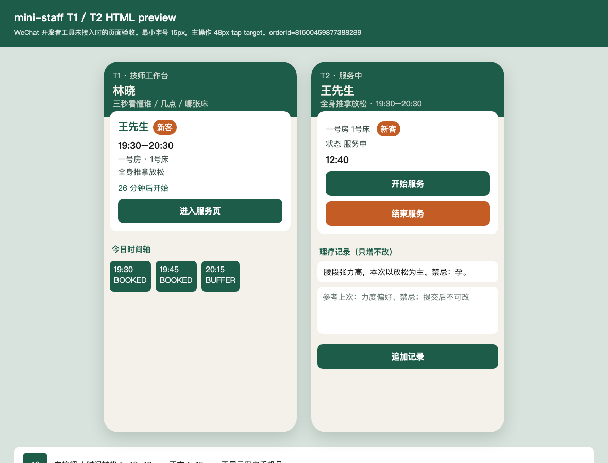
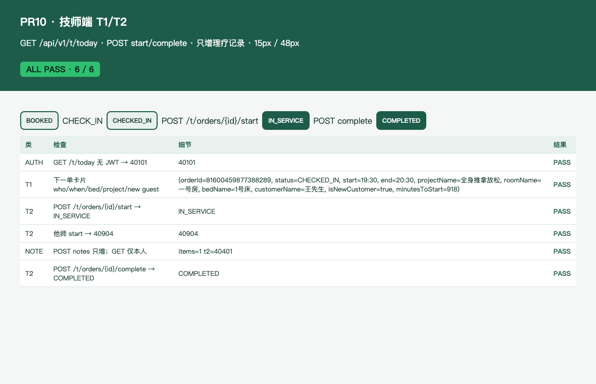

# PR10 测试用例 — feat(mini-staff): today board, start/complete, notes

环境：macOS aarch64，`JAVA_HOME=/opt/homebrew/opt/openjdk@21`（21.0.12），Maven 3.9.16，Node v26.0.0。无 Docker。`dev` profile 用 H2 且 Flyway=false；库存走内存仓。本机 Surge 会劫持 127.0.0.1，HTTP 使用 `curl --noproxy '*'`。无微信开发者工具，员工端页面用 HTML preview + Chrome headless 截图。

## TC-10-01 `GET /api/v1/t/today` 下一单卡片

- **步骤**：C JWT 下林晓 19:30 P60 → `fire(PAY_SUCCESS)` → `fire(CHECK_IN)`；技师林晓 JWT `GET /api/v1/t/today`。
- **预期**：`next` 含 who/when/bed/project/new guest：`customerName=王先生`、`start=19:30` `end=20:30`、`roomName=一号房`、`bedName=1号床`、`projectName=全身推拿放松`、`isNewCustomer=true`、`status=CHECKED_IN`。无手机号。`timeline` 非空。无 JWT `40101`；前台/C JWT `40301`。空档技师 `next=null`。
- **实际结果**：PASS。`StaffApiTest.todayReturnsNextJobCard` / `todayRequiresTherapistJwt` / `emptyTodayHasNullNext`；`StaffWorkbenchReportTest`。

## TC-10-02 `POST /t/orders/{id}/start` / `complete` 只 `fire`

- **步骤**：CHECKED_IN 单，林晓 `POST /api/v1/t/orders/{id}/start` `{requestId}` 再 `complete`。陈默对同一单 start。已 IN_SERVICE / COMPLETED 再打一次。
- **预期**：`fire(START_SERVICE)` → `IN_SERVICE` 且同 TX `INSERT service_record`；`fire(COMPLETE_SERVICE)` → `COMPLETED` 且同 TX 写 `ended_at`。他师 `40904`。同态重放 200。守卫 `actorId=订单技师`（目录技师 ID，不是 staff_user）。
- **实际结果**：PASS。`StaffApiTest.startAndCompleteFireStateMachine` / `otherTherapistCannotStart`。`applySides` 处理 `SERVICE_RECORD` / `ENDED_AT`。

## TC-10-03 `POST /t/orders/{id}/notes` 只增不改；GET 仅 T 本人

- **步骤**：start 后林晓 GET 空记录；无同意 POST；`POST /consent` 后再追加两条。陈默 GET/POST 同一单。前台 GET。
- **预期**：服务技师空记录 `200 {items:[]}`。无 `treatment_consent_at` → `40301`。同意后列表按 id 升序两条；无更新/删除 API。他师 GET `40401`；他师 POST `40401`；前台 GET `40301`。既有种子单 `NOTE_READ` 审计仍过。`GET /t/me/today` 与 `/t/today` 同；`GET /t/orders/{id}` 绑定打开的单而非 `board.next`。
- **实际结果**：PASS。`StaffApiTest.notesAreAppendOnlyAndTherapistOnly` / `orderCardBindsOpenedIdNotBoardNext`；`RbacApiTest.treatmentNoteReadWritesAudit`。

## TC-10-04 mini-staff T1/T2 + 15px / 48px

- **步骤**：`apps/mini-staff` T1 `pages/today` 拉 `/t/today`；T2 `pages/service` 开始/结束/追加记录。无微信开发者工具时打开 [pr-10-t1-t2.html](pr-10-t1-t2.html) 截图。
- **预期**：深玉顶栏；下一单卡片只保留称呼/项目/时段/房间床/新客；主按钮与时间轴格 ≥ 48px；正文 ≥ 15px。
- **实际结果**：PASS。HTML preview。

## TC-10-05 API 报告截图

- **步骤**：`StaffWorkbenchReportTest` 写 [pr-10-staff-board.html](pr-10-staff-board.html)；Chrome headless 截图。
- **预期**：ALL PASS；可见 today 卡片、start/complete、他师 40904、D27 同意、空 notes 200、`/t/me/today` 别名。
- **实际结果**：PASS。

## TC-10-06 既有用例不回归

- **步骤**：`export JAVA_HOME=/opt/homebrew/opt/openjdk@21; export PATH="$JAVA_HOME/bin:$PATH"`；`mvn -f server/pom.xml test`。
- **预期**：Surefire 全绿；`dev` 启动无 MySQL/Redis。
- **实际结果**：PASS。`Tests run: 222, Failures: 0, Errors: 0, Skipped: 0`。
