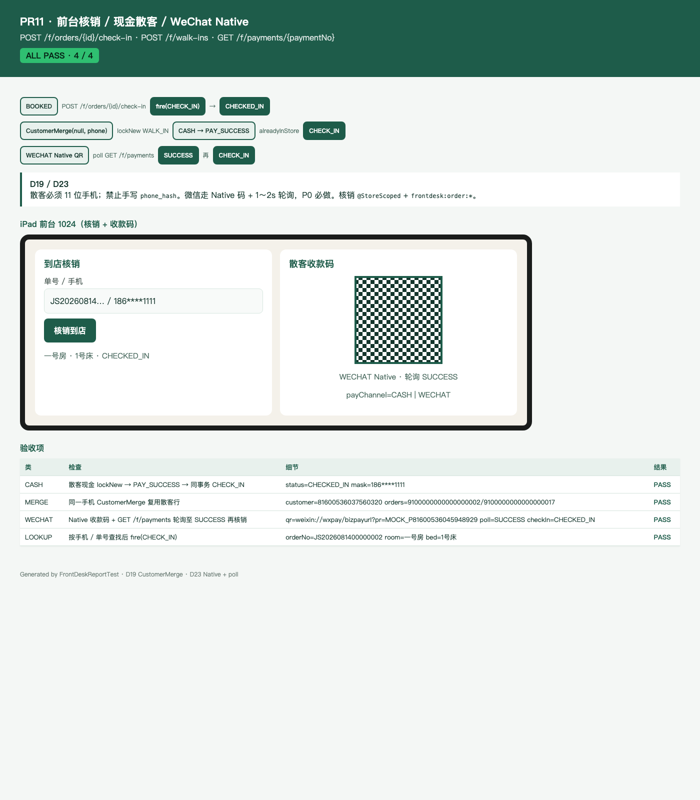
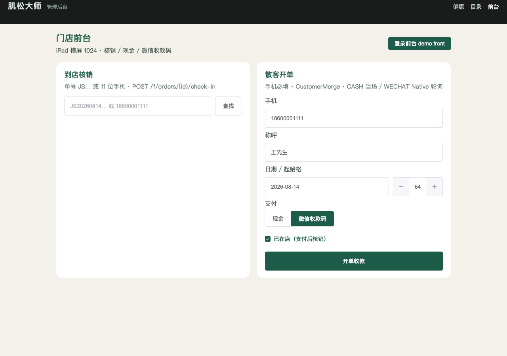

# PR11 测试用例 — feat(frontdesk): check-in, cash and WeChat Native walk-in

环境：macOS aarch64，`JAVA_HOME=/opt/homebrew/opt/openjdk@21`（21.0.12），Maven 3.9.16，Node v26.0.0。无 Docker。`dev` profile 用 H2 且 Flyway=false；库存/支付/客户走内存仓。本机 Surge 会劫持 127.0.0.1，HTTP 使用 `curl --noproxy '*'`。`app.wechat.mock=true`，Native 返回 `weixin://wxpay/bizpayurl?pr=MOCK_{paymentNo}`。

## TC-11-01 `POST /f/orders/{id}/check-in` → `fire(CHECK_IN)`

- **步骤**：C JWT 下单 → `fire(PAY_SUCCESS)` → 前台 JWT `POST /api/v1/f/orders/{id}/check-in` `{requestId, verify=ORDER_NO, keyword=orderNo}`。再打一次。
- **预期**：`{ orderId, status=CHECKED_IN, roomName=一号房, bedName=1号床|2号床, customerMask }`。`@StoreScoped` + `frontdesk:order:*`。重放仍 200 / `CHECKED_IN`。无 JWT → 40101。技师 JWT → 40301。他店 STORE 域 → 40302。
- **实际结果**：PASS。`FrontDeskApiTest.checkInBookedOrder` / `checkInRequiresStaffJwt` / `therapistCannotCheckIn` / `checkInWrongStoreIs40302`。

## TC-11-02 散客现金 `POST /f/walk-ins` + CustomerMerge

- **步骤**：前台 JWT `{ phone, alreadyInStore=true, payChannel=CASH }`；同一 `requestId` 再打；另一 `requestId` 同手机再开一单。
- **预期**：手机必填 11 位；`CustomerMerge(openid=null, phoneHash)` 建/复用 `wx_openid=NULL` 行。现金当场 `PAY_SUCCESS`，`alreadyInStore` 同路径 `CHECK_IN`。响应 `status=CHECKED_IN`、`payChannel=CASH`、`customerMask=186****1111`。幂等 replay=true。第二单复用同一 `customerId`，`BOOKED`。缺手机 / `payChannel=CARD` → 40001。
- **实际结果**：PASS。`FrontDeskApiTest.walkInCashAlreadyInStoreChecksIn` / `walkInReusesCustomerByPhone` / `walkInRejectsMissingPhoneAndBadChannel`；`FrontDeskServiceTest.walkInCashMergesPhoneAndChecksIn`。

## TC-11-03 WeChat Native 收款码 + `GET /f/payments/{paymentNo}` 轮询

- **步骤**：`payChannel=WECHAT` 开单 → 拿 `codeUrl` → `GET /f/payments/{paymentNo}` → mock notify → 再 poll → `POST /f/orders/{id}/check-in` `{verify=PHONE}`。
- **预期**：先 `PENDING_PAY` + 微信返回的 `code_url`（落在支付单上，replay 复用，不从 `paymentNo` 拼）。轮询 PENDING → SUCCESS。订单 BOOKED 后再核销 CHECKED_IN。`alreadyInStore` 现金非当天 → 40904，不吞。
- **实际结果**：PASS。`FrontDeskApiTest.walkInWechatReturnsNativeQrAndPoll`；`FrontDeskServiceTest.walkInWechatNativeThenNotifyThenCheckIn`。

## TC-11-04 按单号 / 手机查找

- **步骤**：现金散客后 `GET /f/orders/lookup?verify=ORDER_NO&keyword=` 与 `verify=PHONE`。
- **预期**：本店且 **当天** `BOOKED`/`CHECKED_IN` 命中；历史日 / 终态不出现。`customerMask` 明文可外呼形态 `186****4444`。
- **实际结果**：PASS。`FrontDeskApiTest.lookupByOrderNoAndPhone`。

## TC-11-05 iPad 前台页 + HTML 报告截图

- **步骤**：`FrontDeskReportTest` 写 [pr-11-frontdesk.html](pr-11-frontdesk.html)；Chrome headless 截图。`apps/admin-web` `/frontdesk` 与 `apps/mini-staff/pages/frontdesk` 横屏 1024、15px / 48px。
- **预期**：ALL PASS 4/4；可见核销、现金、Native 轮询、iPad 双栏。
- **实际结果**：PASS。

## TC-11-06 既有用例不回归

- **步骤**：`export JAVA_HOME=/opt/homebrew/opt/openjdk@21; export PATH="$JAVA_HOME/bin:$PATH"`；`mvn -f server/pom.xml test`。
- **预期**：Surefire 全绿；`dev` 启动无 MySQL/Redis。
- **实际结果**：PASS。`Tests run: 230, Failures: 0, Errors: 0, Skipped: 0`。
