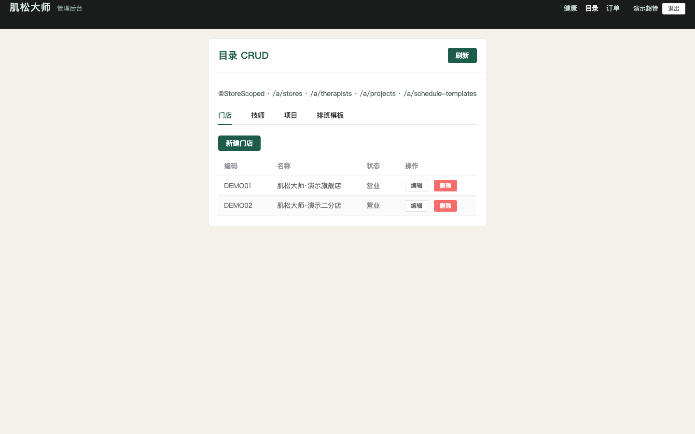
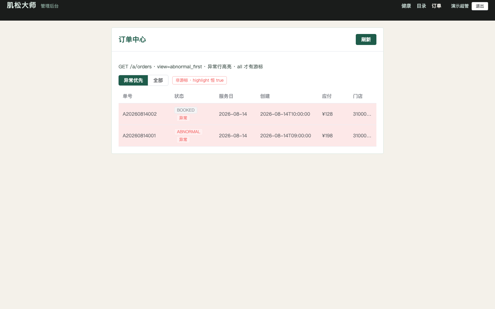
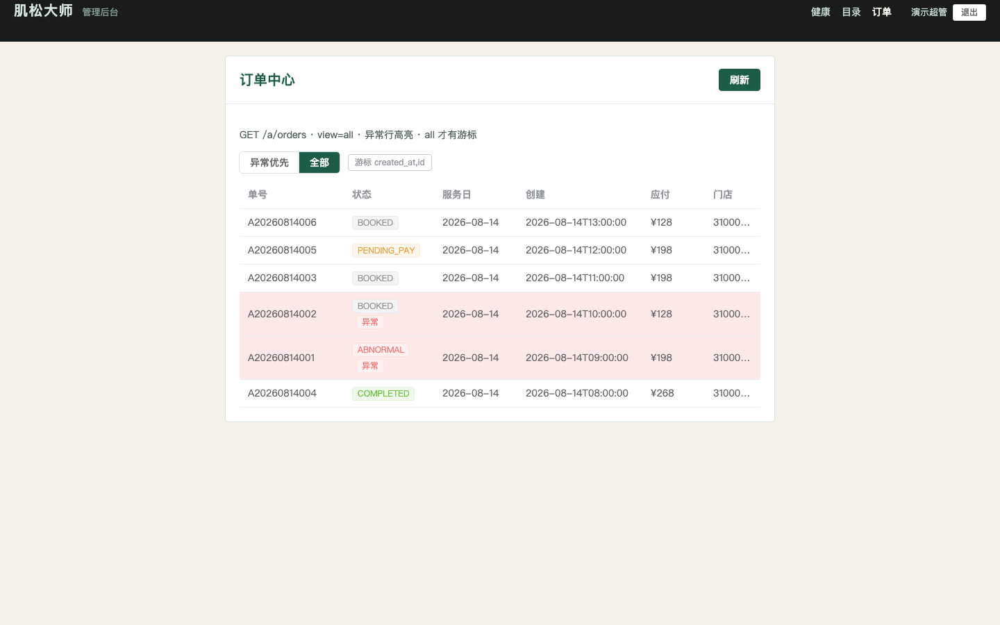

# PR12 测试用例 — feat(admin-web): catalog CRUD and dual-view orders

环境：macOS aarch64，`JAVA_HOME=/opt/homebrew/opt/openjdk@21`（21.0.12），Maven 3.9.16，Node v26.0.0。无 Docker。`dev` profile 用 H2 且 Flyway=false；内存仓 `@Profile("dev")`。本机 Surge 会劫持 127.0.0.1，HTTP 使用 `curl --noproxy '*'`。8080 已被其他 worktree 占用时，本机验收用 `--server.port=18080` + `API_PROXY=http://127.0.0.1:18080` preview `:4174`。

## TC-12-01 目录 CRUD @StoreScoped

- **步骤**
  1. `export JAVA_HOME=/opt/homebrew/opt/openjdk@21; export PATH="$JAVA_HOME/bin:$PATH"`
  2. `mvn -f server/pom.xml -q test`
  3. 超管 JWT（`typ=A` `scope=ALL`）调用 `GET/POST/PUT/DELETE /api/v1/a/stores|therapists|projects|schedule-templates`。
  4. `POST /a/projects` `bufferMinutes=20`。
  5. 店长 JWT（`typ=F`）打 `/a/therapists`；STORE 域超管写 DEMO02 `status`。
- **预期**：写接口均有 `@StoreScoped` + `@RequirePerm`。`buffer_minutes>15` → `40001`。店长 `40301`；越权店 `40302`。
- **实际结果**：PASS。`AdminCatalogApiTest` 5/5。`StoreScopedWriteScanner` 生产 `/a` `/f` 写映射 0 漏注。

## TC-12-02 `view=abnormal_first` 非游标

- **步骤**：超管 `GET /api/v1/a/orders` 与 `?view=abnormal_first`。
- **预期**：默认即 `abnormal_first`。只返回 `status=ABNORMAL` 或 `workflow_instance.status=MANUAL`。`nextCursor=null`。`highlight` 恒 true。`ORDER BY id DESC`，上限 200。
- **实际结果**：PASS。`AdminOrderApiTest.abnormalFirstIsNotCursorAndAlwaysHighlighted`：2 行 `A20260814002`（MANUAL）+ `A20260814001`（ABNORMAL），均 `highlight=true`。

## TC-12-03 `view=all` 游标 `(created_at,id)`

- **步骤**：`GET /api/v1/a/orders?view=all&limit=2`，跟随 `nextCursor` 直到空。再叠加 `status=BOOKED`；STORE 域超管看本店；越权 `storeId=DEMO02`。
- **预期**：稳定游标 `(created_at DESC, id DESC)`，页间无重复。异常行 `highlight=true`，普通行 false。STORE 看不见二分店单；越权 `40302`。
- **实际结果**：PASS。6 单无重复翻完。STORE 域 5 单不含 `ORDER_EAST`。

## TC-12-04 admin-web 目录 CRUD + 双视图订单截图

- **步骤**
  1. `java -jar server/target/muscle-master-server-0.0.1-SNAPSHOT.jar --spring.profiles.active=dev --server.port=18080`
  2. `cd apps/admin-web && npm ci && npm run build && API_PROXY=http://127.0.0.1:18080 npm run preview -- --host 127.0.0.1 --port 4174`
  3. Playwright 打开 `/catalog`，点「超管登录」，等待 `#store-table` 后门店行后截图。
  4. 打开 `/orders`（默认异常优先），截图；点「全部」，截图。
- **预期**：目录页可 CRUD 门店/技师/项目/排班模板。异常优先 2 行全高亮；全部 6 行，异常行红底 +「异常」标签。
- **实际结果**：PASS。

## TC-12-05 既有用例不回归

- **步骤**：同 `mvn -f server/pom.xml test` + `cd apps/admin-web && npm run build`。
- **预期**：Surefire 全绿；`vue-tsc -b && vite build` 退出码 0。
- **实际结果**：PASS。`Tests run: 226, Failures: 0, Errors: 0, Skipped: 0`。admin-web `vite v8.2.1` 构建成功。
