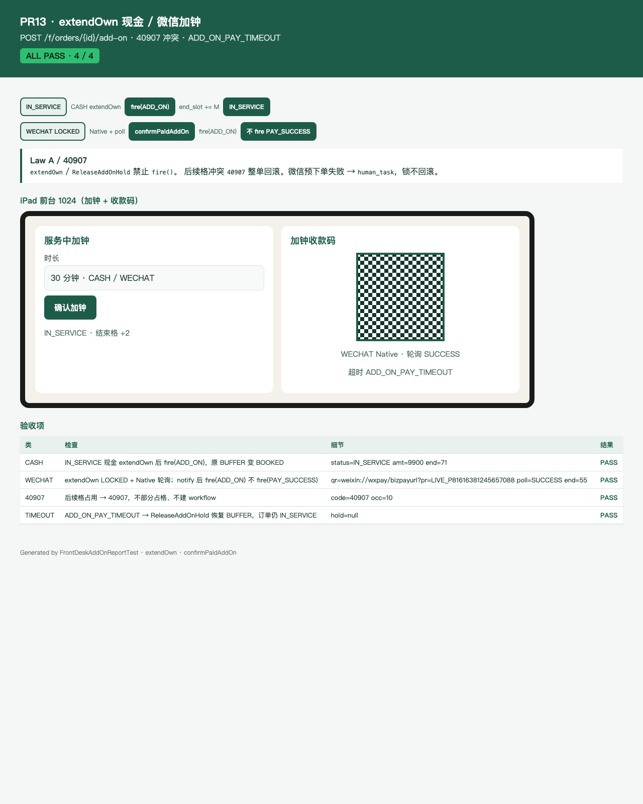

# PR13 测试用例 — feat(inventory,frontdesk): extendOwn cash add-on

环境：macOS aarch64，`JAVA_HOME=/opt/homebrew/opt/openjdk@21`（21.0.12），Maven 3.9.16。无 Docker。`dev` profile 用 H2 且 Flyway=false；库存/支付/客户走内存仓。本机 Surge 会劫持 127.0.0.1，HTTP 使用 `curl --noproxy '*'`。`app.wechat.mock=true`。测试 `RANDOM_PORT`，不绑定 8080。

## TC-13-01 现金 `extendOwn` 吃掉本单 BUFFER + 新尾

- **步骤**：`lockNew` 60 分钟（78–83）→ `confirmPaidSlots` → 状态 `IN_SERVICE`。`extendOwn(orderId, P60, M=2, cash=true)`。
- **预期**：原 BUFFER 格 82 变 `BOOKED`；新尾 83 `BOOKED`、84 `BUFFER`。occupancy 只为新尾 INSERT（+2M）。`end_slot_no` 83→85，`payable_fen`/`paid_fen` 各 +9900（无 `add_on_price_fen` 按比例）。不 `fire()`。
- **实际结果**：PASS。`ExtendOwnServiceTest.cashExtendOwnPromotesBufferAndTail`。

## TC-13-02 微信 `extendOwn` 全部 LOCKED，不改 `end_slot_no`

- **步骤**：同上进入 `IN_SERVICE` 后 `extendOwn(..., cash=false)`。
- **预期**：82–84 技师+床均为 `LOCKED` + `addHold`。`end_slot_no` 仍 83。`add_on_hold_id` 已设。插入 `delayed_job RELEASE_ADDON` `biz_key=hold:{addHold}` `run_at=now+15min`。
- **实际结果**：PASS。`ExtendOwnServiceTest.wechatExtendOwnLocksAndHolds`。

## TC-13-03 后续格冲突 40907，无部分占用

- **步骤**：把下一格（83）标 `BOOKED` 再 `extendOwn` 现金。
- **预期**：`40907 ADD_ON_CONFLICT`。occupancy 数不变；原 82 仍 `BUFFER`；不插 ADD_ON 行；`end_slot_no` 不变。
- **实际结果**：PASS。`ExtendOwnServiceTest.busyNextSlotsIs40907NoPartial`。

## TC-13-04 已有未支付加钟 / 非 IN_SERVICE → 40904

- **步骤**：微信 `extendOwn` 后再加一次；`BOOKED` 单直接加钟。
- **预期**：均为 `40904`。未支付 hold 保留。
- **实际结果**：PASS。`ExtendOwnServiceTest.secondAddOnWhileUnpaidHoldIs40904` / `notInServiceIs40904`。

## TC-13-05 `ADD_ON_PAY_TIMEOUT` → `ReleaseAddOnHold`

- **步骤**：微信 `extendOwn` 后 `fire(ADD_ON_PAY_TIMEOUT)`（Job 上下文）。
- **预期**：尾格 FREE，原 BUFFER 恢复且 `hold_id` 回主锁；`add_on_hold_id=NULL`；未支付 ADD_ON 行删除；订单仍 `IN_SERVICE`。`ReleaseAddOnHold` 不 `fire()`。
- **实际结果**：PASS。`ExtendOwnServiceTest.addOnPayTimeoutRestoresBuffer`。

## TC-13-06 `confirmPaidAddOn` 再 `fire(ADD_ON)`

- **步骤**：微信 `extendOwn` → `confirmPaidAddOn` → `fire(ADD_ON, addOnPaid=true)`。
- **预期**：LOCKED 按新序列升 `BOOKED`/`BUFFER`，`lock_expire_at=NULL`，`end_slot_no=85`，`add_on_hold_id=NULL`，`RELEASE_ADDON` 标 DONE。订单仍 `IN_SERVICE`（不 `PAY_SUCCESS`）。
- **实际结果**：PASS。`ExtendOwnServiceTest.confirmPaidAddOnThenFirePromotesSlots`。

## TC-13-07 `POST /f/orders/{id}/add-on` 现金 + JWT

- **步骤**：前台 JWT 散客现金核销 → `fire(START_SERVICE)` → `POST /api/v1/f/orders/{id}/add-on` `{requestId, projectId, durationMinutes=30, payChannel=CASH}`。技师 JWT；无 JWT。
- **预期**：200，`amountFen=9800`（V3 `add_on_price_fen=4900` × 2），`endSlotNo` +2，`IN_SERVICE`。技师 `40301`。无 JWT `40101`。
- **实际结果**：PASS。`FrontDeskAddOnApiTest.cashAddOnWithFrontJwt` / `addOnRequiresFrontJwt` / `therapistCannotAddOn`。

## TC-13-08 微信加钟 Native + `GET /f/payments` 轮询 + notify

- **步骤**：`payChannel=WECHAT` 加钟 → 拿 `codeUrl` → poll PENDING → mock notify（金额=加钟价）→ 再 poll。
- **预期**：先 `LOCKED` 且 `end_slot_no` 不变。notify 后 `confirmPaidAddOn` + `fire(ADD_ON)`，不 `PAY_SUCCESS`。订单 `IN_SERVICE`，`end_slot_no` +M，`add_on_hold_id` 清空。poll SUCCESS。
- **实际结果**：PASS。`FrontDeskAddOnApiTest.wechatAddOnQrThenNotify`。

## TC-13-09 HTML 报告 + Chrome 截图

- **步骤**：`FrontDeskAddOnReportTest` 写 [pr-13-addon.html](pr-13-addon.html)；Chrome headless 截图。
- **预期**：ALL PASS 4/4；可见现金 / 微信 / 40907 / 超时；iPad 加钟 + 收款码。
- **实际结果**：PASS。

## TC-13-10 既有用例不回归

- **步骤**：`export JAVA_HOME=/opt/homebrew/opt/openjdk@21; export PATH="$JAVA_HOME/bin:$PATH"`；`mvn -f server/pom.xml test`。
- **预期**：Surefire 全绿；`dev` 启动无 MySQL/Redis。
- **实际结果**：PASS。`Tests run: 270, Failures: 0, Errors: 0, Skipped: 0`（含新增 12：ExtendOwn 7 + FrontDeskAddOnApi 4 + Report 1）。
