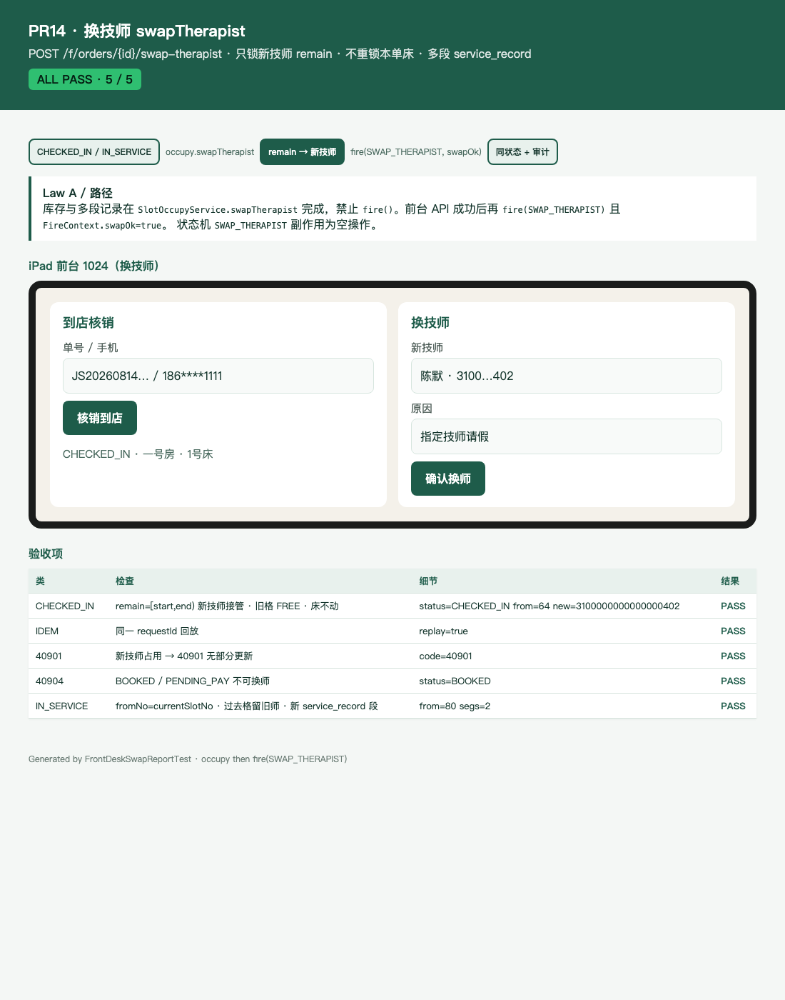

# PR14 测试用例 — feat(inventory,frontdesk): swapTherapist

环境：macOS aarch64，`JAVA_HOME=/opt/homebrew/opt/openjdk@21`（21.0.12），Maven 3.9.16。无 Docker。`dev` profile 用 H2 且 Flyway=false；库存走内存仓。不绑定 8080。

**路径（择一）**：`SlotOccupyService.swapTherapist` 完成库存 + 多段 `service_record` / 系统「中途换师」笔记，**禁止** `fire()`（Law A）。前台 API 成功后再 `fire(SWAP_THERAPIST, FireContext.swapOk=true)` 写状态机审计。`SWAP_THERAPIST` 副作用为空操作。

## TC-14-01 CHECKED_IN 换师

- **步骤**：lockNew → confirmPaid → `CHECKED_IN` → `swapTherapist` 新技师空闲。同一 `requestId` 再打。
- **预期**：`remain=[start,end)`。新技师格状态 = 旧技师对应格（BOOKED/BUFFER）；旧技师 remain FREE；床 occupancy 一行不改；`therapist_id` 更新。幂等 replay=true。
- **实际结果**：PASS。`SwapTherapistServiceTest.checkedInSwapMovesRemainAndLeavesBed`。

## TC-14-02 IN_SERVICE 换师（多段 service_record）

- **步骤**：固定时钟 20:00（slot 80），订单 19:30 起（slot 78）。`IN_SERVICE` 后换师。
- **预期**：`fromNo=currentSlotNo`（夹在 `[start,end)`）。过去格留旧技师；新 `service_record` 段；上一段 `ended_at` 已写。
- **实际结果**：PASS。`SwapTherapistServiceTest.inServiceSwapKeepsPastSlotsAndAddsSegment`。

## TC-14-03 新技师占用 → 40901

- **步骤**：新技师 remain 中一格 BOOKED。
- **预期**：40901；订单 `therapist_id` 不变；无部分更新。
- **实际结果**：PASS。`SwapTherapistServiceTest.busyNewTherapistReturns40901WithoutPartialUpdate`；`FrontDeskSwapApiTest.busyNewTherapistReturns40901`。

## TC-14-04 非法状态 → 40904

- **步骤**：`PENDING_PAY` / `BOOKED` 调换师。
- **预期**：40904。
- **实际结果**：PASS。`SwapTherapistServiceTest.bookedOrPendingPayReturns40904`；`FrontDeskSwapApiTest.pendingPayAndBookedReturn40904`。

## TC-14-05 API 鉴权

- **步骤**：`POST /api/v1/f/orders/{id}/swap-therapist`。
- **预期**：前台 JWT 200；技师 JWT 40301；无 JWT 40101；他店 STORE 域 40302。
- **实际结果**：PASS。`FrontDeskSwapApiTest`。

## TC-14-06 HTML 报告 + 截图

- **步骤**：`FrontDeskSwapReportTest` 写 [pr-14-swap.html](pr-14-swap.html)；Chrome headless 截图。
- **预期**：ALL PASS；可见换师表单与验收表。
- **实际结果**：PASS。



## 命令

```
export JAVA_HOME=/opt/homebrew/opt/openjdk@21
export PATH="$JAVA_HOME/bin:$PATH"
mvn -f server/pom.xml -q -Dtest=SwapTherapist*Test,FrontDeskSwap*Test test
```
