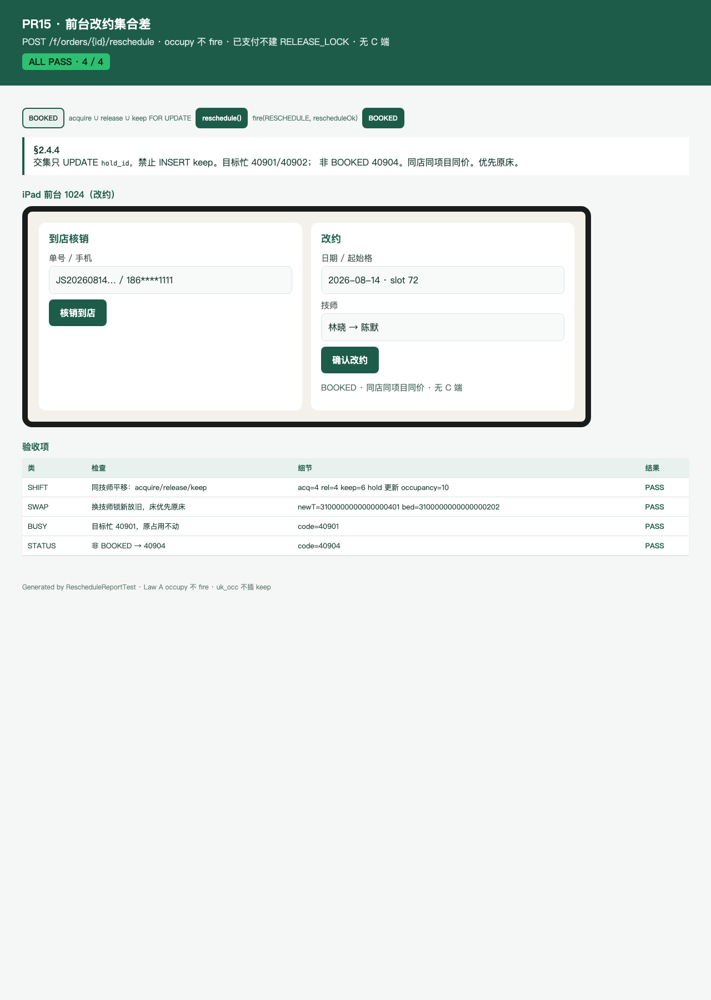

# PR15 测试用例 — feat(inventory,frontdesk): reschedule set-difference

环境：macOS aarch64，`JAVA_HOME=/opt/homebrew/opt/openjdk@21`（21.0.12），Maven 3.9.16。无 Docker。H2 **不能**执行 V1 MySQL DDL，改约走内存 CAS 仓库；`dev` profile Flyway=false。本机 Surge 会劫持 127.0.0.1，HTTP 使用随机端口 TestRestTemplate。P0 **无** C 端改约。`occupy.reschedule` 不 `fire()`；API 成功后再 `fire(RESCHEDULE, rescheduleOk=true)`。已支付单不建 `RELEASE_LOCK`。交集只 UPDATE `hold_id`，禁止 INSERT keep。

## TC-15-01 同技师平移：acquire / release / keep

- **步骤**：P60 lockNew 19:30（slot 78–82）→ `confirmPaid` + `BOOKED`。`reschedule` 到同技师 20:00（80–84）。
- **预期**：acquire=4、release=4、keep=6；occupancy 仍 10 且无重复键；keep/新格 `hold_id` 换成 snowflake；78–79 FREE；80–83 BOOKED、84 BUFFER。`order_change_log(RESCHEDULE)` 一行。同一 `requestId` 回放 `replay=true` 且不二次占用。无新 `RELEASE_LOCK`。
- **实际结果**：PASS。`RescheduleServiceTest.moveStartSameTherapistAcquiresReleasesKeepsHold`。

## TC-15-02 换技师：新技师锁定、旧技师释放、床优先原床

- **步骤**：T1 先占 BED1 19:30；T2 落到 BED2。把 T2 单改到 T1 16:00（64）。
- **预期**：新技师 64–67 BOOKED / 68 BUFFER；旧技师 78–82 FREE 且 occupancy 删除；床仍是 BED2（lockNew 会选 BED1，改约优先原床）。已支付不插 `RELEASE_LOCK`。
- **实际结果**：PASS。`RescheduleServiceTest.changeTherapistFreesOldAndPrefersOriginalBed`；`FrontDeskRescheduleApiTest.rescheduleChangeTherapistPrefersOriginalBed`。

## TC-15-03 目标忙 → 40901，原占用不动

- **步骤**：本单 BOOKED 在 16:00；目标窗技师格标 BOOKED（或已被另一单占用）。
- **预期**：`40901`；原 `hold_id` / occupancy / start 不变。
- **实际结果**：PASS。`RescheduleServiceTest.targetBusyLeavesOriginalOccupancy`；`FrontDeskRescheduleApiTest.targetBusyIs40901AndLeavesOccupancy`。

## TC-15-04 `status!=BOOKED` → 40904

- **步骤**：`PENDING_PAY` 直接改约；支付后核销 `CHECKED_IN` 再改约。
- **预期**：均 `40904`；格与 start 不改。
- **实际结果**：PASS。`RescheduleServiceTest.statusNotBookedIs40904`；`FrontDeskRescheduleApiTest.statusNotBookedIs40904`；`FrontDeskRescheduleServiceTest.pendingPayCannotReschedule`。

## TC-15-05 仅前台 API，无 C 端

- **步骤**：C JWT 下单并 `PAY_SUCCESS`；前台 JWT `POST /api/v1/f/orders/{id}/reschedule`。再打 `POST /c/bookings/{id}/reschedule` 与 `/c/orders/{id}/reschedule`。无 JWT / 技师 JWT。
- **预期**：前台 200、`status=BOOKED`、`@StoreScoped` + `frontdesk:order:*`。C 端无映射（非 2xx，订单不改）。无 JWT → 40101。技师 JWT → 40301。
- **实际结果**：PASS。`FrontDeskRescheduleApiTest.frontDeskRescheduleMovesBookedOrder` / `rescheduleRequiresFrontDeskJwt` / `therapistCannotReschedule` / `noCustomerRescheduleEndpoint`；`FrontDeskRescheduleServiceTest.deskRescheduleFiresBookedToBookedWithoutReleaseLock`。

## TC-15-06 HTML 报告 + 截图

- **步骤**：`RescheduleReportTest` 写 [pr-15-reschedule.html](pr-15-reschedule.html)；Chrome headless 截图 [screenshots/pr-15-reschedule.png](screenshots/pr-15-reschedule.png)。
- **预期**：ALL PASS 4/4；可见集合差、换师原床、40901、40904、iPad 改约表单。
- **实际结果**：PASS。

## TC-15-07 既有用例不回归

- **步骤**：`export JAVA_HOME=/opt/homebrew/opt/openjdk@21; export PATH="$JAVA_HOME/bin:$PATH"`；`mvn -f server/pom.xml -q -Dtest=Reschedule*Test,FrontDeskReschedule* test`。
- **预期**：Surefire 全绿。
- **实际结果**：PASS。`Tests run: 14, Failures: 0, Errors: 0, Skipped: 0`（`RescheduleServiceTest` 4 + `RescheduleReportTest` 1 + `FrontDeskRescheduleServiceTest` 2 + `FrontDeskRescheduleApiTest` 7）。
