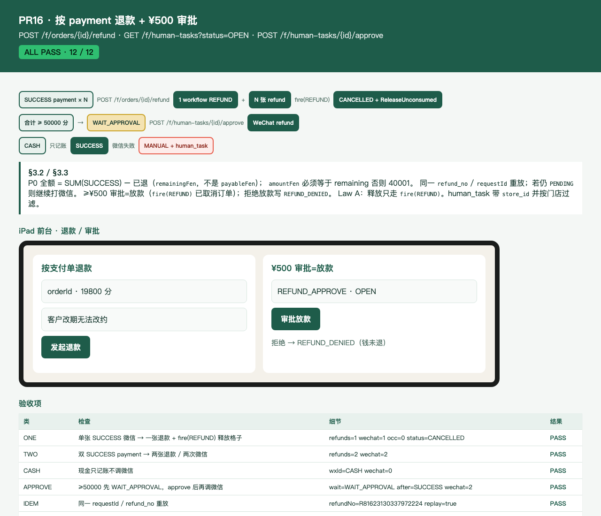

# PR16 测试用例 — feat(payment): refund per payment and ¥500 approve

环境：macOS aarch64，`JAVA_HOME=/opt/homebrew/opt/openjdk@21`（21.0.12），Maven 3.9.16。无 Docker。`dev` profile 用 H2 且 Flyway=false；库存/支付走内存仓。本机 Surge 会劫持 127.0.0.1，HTTP 使用 `curl --noproxy '*'`。`app.wechat.mock=true`。不绑定 8080。

## TC-16-01 单张 SUCCESS 微信 → 一张退款 + `fire(REFUND)` 释放格子

- **步骤**：C JWT 下单 → notify 成功 `BOOKED` → 前台 JWT `POST /api/v1/f/orders/{id}/refund` `{requestId, amountFen=19800, reason}`。
- **预期**：一 `workflow_instance type=REFUND` + 一张 `refund`（`refund_no=R{paymentId}`）`SUCCESS`；mock 微信退款 1 次；订单 `CANCELLED`；`ReleaseUnconsumed(start)` 后 occupancy 空。`@StoreScoped` + `refund:create`。
- **实际结果**：PASS。`RefundTest.singleWechatSuccessRefundsOneRowAndReleasesSlots`；`FrontDeskRefundApiTest.bookedWechatRefundReleasesSlots`。

## TC-16-02 双 SUCCESS payment（主+加钟）→ 两张退款 / 两次微信

- **步骤**：主单支付 SUCCESS 后测试内直接插入第二张 SUCCESS 支付行（模拟加钟，不调 extendOwn）。再退款。
- **预期**：两张 `refund`，两次 WeChat refund。同一 workflow。
- **实际结果**：PASS。`RefundTest.twoSuccessPaymentsCreateTwoWechatRefunds`；`FrontDeskRefundApiTest.twoSuccessPaymentsYieldTwoRefunds`。

## TC-16-03 现金只记账不调微信

- **步骤**：前台现金散客 `BOOKED` 后退款。
- **预期**：`refund.status=SUCCESS`、`wxRefundId=CASH`；mock 微信调用 0 次。
- **实际结果**：PASS。`RefundTest.cashRefundSucceedsWithoutWechat`；`FrontDeskRefundApiTest.cashRefundSkipsWechat`。

## TC-16-04 ≥50000 分先 `WAIT_APPROVAL`，审批后再调微信

- **步骤**：SUCCESS 合计 ≥50000 → `POST /f/orders/{id}/refund` → `GET /f/human-tasks?status=OPEN` → 店长 JWT `POST /f/human-tasks/{id}/approve`。前台 JWT 审批 → 40301。
- **预期**：先 `workflow=WAIT_APPROVAL`、`refund=WAIT_APPROVAL`、无微信调用、`task_type=REFUND_APPROVE`。`fire(REFUND)` 已取消订单（审批=放款，不是决定是否取消）。审批后微信退款成功，任务 DONE。`refund:approve`。他店 STORE 域看不见/不能批（40302）。`POST /f/human-tasks/{id}/deny` → `workflow=MANUAL` + OPEN `REFUND_DENIED`（钱未退）。
- **实际结果**：PASS。`RefundTest.amountAtLeast50000WaitsApproval` / `denyCreatesVisibleManualTask`；`HumanTaskApproveApiTest.amountAtLeast50000WaitsUntilApprove` / `otherStoreCannotListOrApprove` / `denyCreatesVisibleManualTask`。

## TC-16-05 同一 `refund_no` / `requestId` 重放幂等；PENDING 继续打渠道

- **步骤**：同一 `requestId` 退两次；再换 `requestId` 打一次。另：库中已有 `refund=PENDING` + `workflow=RUNNING` 再打同一 `requestId`。审批任务已 DONE 但退款仍 PENDING 时再 `approve`。
- **预期**：成功后的重放 `replay=true`、不重打微信。PENDING 重放 / 审批重放会再调 `settleChannelRefunds`（微信 `refund_no` 幂等）。
- **实际结果**：PASS。`RefundTest.sameRequestIdAndRefundNoReplayIsIdempotent` / `replayResumesPendingRefunds`；`FrontDeskRefundApiTest.sameRequestIdReplayIsIdempotent`；`HumanTaskApproveApiTest.approveReplayResumesPending`。

## TC-16-05b `amountFen` 必须等于 remaining

- **步骤**：待退 19800，请求 `amountFen=1`。
- **预期**：40001，不写 refund。Vue 金额锁定 `remainingFen` = SUM(SUCCESS)−已退（不是 `payableFen`）。查找主+加钟返回 29700。
- **实际结果**：PASS。`RefundTest.amountFenMismatchIs40001` / `remainingFenIsSuccessMinusCoveredRefunds`；`FrontDeskRefundApiTest.amountFenMismatchIs40001` / `lookupRemainingFenIncludesAddonPayment`。

## TC-16-06 `IN_SERVICE` 无 `refund:after_start` → 40904

- **步骤**：`BOOKED` → `CHECK_IN` → `START_SERVICE` 后前台 JWT 退款。
- **预期**：40904；不写 refund、不调微信。
- **实际结果**：PASS。`RefundTest.inServiceWithoutAfterStartIs40904`；`FrontDeskRefundApiTest.inServiceWithoutAfterStartIs40904`。

## TC-16-07 `PENDING_PAY` 禁止走退款 API

- **步骤**：锁单未支付即 `POST /f/orders/{id}/refund`。
- **预期**：40904。取消走 `ReleaseLock`，不走退款。
- **实际结果**：PASS。`RefundTest.pendingPayMustNotUseRefundApi`；`FrontDeskRefundApiTest.pendingPayRefundIs40904`。

## TC-16-08 微信退款失败 → `human_task` + `workflow.MANUAL`

- **步骤**：mock `failRefunds=true` 后退款。
- **预期**：`refund=FAILED`；`workflow=MANUAL`；`human_task(REFUND_FAILED)`。不写补偿 saga。订单已 `CANCELLED`（`fire` 在渠道前）。
- **实际结果**：PASS。`RefundTest.wechatRefundFailWritesManualHumanTask`；`HumanTaskApproveApiTest.wechatFailCreatesManualTask`。

## TC-16-09 HTML 报告 + 截图

- **步骤**：`RefundReportTest` 写 [pr-16-refund.html](pr-16-refund.html)；Chrome headless 截图。
- **预期**：ALL PASS；可见按 payment 退款、¥500 审批=放款、拒绝 `REFUND_DENIED`、`amountFen` 40001、PENDING 续打。
- **实际结果**：PASS。

## TC-16-10 既有用例不回归

- **步骤**：`export JAVA_HOME=/opt/homebrew/opt/openjdk@21; export PATH="$JAVA_HOME/bin:$PATH"`；`mvn -f server/pom.xml -Dtest=Refund*Test,FrontDeskRefund*,HumanTaskApprove* test`。
- **预期**：Surefire 全绿。
- **实际结果**：PASS。
