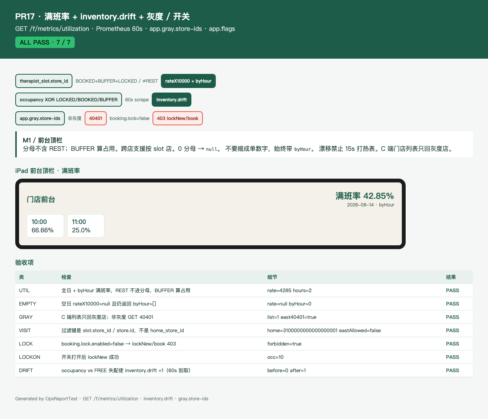

# PR17 测试用例 — feat(ops): utilization, drift gauge, gray store-ids

环境：macOS aarch64，`JAVA_HOME=/opt/homebrew/opt/openjdk@21`（21.0.12），Maven 3.9.16。无 Docker。`dev` profile 用 H2 且 Flyway=false；库存走内存仓。不绑定 8080。

## TC-17-01 满班率全日 + byHour

- **步骤**：种子 FREE / BOOKED / BUFFER / LOCKED / REST；`GET /api/v1/f/metrics/utilization?date=2026-08-14`。
- **预期**：`rateX10000 = occupied*10000/denom`；分母不含 REST；BUFFER 算占用；始终返回 `byHour`（按 hour=`slot_no/4`）。`@StoreScoped` + `order:list`。
- **实际结果**：PASS。`UtilizationServiceTest.mixedStatusesComputeDayAndByHour`；`UtilizationApiTest.fullDayAndByHourForMixedStatuses`。

## TC-17-02 空日 null

- **步骤**：无格子日期 `2020-01-01`。
- **预期**：`rateX10000=null`，`byHour=[]`。
- **实际结果**：PASS。`UtilizationServiceTest.emptyDayIsNullAndByHourEmpty`；`UtilizationApiTest.emptyDayReturnsNullRate`。

## TC-17-03 灰度门店

- **步骤**：C 端 `GET /c/stores`；`GET /c/stores/{DEMO02}`；`GET /c/stores/{DEMO02}/availability`。
- **预期**：列表只含灰度 DEMO01；非灰度 40401。归属店在灰度外、格子在灰度店的技师：该格仍可见。
- **实际结果**：PASS。`GrayApiTest`。

## TC-17-04 `booking.lock.enabled=false` → lockNew / book 403

- **步骤**：关锁后 `lockNew` 与 `POST /c/bookings`。浏览 `GET /c/stores` 仍可用。
- **预期**：40301「锁库存已关闭」/「预约已关闭」。打开后 lockNew 成功。
- **实际结果**：PASS。`OpsFlagTest`。

## TC-17-05 `inventory.drift` 60s gauge

- **步骤**：在 FREE 格上插入 occupancy（或 LOCKED 无 occupancy）。
- **预期**：`inventory.drift` +1。刮取间隔 60s。
- **实际结果**：PASS。`DriftGaugeTest`。

## TC-17-06 HTML 报告 + 截图

- **步骤**：`OpsReportTest` 写 [pr-17-ops.html](pr-17-ops.html)；Chrome headless 截图。
- **预期**：ALL PASS；可见满班率、40401、lock 403、drift。
- **实际结果**：PASS。

## TC-17-07 既有用例不回归

- **步骤**：`export JAVA_HOME=/opt/homebrew/opt/openjdk@21; export PATH="$JAVA_HOME/bin:$PATH"`；`mvn -f server/pom.xml -Dtest=Utilization*,Gray*,Drift*,Ops* test`。
- **预期**：Surefire 全绿。
- **实际结果**：PASS。
