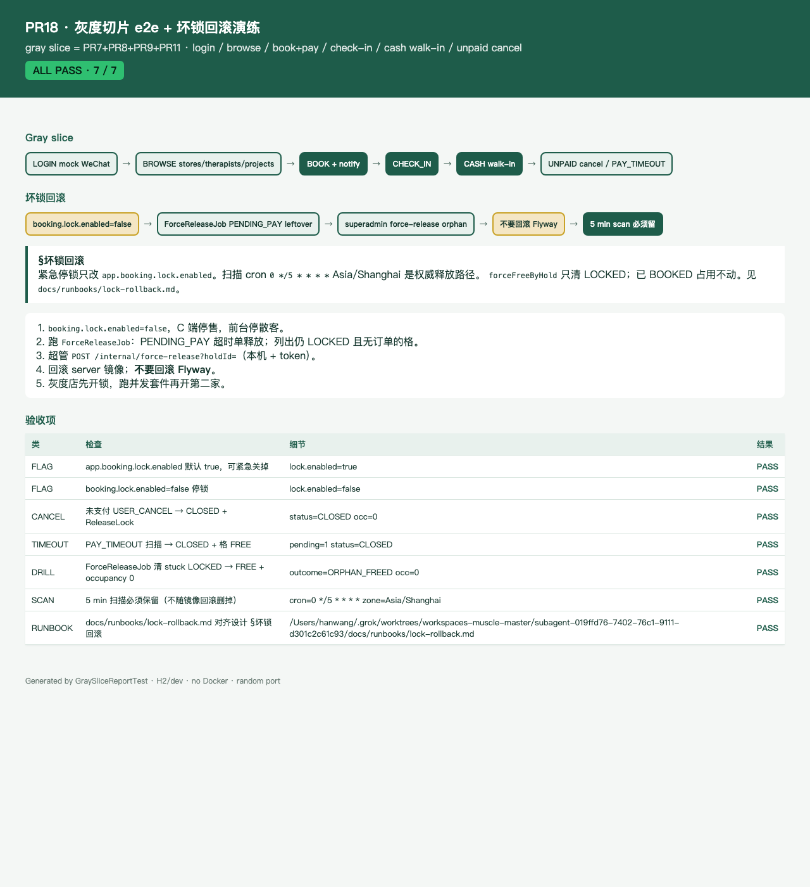

# PR18 测试用例 — test: gray-slice e2e and lock-rollback drill

环境：macOS aarch64，`JAVA_HOME=/opt/homebrew/opt/openjdk@21`，Maven 3.9.x。无 Docker。`dev` profile 用 H2 且 Flyway=false；库存/支付/客户走内存仓。不绑定 8080（`RANDOM_PORT`）。`app.wechat.mock=true`。灰度切片 = PR7+PR8+PR9+PR11（登录、浏览、下单支付、核销、现金散客、未支付取消）。脏流程已存在，本 PR 不重做产品功能。

## TC-18-01 Gray slice e2e：登录 → 浏览 → 下单支付 → 核销 → 现金散客 → 未支付取消 / PAY_TIMEOUT

- **步骤**
  1. `POST /api/v1/c/auth/wechat` `{code: mock:gray-slice-c}` mock 登录。
  2. `GET /api/v1/c/stores` / `therapists` / `projects` 浏览目录。
  3. C JWT `POST /api/v1/c/bookings` → `POST …/pay` → `POST /api/v1/pay/wechat/notify`。
  4. 前台 JWT `POST /api/v1/f/orders/{id}/check-in`。
  5. 前台 JWT `POST /api/v1/f/walk-ins` `{payChannel=CASH, alreadyInStore=true}`。
  6. 再下一单未支付，`POST …/cancel`；再下一单把 `lock_expire_at` 拨到过去，`SlotScanJob` `fire(PAY_TIMEOUT)`。
- **预期**：token 2h；门店/技师/项目对齐 V3 demo；notify 后 `BOOKED`；核销 `CHECKED_IN` + 一号房；现金散客 `CHECKED_IN` / `CASH` / `186****1818`；取消与超时均 `CLOSED`、格 `FREE`、该 hold occupancy 清空。
- **实际结果**：PASS。`GraySliceE2eTest.graySliceLoginBrowseBookPayCheckInWalkInCancelAndTimeout`。

## TC-18-02 坏锁回滚演练：stuck LOCKED → ForceReleaseJob / forceFreeByHold

- **步骤**：`lockNew` 种 PENDING_PAY leftover；另种床-only 孤儿 LOCKED。跑 `ForceReleaseJob` / `forceFreeByHold`。对照已 `confirmPaid` 的 BOOKED 单再 force。
- **预期**：LOCKED leftover / 孤儿 → `ORPHAN_FREED`，格 `FREE`，occupancy 空。已 BOOKED occupancy 不被删（`IDEMPOTENT`）。
- **实际结果**：PASS。`LockRollbackDrillTest.forceReleaseJobFreesPendingPayLeftoverLockedSlots` / `forceFreeByHoldReleasesStuckOrphanAndLeavesPaidBookedAlone`。

## TC-18-03 Runbook 对齐设计 §坏锁回滚

- **步骤**：读 [docs/runbooks/lock-rollback.md](../runbooks/lock-rollback.md)；断言 `app.booking.lock.enabled` 默认 true、可关掉；`JobRunner.scanExpiredLocksEvery5Min` cron 仍在；Flyway 目录只有 `V*__*.sql`（无 undo）。
- **预期**：
  1. `booking.lock.enabled=false`，C 端停售，前台停散客。
  2. `ForceReleaseJob` 清 PENDING_PAY leftover；超管 `POST /internal/force-release` 清孤儿。
  3. **不要回滚 Flyway**。
  4. 5 min 扫描必须保留。
- **实际结果**：PASS。`LockRollbackDrillTest.bookingLockEnabledDefaultsTrueAndCanBeFlipped` / `fiveMinuteScanMustRemainAndFlywayIsAddOnly`。

## TC-18-04 HTML 报告 + Chrome 截图

- **步骤**：`GraySliceReportTest` 写 [pr-18-gray-slice.html](pr-18-gray-slice.html)；Chrome headless 截图。
- **预期**：ALL PASS；可见 gray slice 六步与坏锁回滚五步。
- **实际结果**：PASS。

## TC-18-05 既有用例不回归

- **步骤**：`export JAVA_HOME=/opt/homebrew/opt/openjdk@21; export PATH="$JAVA_HOME/bin:$PATH"`；`mvn -f server/pom.xml -Dtest=GraySlice*,LockRollback*,GrayE2e* test`。
- **预期**：Surefire 全绿；`dev` 启动无 MySQL/Redis；不绑 8080。
- **实际结果**：PASS。`Tests run: 6, Failures: 0, Errors: 0, Skipped: 0`。
