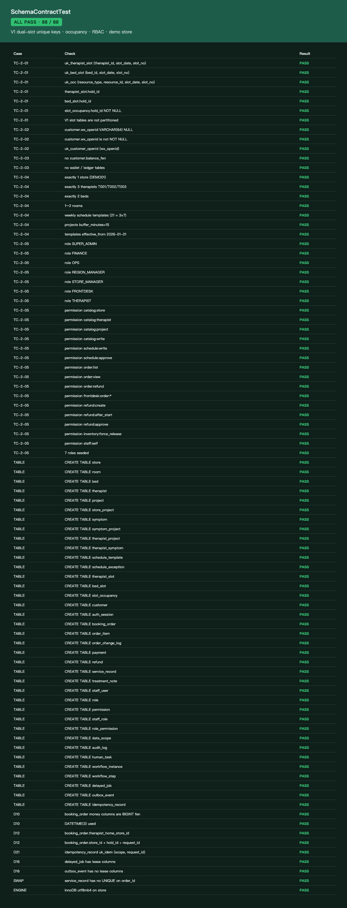
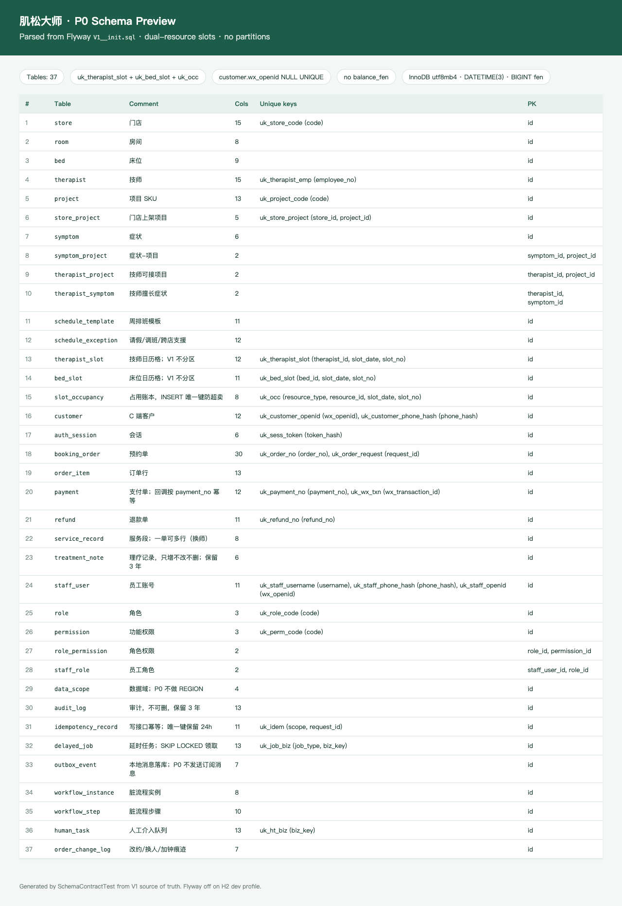

# PR2 测试用例 — feat(db): P0 schema, RBAC seed, schedule template fixtures

环境：macOS aarch64，`JAVA_HOME=/opt/homebrew/opt/openjdk@21`（21.0.12），Maven 3.9.16。无 Docker。`dev` profile 用 H2 且 **Flyway=false**（V1 含 VARBINARY / DATETIME(3) / JSON，不为 H2 削 DDL）。Schema 由 `SchemaContractTest` 对 V1–V3 源文件做契约断言；compose MySQL 用 `scripts/verify-schema.sh`。

## TC-2-01 V1 dual slot unique keys + occupancy unique + hold_id

- **步骤**
  1. 读 `server/src/main/resources/db/migration/V1__init.sql`
  2. `export JAVA_HOME=/opt/homebrew/opt/openjdk@21; export PATH="$JAVA_HOME/bin:$PATH"`
  3. `mvn -f server/pom.xml -q test`
- **预期**
  - `UNIQUE KEY uk_therapist_slot (therapist_id, slot_date, slot_no)`
  - `UNIQUE KEY uk_bed_slot (bed_id, slot_date, slot_no)`
  - `UNIQUE KEY uk_occ (resource_type, resource_id, slot_date, slot_no)`
  - `therapist_slot.hold_id` / `bed_slot.hold_id` / `slot_occupancy.hold_id NOT NULL`
  - 无 `PARTITION BY`（D24）
- **实际结果**：PASS。`SchemaContractTest` 88/88。Surefire：`Tests run: 1, Failures: 0, Errors: 0`（契约）+ `MuscleMasterApplicationTests` `Tests run: 2`。合计 `Tests run: 3, Failures: 0, Errors: 0`。

## TC-2-02 wx_openid nullable unique

- **步骤**：契约测试解析 `CREATE TABLE customer`。
- **预期**：`wx_openid VARCHAR(64) NULL` + `UNIQUE KEY uk_customer_openid (wx_openid)`；不是 `NOT NULL`。MySQL 允许多个 NULL。
- **实际结果**：PASS。

## TC-2-03 no balance_fen

- **步骤**：扫描 V1–V3 列定义；禁止 `CREATE TABLE wallet|ledger|customer_wallet|account_book`。
- **预期**：无 `customer.balance_fen`，无钱包/账本表（D14）。
- **实际结果**：PASS。V1 头注释仅文字提及「No customer.balance_fen」，无列。

## TC-2-04 V3 demo 1 store / 3 therapists / 2 beds / templates

- **步骤**：解析 `V3__demo_store.sql` INSERT 行数。
- **预期**：1 店 `DEMO01`；3 技师 `T001/T002/T003`；2 床（1 房）；21 条周模板（3×7）；项目 `buffer_minutes=15`；`effective_from=2026-01-01`。
- **实际结果**：PASS。旗舰店 + 林晓/陈默/周可 + 1/2 号床 + P60/P45/P90。

## TC-2-05 V2 roles seeded

- **步骤**：解析 `V2__rbac_seed.sql`。
- **预期**：超管/财务/运营/区域经理/店长/前台/技师（`SUPER_ADMIN` `FINANCE` `OPS` `REGION_MANAGER` `STORE_MANAGER` `FRONTDESK` `THERAPIST`）。权限含 `order:view` `order:refund` `schedule:approve` `catalog:write` 及设计最小集（`catalog:*` 拆码、`schedule:write`、`order:list`、`frontdesk:order:*`、`refund:*`、`inventory:force_release`、`staff:self`）。P0 `data_scope` 无 REGION 类型。
- **实际结果**：PASS。7 角色 + 15 权限码 + `role_permission` 映射。

## 附加：schema preview

从 V1 解析出 37 张表与唯一键，写入 `docs/test-cases/schema-preview.html`。

`scripts/verify-schema.sh` 在本机因无 Docker/MySQL 以 exit 2 退出并提示改跑契约测试；有 compose MySQL 时会 `CREATE` + 查 `information_schema`。
