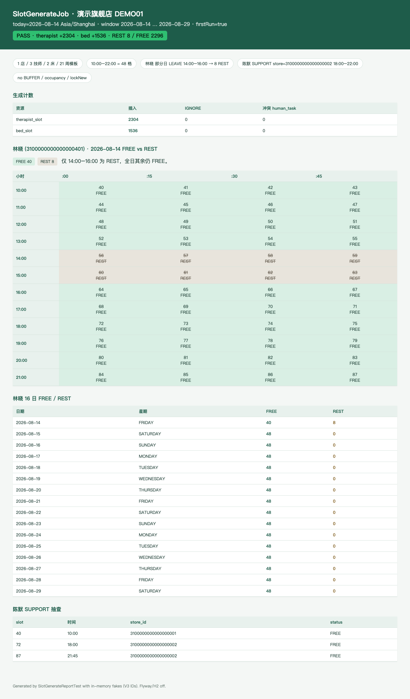
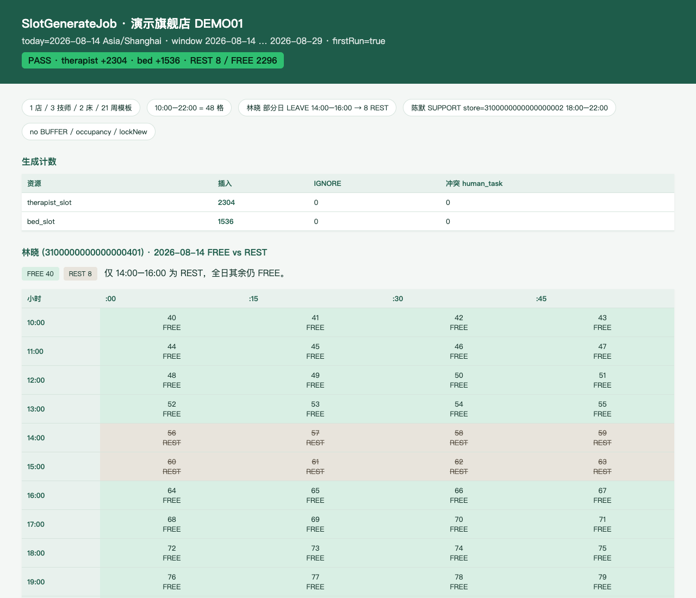

# PR3a 测试用例 — feat(inventory): slot generation and leave/support

环境：macOS aarch64，`JAVA_HOME=/opt/homebrew/opt/openjdk@21`（21.0.12），Maven 3.9.16。无 Docker。H2 **不能**执行 V1 MySQL DDL（VARBINARY / DATETIME(3) / JSON），因此生成逻辑用内存 fake 仓库单测；`dev` 仍 `app.jobs.enabled=false`，JobRunner 不装载。

## TC-3a-01 slot_no 换算 + Asia/Shanghai

- **步骤**：`SlotTimesTest`；`toSlotNo` / `toTime` / 半开区间。
- **预期**：`10:00→40`，`14:00→56`，`19:30→78`，`22:00→88`；`[10:00,22:00)` 48 格；时区 `Asia/Shanghai`。
- **实际结果**：PASS。

## TC-3a-02 部分日 LEAVE 只把对应 slot 标 REST

- **步骤**：模板 10:00–22:00 + APPROVED LEAVE 14:00–16:00。`SlotPlannerTest` + `SlotGenerateServiceTest.partialLeaveWritesRestOnlyOnThoseSlots`。
- **预期**：slot 56–63 REST（8 格），其余 FREE；次日同 slot 仍 FREE；不写 BUFFER / occupancy。
- **实际结果**：PASS。全日 LEAVE（时间为空）则当天全部 planned 格 REST。PENDING 请假不生效。

## TC-3a-03 SUPPORT 用 exception.store_id

- **步骤**：陈默 18:00–22:00 SUPPORT 到店 `3100000000000000002`。
- **预期**：slot 72–87 的 `store_id` = 支援店，不是 `home_store_id`；10:00–18:00 仍归属店。
- **实际结果**：PASS。

## TC-3a-04 store_id 冲突写 human_task，禁止 INSERT IGNORE 静默留旧店

- **步骤**
  1. 同一技师同一 weekday 两套模板不同店重叠 10:00–12:00。
  2. 库中已有格 `store_id` 与 planned 不同。
- **预期**：该格不写 / 不覆盖；`human_task.task_type=GENERATION_STORE_CONFLICT`，`biz_key=gsc:{therapistId}:{date}:{slotNo}`。
- **实际结果**：PASS。8 个重叠格未插入；已有错误店的格保留并建 1 条待办。

## TC-3a-05 首次回补 today..today+15；二次 INSERT IGNORE

- **步骤**：固定 today=`2026-08-14`，V3 1 店 / 3 技师 / 2 床 / 21 周模板。
- **预期**：窗口 16 天；`therapist_slot` 3×16×48=**2304**；`bed_slot` 2×16×48=**1536**；二次 `firstRun=false` 且插入 0。
- **实际结果**：PASS。Job 日志：`therapist +2304/skip 0 bed +1536/skip 0`。

## TC-3a-06 JobRunner 单实例且受 `app.jobs.enabled` 门控

- **步骤**：`JobRunnerContractTest` + `MuscleMasterApplicationTests`（dev）。
- **预期**：`@ConditionalOnProperty(app.jobs.enabled=true)`；cron `0 15 2 * * *` zone `Asia/Shanghai`；只注入 `SlotGenerateJob`；dev 上下文无 `JobRunner` bean。
- **实际结果**：PASS。Surefire：`Tests run: 26, Failures: 0, Errors: 0, Skipped: 0`。

## 附加：生成报告截图

`SlotGenerateReportTest` 用 V3 ID 跑首次生成（林晓部分假 + 陈默支援），写出 [pr-3a-slot-report.html](pr-3a-slot-report.html)。

计数：therapist **+2304** / bed **+1536** / REST **8** / FREE **2296**。林晓 2026-08-14 仅 14:00–16:00 为 REST。

