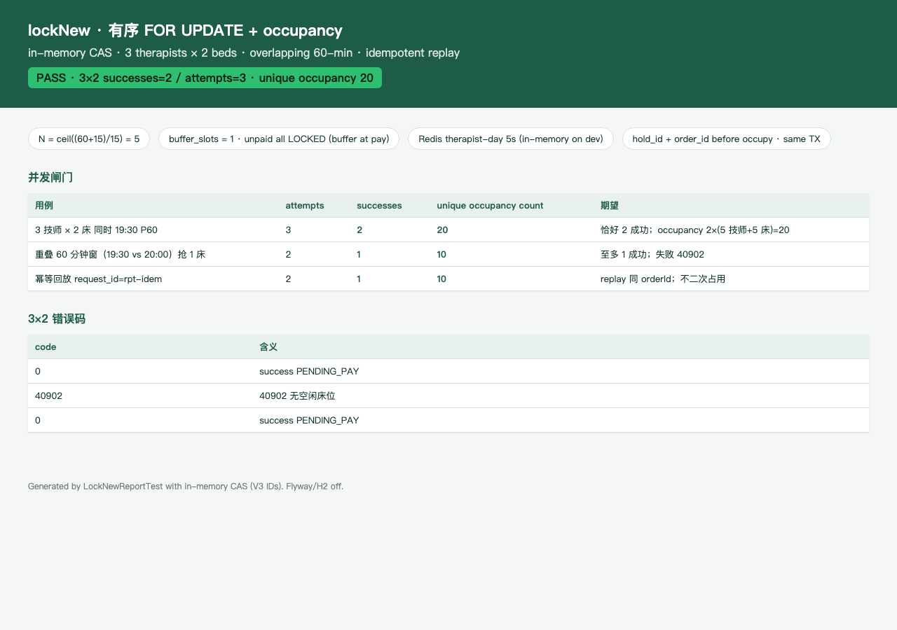

# PR3b 测试用例 — feat(inventory): lockNew with ordered FOR UPDATE

环境：macOS aarch64，`JAVA_HOME=/opt/homebrew/opt/openjdk@21`（21.0.12），Maven 3.9.16。无 Docker。H2 **不能**执行 V1 MySQL DDL（VARBINARY / DATETIME(3) / JSON），因此 lockNew 用内存 CAS 仓库单测；`dev` Redis 自动配置关闭，技师日锁走内存 mutex（`SET NX EX 5` 语义）。

## TC-3b-01 occupySpec + 未支付全 LOCKED

- **步骤**：`OccupySpecTest`；`SlotOccupyServiceTest.lockNewWritesAllLockedAndInsertsOccupancyAndJob`。
- **预期**：`N = ceil((60+15)/15) = 5`，`buffer_slots=1`；slot 78–82 全部 `LOCKED`（末格只在 occupy 窗口上标为 buffer 位，支付后才 BUFFER）；`hold_id`/`order_id` 在占格前分配；同 TX 写 `booking_order` + `order_item` + `delayed_job(RELEASE_LOCK, biz_key=hold:{holdId}, run_at=now+15min)`；occupancy 10 行（技师 5 + 床 5）。
- **实际结果**：PASS。

## TC-3b-02 只锁 FREE，跳过忙床

- **步骤**：床 1 的 78–82 先标 `BOOKED`，再 lockNew 林晓 19:30 P60。
- **预期**：选中床 2；床 1 行不改、无 occupancy；不 `SELECT FOR UPDATE` 钉住忙床。
- **实际结果**：PASS。`skipsBusyBedAndDoesNotLockIt` 且 `slotPinAttempts` 不含忙床格。技师 REST → `40901` 且回滚；两床皆忙 → `40902` 且技师格仍 FREE。`uk_occ` 中途失败会删该床 occupancy 再试下一张床。

## TC-3b-03 3 技师 × 2 床超卖（in-memory CAS）

- **步骤**：3 线程同时 lockNew（林晓/陈默/周可，同一 19:30 P60 窗）。`SlotOccupyConcurrencyTest.threeTherapistsTwoBedsExactlyTwoSucceed`。
- **预期**：恰好 2 成功、1 个 `40902`；unique occupancy = 20；两单床位不同。
- **实际结果**：PASS。错误码 `0 / 40902 / 0`。

## TC-3b-04 重叠 60 分钟窗

- **步骤**：1 张床；技师 A 19:30（slot 78–82）、技师 B 20:00（80–84）并发。
- **预期**：至多 1 成功；失败者 `40902`；禁止 500。
- **实际结果**：PASS。恰好 1 成功，occupancy 10。

## TC-3b-05 幂等 24h 回放 + 禁止覆盖 DONE

- **步骤**：同一 `request_id` 调两次 lockNew；再对 DONE 行 `finishIdempotent`。
- **预期**：第二次 `replay=true` 且同 `orderId`/`holdId`；occupancy 仍 10；`finishIdempotent WHERE status=PROCESSING AND version=?` 影响 0，响应体不改。PROCESSING 未过期 → `40903`。
- **实际结果**：PASS。`SlotOccupyIdempotencyTest` 3/3。

## TC-3b-06 技师日锁 5s + 同技师并发

- **步骤**：`tryAcquire` 失败；3 线程同技师同起点。
- **预期**：拿不到锁立即 `40903`、不占格；同技师恰好 1 成功，其余 `40903/40901`。
- **实际结果**：PASS。`dev` 无 Redis 时用 `InMemoryTherapistDayLock`。

## TC-3b-07 既有用例不回归

- **步骤**：`export JAVA_HOME=/opt/homebrew/opt/openjdk@21; export PATH="$JAVA_HOME/bin:$PATH"`；`mvn -f server/pom.xml test`。
- **预期**：生成 / 登录 / 目录 / schema / JobRunner 仍过；`dev` 上下文无 Redis。
- **实际结果**：PASS。Surefire：`Tests run: 82, Failures: 0, Errors: 0, Skipped: 0`。

## 附加：lock 报告截图

`LockNewReportTest` 写出 [pr-3b-lock-report.html](pr-3b-lock-report.html)。计数：3×2 **attempts=3 / successes=2 / unique occupancy=20**；重叠窗 1/2；幂等回放不二次占用。

