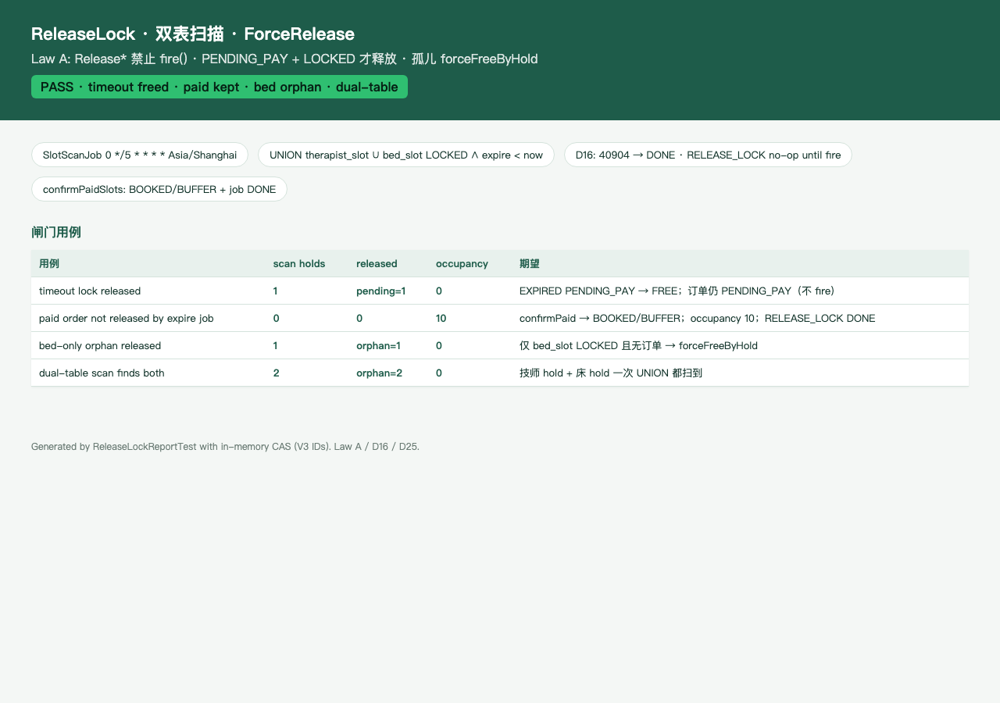

# PR3c 测试用例 — feat(inventory): ReleaseLock, dual-table scan, ForceReleaseJob

环境：macOS aarch64，`JAVA_HOME=/opt/homebrew/opt/openjdk@21`（21.0.12），Maven 3.9.16。无 Docker。H2 **不能**执行 V1 MySQL DDL，因此释放 / 扫描用内存 CAS 仓库单测；`dev` 仍 `app.jobs.enabled=false`，JobRunner 不装载。

## TC-3c-01 timeout lock released

- **步骤**：`lockNew` 林晓 19:30 P60 → 把 `lock_expire_at` 拨到过去 → `SlotScanJob.run()`。
- **预期**：`holds=1` `pendingReleased=1`；技师+床 78–82 全部 `FREE`；occupancy 0；订单仍 `PENDING_PAY`（Law A：`Release*` 禁止 `fire()`）。
- **实际结果**：PASS。`SlotScanJobTest.timeoutPendingPayIsReleasedByScan`；`SlotReleaseServiceTest.releaseLockFreesPendingPayLockedSlotsAndIsIdempotent` 二次调用 `IDEMPOTENT`。

## TC-3c-02 paid order not released by expire job

- **步骤**：`lockNew` 后 `confirmPaidSlots`（78–81 BOOKED、82 BUFFER，`lock_expire_at=NULL`，`RELEASE_LOCK` 标 DONE）。再把 job 拨回 PENDING 到期，`JobRunner.drainDueJobs()`。
- **预期**：扫描找不到 LOCKED；occupancy 仍 10；slot 仍 BOOKED/BUFFER；expire job no-op 后 `DONE`（不是 FAILED）。`BOOKED`/`IN_SERVICE` 的 `ReleaseLock` 直接 `SKIPPED_NOT_PENDING`。`CLOSED`（fire 已写终态）仍释放 LOCKED。
- **实际结果**：PASS。`SlotReleaseServiceTest.confirmPaidThenExpireJobDoesNotRelease` / `releaseLockDoesNotFreePaidOrder` / `releaseLockFreesClosedOrderLockedSlots`；`SlotScanJobTest.paidOrderNotReleasedByExpireScan` / `closedOrderExpiredLockIsReleased`。

## TC-3c-03 bed-only orphan released

- **步骤**：只在 `bed_slot` 种 5 格 `LOCKED` + occupancy，无 `booking_order`。
- **预期**：扫描 1 个 hold；`forceFreeByHold` 删 occupancy 并 FREE；技师格不动。
- **实际结果**：PASS。`SlotScanJobTest.bedOnlyOrphanIsReleased`。

## TC-3c-04 dual-table scan finds both

- **步骤**：技师格 orphan hold A + 床格 orphan hold B，均过期 LOCKED。`UNION therapist_slot ∪ bed_slot`。
- **预期**：一次扫描 `holdIds=[A,B]`，`orphansFreed=2`；两表都回到 FREE。
- **实际结果**：PASS。`SlotScanJobTest.dualTableScanFindsTherapistAndBedHolds`。

## TC-3c-05 JobRunner D16 + Law A

- **步骤**：领取 `PENDING∧run_at<=now` 或 `RUNNING∧lease_until<now`（抢回 `retry_count++`）。`completeJob(40904)`；`RELEASE_LOCK` dispatch 为 no-op。
- **预期**：`40904` / `0` → `DONE`；其它 → `FAILED`；no-op 不释放已支付库存。扫描 cron `0 */5 * * * *` zone `Asia/Shanghai`。
- **实际结果**：PASS。`JobRunnerContractTest` 4/4；`SlotReleaseServiceTest.jobRunnerTreats40904AsDone` / `jobRunnerClaimsPendingOrExpiredLease`。

## TC-3c-06 ForceRelease + 内部端点

- **步骤**：订单标 `BOOKED` 但格仍 LOCKED；`ReleaseLock` 跳过；`ForceReleaseJob` 只清 LOCKED。`POST /internal/force-release?holdId=` 默认关；开启须本机 + `X-Internal-Token`。
- **预期**：内部路径不在 `/api/v1/c|t|f|a`；dev 未开 → 40301；无 LOCKED → 40901；已 BOOKED 的 occupancy 不被 `forceFreeByHold` 删除。
- **实际结果**：PASS。`SlotReleaseServiceTest.forceFreeByHoldReleasesNonPendingLockedOrphan` / `forceFreeByHoldDoesNotDeleteBookedOccupancy`；`InternalForceReleaseControllerTest`；`MuscleMasterApplicationTests.internalForceReleaseIsOffOnDev`。

## TC-3c-07 既有用例不回归

- **步骤**：`export JAVA_HOME=/opt/homebrew/opt/openjdk@21; export PATH="$JAVA_HOME/bin:$PATH"`；`mvn -f server/pom.xml test`。
- **预期**：生成 / lockNew / 登录 / 目录 / schema / RBAC / JobRunner 仍过。
- **实际结果**：PASS。Surefire：`Tests run: 145, Failures: 0, Errors: 0, Skipped: 0`。

## 附加：释放报告截图

`ReleaseLockReportTest` 写出 [pr-3c-release-report.html](pr-3c-release-report.html)。

