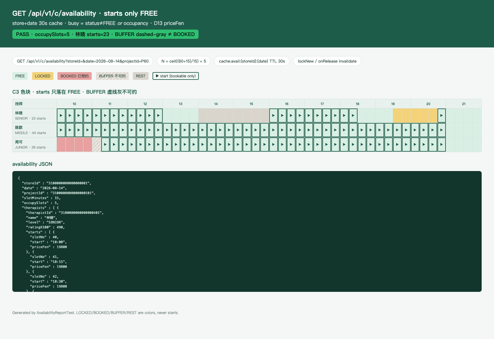

# PR3d 测试用例 — feat(inventory): availability cache and busy-or-occupancy

环境：macOS aarch64，`JAVA_HOME=/opt/homebrew/opt/openjdk@21`（21.0.12），Maven 3.9.16。无 Docker。H2 **不能**执行 V1 MySQL DDL，可约查询用内存仓；`dev` 的 `InMemoryAvailabilityStore` 预置 2026-08-14 日（FREE/LOCKED/BOOKED/BUFFER/REST）。缓存 30s、键 `storeId+date`（内存，invalidate 升 generation 防 in-flight 回写）；`lockNew` / `onRelease` 写成功后失效。

## TC-3d-01 可约起点 = N 连格技师闲 ∧ 某床闲

- **步骤**：P60 `N = ceil((60+15)/15) = 5`。`AvailabilityServiceTest.startsAreOnlyFreeBookableWindows`。林晓 14:00–16:00 REST、19:30–20:45 LOCKED。
- **预期**：`starts` 含 40（10:00）、51、64、73、83（20:45）；不含 52（撞 REST）、74/78（撞 LOCKED）。`occupySlots=5`，`slotMinutes=15`。
- **实际结果**：PASS。

## TC-3d-02 `starts[]` 只含 FREE 可约，不列 LOCKED/BOOKED

- **步骤**：`lockedAndBookedAreNeverStarts` + `GET …&includeBusy=1`。
- **预期**：LOCKED / BOOKED / BUFFER / REST 只出现在 `blocks[]`；`starts` 无 `state`。周可 10:00 BOOKED、11:00 BUFFER（虚线灰不可约，≠ 已预约），最早起点 45。
- **实际结果**：PASS。`lockedAndBookedAreNeverStarts` + `bufferIsDashedGrayNotBookedAndNotAStart`。

## TC-3d-03 busy-or-occupancy：status≠FREE **或** 有 occupancy 即忙

- **步骤**：技师格仍 `FREE`，但 slot 50 写入 occupancy；两床皆忙后再只放开一张床 78–82。
- **预期**：含 50 的窗口不可约；`blocks[50].state=LOCKED`。无空闲床时 `therapists` 空；放开床 2 后仅起点 78。
- **实际结果**：PASS。`occupancyOnFreeStatusIsBusy` / `needsSomeBedWindowIdle`。

## TC-3d-04 30s `store+date` 缓存 + 写失效

- **步骤**
  1. 同一 `store+date` 连打两次（不同 `projectId` 共用快照）。
  2. 改格但不 `invalidate` → 仍返回旧 `starts`。
  3. `lockNew` / `onRelease` 后缓存 miss。
  4. 时钟 +31s 自动过期。
  5. miss 加载中途 `invalidate`：in-flight 结果不得 `put` 回缓存。
- **预期**：TTL 30s；键不含 project/therapist；invalidate 先 bump generation 再 `remove`；`lockNew` / `onRelease` 都失效。
- **实际结果**：PASS。`AvailabilityCacheTest` 4/4（含 `invalidateBumpsGenerationAndDropsInFlightPut`）。

## TC-3d-05 定价 D13

- **步骤**：`Pricing.priceFen(override, storeProject, project)`；可约起点带 slot override。
- **预期**：`coalesce(slot.price_override_fen, store_project.price_fen, project.price_fen)`。P60 默认 19800；slot 40 override 15000 仅该起点变价。
- **实际结果**：PASS。`PricingTest` 2/2 + `AvailabilityServiceTest.d13UsesSlotOverride`。lockNew 已走同一函数。

## TC-3d-06 HTTP `GET /api/v1/c/availability`

- **步骤**：`dev` 上下文；`?storeId=&date=2026-08-14&projectId=&therapistId=`。别名 `GET /c/stores/{storeId}/availability`。缺 `projectId` / 坏 date / 未知店。
- **预期**：无需 JWT。`starts` 仅可约；缺参 40001；未知店 40401。
- **实际结果**：PASS。`AvailabilityApiTest` 4/4。

## TC-3d-07 四态日历截图

- **步骤**：`AvailabilityReportTest` 写 [pr-3d-availability.html](pr-3d-availability.html)；Chrome headless 截图。
- **预期**：林晓 FREE / REST / LOCKED + 20:45 起点；周可 BOOKED + BUFFER 虚线灰；`starts` 只落在 FREE。JSON 含 `priceFen`。
- **实际结果**：PASS。

## TC-3d-08 既有用例不回归

- **步骤**：`export JAVA_HOME=/opt/homebrew/opt/openjdk@21; export PATH="$JAVA_HOME/bin:$PATH"`；`mvn -f server/pom.xml test`。
- **预期**：生成 / lockNew / 登录 / 目录 / RBAC / schema 仍过。
- **实际结果**：PASS。Surefire：`Tests run: 137, Failures: 0, Errors: 0, Skipped: 0`。
