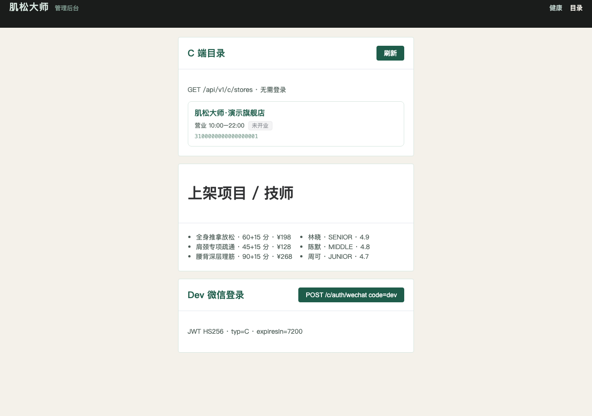
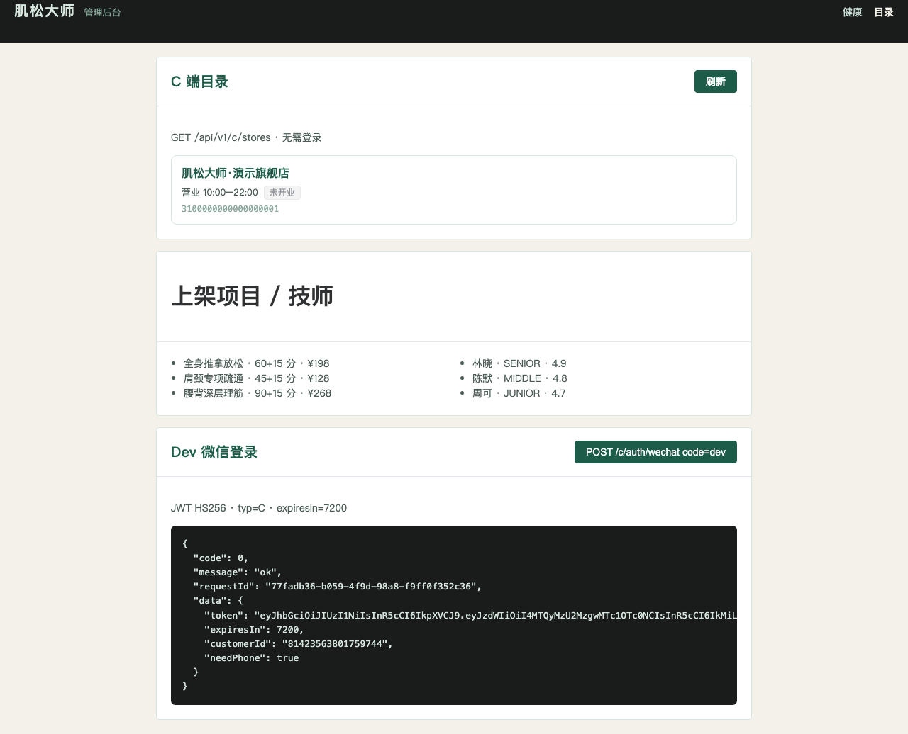

# PR4 测试用例 — feat(auth,catalog): WeChat login and C catalog

环境：macOS aarch64，`JAVA_HOME=/opt/homebrew/opt/openjdk@21`（21.0.12），Maven 3.9.16，Node v26.0.0。无 Docker。`dev` profile 用 H2 且 Flyway=false；内存仓 `@Profile("dev")`，夹具 ID 对齐 V3。默认 profile 走 JDBC（MySQL V1–V3）。本机 Surge 会劫持 127.0.0.1，HTTP 使用 `curl --noproxy '*'`。

技师「当天有班」：已生成 `therapist_slot` 时按 `slot_date=today AND status<>REST`（`store_id` 可选）。库存 PR 未跑时回退周模板（V3 3×7）。不读 SUPPORT / `schedule_exception`。

## TC-4-01 C 端微信登录 `code=dev`

- **步骤**
  1. `export JAVA_HOME=/opt/homebrew/opt/openjdk@21; export PATH="$JAVA_HOME/bin:$PATH"`
  2. `mvn -f server/pom.xml -q test`
  3. `java -jar server/target/muscle-master-server-0.0.1-SNAPSHOT.jar --spring.profiles.active=dev`
  4. `curl --noproxy '*' -sS -H 'Content-Type: application/json' -d '{"code":"dev"}' http://127.0.0.1:8080/api/v1/c/auth/wechat`
- **预期**：`code=0`；`expiresIn=7200`；`needPhone=true`；JWT HS256 claims `sub`/`typ=C`/`cid`。
- **实际结果**：PASS。`AuthApiTest.customerDevLoginIssuesTwoHourJwt`。现场响应：

```json
{"code":0,"message":"ok","data":{"token":"eyJ…","expiresIn":7200,"customerId":"81423563801759744","needPhone":true}}
```

## TC-4-02 bind-phone 走 CustomerMerge（openid 行 + 散客手机行）

- **步骤**：先 `CustomerMerge(null, phoneHash)` 建散客，再 `code=dev` 登录，再 `POST /api/v1/c/auth/bind-phone` `{ "phoneCode":"dev-phone" }`。
- **预期**：存活行是带手机号的 B；新 JWT `sub=B.id`；A 软删；booking/session/service_record 改挂 B。
- **实际结果**：PASS。`AuthApiTest.bindPhoneMergesWalkInAndReturnsSurvivor` 断言登录写入的 `auth_session.subject_id` 改挂 B；`CustomerMergeServiceTest` 含 40908 与 `biz_key` ≤64。

## TC-4-03 员工微信登录 `code=dev-staff`

- **步骤**：`POST /api/v1/staff/auth/wechat` `{"code":"dev-staff"}`。
- **预期**：映射 V3 `demo.admin`（id `3100000000000000301`）；`typ=A`；`expiresIn=28800`；`scopeType=ALL`。
- **实际结果**：PASS。`AuthApiTest.staffDevLoginIssuesEightHourJwt`。

## TC-4-04 C 目录浏览（无需 JWT）

- **步骤**：`GET /api/v1/c/stores`、`/stores/{id}`、`/therapists`、`/projects`、`/symptoms`、`/symptoms/{id}/projects`。LBS：`?lng=121.4737&lat=31.2304`。
- **预期**：旗舰店 V3 ID；3 技师 林晓/陈默/周可；P60/P45/P90 `bufferMinutes=15`；症状含 BODY_PART/DISCOMFORT；无映射返回「面诊后调整」；响应无 `phoneCipher`。
- **实际结果**：PASS。`CatalogApiTest` 7/7。无经纬度时 `open=false`（截图时刻 00:28，营业 10:00–22:00）。

## TC-4-05 admin-web `/catalog` + 登录 token 截图

- **步骤**
  1. 保持 server `dev` 在 8080。
  2. `cd apps/admin-web && npm ci && npm run build && npm run preview -- --host 127.0.0.1 --port 4173`
  3. Playwright 打开 `http://127.0.0.1:4173/catalog`，等待门店卡片后截图。
  4. 点击「POST /c/auth/wechat code=dev」，等待 `#login-token` 后截图。
- **预期**：门店列表 + 项目/技师；token JSON `expiresIn=7200` `needPhone=true`。
- **实际结果**：PASS。





## TC-4-06 既有用例不回归

- **步骤**：同 `mvn -f server/pom.xml test`。
- **预期**：`MuscleMasterApplicationTests` 2、`SchemaContractTest` 1 仍过；`dev` 启动无 MySQL/Redis。
- **实际结果**：PASS。

## 附加：小程序门店页

`apps/mini-customer` 首页改为拉 `GET {apiBase}/api/v1/c/stores`，`apiBase` 默认 `http://127.0.0.1:8080`（`config.js`）。
