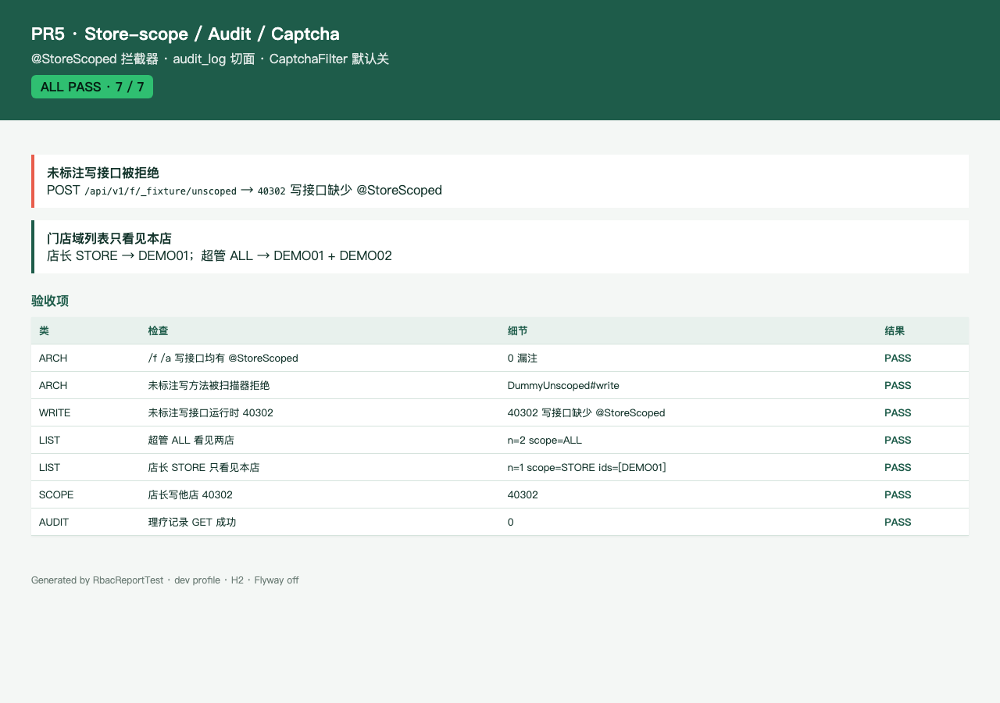

# PR5 测试用例 — feat(rbac): store-scope interceptor, audit, captcha stub

环境：macOS aarch64，`JAVA_HOME=/opt/homebrew/opt/openjdk@21`（21.0.12），Maven 3.9.16，Node v26.0.0。无 Docker。`dev` profile 用 H2 且 Flyway=false；内存仓 `@Profile("dev")`。本机 Surge 会劫持 127.0.0.1，HTTP 使用 `curl --noproxy '*'`。

数据域复用 PR4 员工 JWT：`scope=ALL/STORE/SELF` + `stores[]`，来自 `data_scope`。C 目录仍只有 V3 旗舰店；`/a` `/f` 列表另有 RBAC 夹具店 DEMO02，用于证明「只看见本店」。

## TC-5-01 写接口无 `@StoreScoped` → CI + 运行时拒绝

- **步骤**
  1. `export JAVA_HOME=/opt/homebrew/opt/openjdk@21; export PATH="$JAVA_HOME/bin:$PATH"`
  2. `mvn -f server/pom.xml -q test`
  3. `StoreScopedWriteScanner` 扫描 `/api/v1/f` `/api/v1/a` 的 POST/PUT/PATCH/DELETE。
  4. 店长 JWT `POST /api/v1/f/_fixture/unscoped`（测试夹具，故意不标注）。
- **预期**：生产写映射 0 漏注；扫描器对 `DummyUnscoped#write` 报违规；运行时 `40302`「写接口缺少 @StoreScoped」。
- **实际结果**：PASS。`StoreScopedWriteScannerTest` + `RbacApiTest.productionFaWritesMustBeStoreScoped` + `unscopedWriteIsRejected`。

## TC-5-02 门店域列表只看见本店

- **步骤**：超管 JWT（`typ=A` `scope=ALL`）`GET /api/v1/a/stores`；店长 JWT（`typ=F` `scope=STORE` 仅旗舰店）`GET /api/v1/f/stores`。
- **预期**：超管 2 店 DEMO01+DEMO02；店长 1 店 DEMO01，不含 DEMO02。店长写 DEMO02 `POST /f/desk-notes` → `40302`。
- **实际结果**：PASS。`RbacApiTest.storeScopedListOnlySeesOwnStore` / `outOfScopeWriteIs40302`。

## TC-5-03 审计切面：前台写 + 理疗记录读

- **步骤**：店长 `POST /api/v1/f/desk-notes` `{storeId:旗舰店, content:到店核销}`；技师林晓 `GET /api/v1/t/orders/{noteOrder}/notes`；陈默读同一单。
- **预期**：成功写留下 `audit_log` `actor_type=STAFF` `action=POST`；读笔记 `action=NOTE_READ` `resource_type=TREATMENT_NOTE`；他师 `40302`。
- **实际结果**：PASS。`RbacApiTest.inScopeWriteIsAudited` / `treatmentNoteReadWritesAudit` / `otherTherapistCannotReadNotes`。

## TC-5-04 CaptchaFilter 挂在 `POST /c/bookings`，默认关

- **步骤**：确认 bean 存在；`app.booking.captcha.enabled=false`；无 header 调 `POST /api/v1/c/bookings`。单测再打开开关。
- **预期**：默认不因缺 `X-Captcha-Token` 返回 40001（预订尚未实现，落到 404/500）；`enabled=true` 且无 token → 40001「缺少验证码」。
- **实际结果**：PASS。`CaptchaFilterTest` 5/5；`RbacApiTest.captchaFilterIsRegisteredAndDefaultOff`。过滤器在请求链中（位于 `RequestIdFilter` 之后）。

## TC-5-05 员工 JWT 复用 + 身份闸

- **步骤**：无 JWT `GET /f/stores`；C JWT 打 `/f`；店长打 `/a/stores`；`POST /staff/auth/wechat` `code=dev-staff-manager`。
- **预期**：`40101` / `40301` / `40301`；店长 token `typ=F` `scope=STORE`。
- **实际结果**：PASS。`RbacApiTest.missingJwtIs40101` / `customerJwtCannotHitFrontApi` / `managerCannotCallAdminApi`。Mock code `dev-staff-manager|front|t1` 可登录。

## TC-5-06 HTML 报告截图

- **步骤**：`RbacReportTest` 写 `docs/test-cases/pr-5-rbac-report.html`；Chrome headless 截图。
- **预期**：ALL PASS 7/7；可见「未标注写接口被拒绝」与「店长只看见本店」。
- **实际结果**：PASS。

## TC-5-07 既有用例不回归

- **步骤**：同 `mvn -f server/pom.xml test`。
- **预期**：Surefire 全绿；`dev` 启动无 MySQL/Redis。
- **实际结果**：PASS。`Tests run: 91, Failures: 0, Errors: 0, Skipped: 0`。
