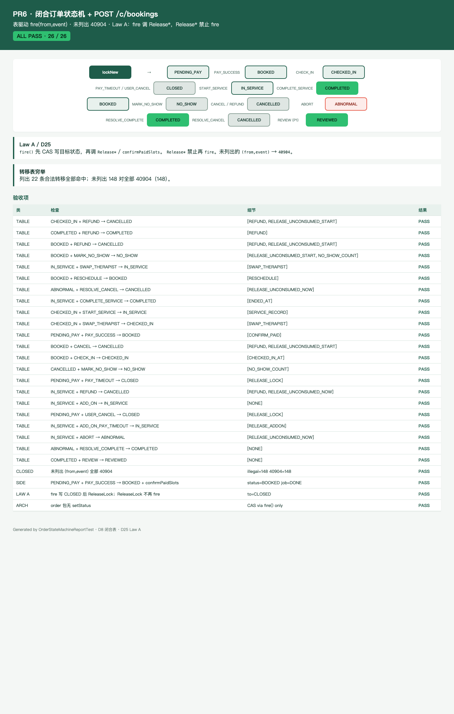

# PR6 测试用例 — feat(order): closed state machine and POST /c/bookings

环境：macOS aarch64，`JAVA_HOME=/opt/homebrew/opt/openjdk@21`（21.0.12），Maven 3.9.16。无 Docker。`dev` profile 用 H2 且 Flyway=false；库存走内存 CAS 仓（`InMemorySlotOccupyStore`），夹具 ID 对齐 V3。本机 Surge 会劫持 127.0.0.1，HTTP 使用 `curl --noproxy '*'`。

## TC-6-01 闭合转移表穷举

- **步骤**：`OrderStateMachineTableTest.listedPairsMatchClosedTable` + `everyUnlistedPairIs40904`。
- **预期**：设计 §3.2 列出的 22 对 `(from,event)` 命中目标态；未列出的全部 `40904`。含：
  - `PENDING_PAY + PAY_SUCCESS → BOOKED`（副作用 `confirmPaidSlots`）
  - `PENDING_PAY + PAY_TIMEOUT / USER_CANCEL → CLOSED`（副作用 `ReleaseLock`）
  - `BOOKED + CHECK_IN → CHECKED_IN`
  - `CHECKED_IN + START_SERVICE → IN_SERVICE`
  - `IN_SERVICE + COMPLETE_SERVICE → COMPLETED`
  - `BOOKED + MARK_NO_SHOW → NO_SHOW`
  - `ABNORMAL + RESOLVE_COMPLETE / RESOLVE_CANCEL`
- **实际结果**：PASS。别名 `START` / `COMPLETE` / `NO_SHOW` 映射到设计事件名。

## TC-6-02 禁止 `setStatus`

- **步骤**：扫描 `com.jisuodashi.order` 源码；状态写入只走 `OrderStateMachine.fire` → `casOrderStatus`。
- **预期**：order 包无 `setStatus(`。初始 `PENDING_PAY` 仅由 `lockNew` INSERT。
- **实际结果**：PASS。`OrderStateMachineTableTest.orderPackageHasNoSetStatus`。

## TC-6-03 Law A：`fire` 调 `Release*`，`Release*` 禁止 `fire`

- **步骤**
  1. `lockNew` 后 `fire(PAY_TIMEOUT)` / `fire(USER_CANCEL)`。
  2. 单独调 `releaseLock`（不经 fire）。
  3. `fire(PAY_SUCCESS)` 后再 `fire(PAY_TIMEOUT)`。
  4. 扫描 `SlotOccupyService` 释放路径源码。
- **预期**：超时/取消先 CAS 成 `CLOSED` 再 `ReleaseLock` 清 LOCKED；单独 `ReleaseLock` 订单仍 `PENDING_PAY`；已支付后再超时 `40904` 且 occupancy 保留；`Release*` / `confirmPaidSlots` 不引用 `OrderStateMachine`、不 `.fire(`。
- **实际结果**：PASS。`OrderStateMachineLawATest` 7/7。`fire` 走 `*InOpenTx`，不再套第二层 `TransactionTemplate`。

## TC-6-03b §3.2 guards + 审计 + ReleaseAddOnHold

- **步骤**：`OrderStateMachineGuardTest`：取消窗口、金额不符、店域、`MARK_NO_SHOW` 过早、他师 START；`ReleaseAddOnHold` 种尾格。
- **预期**：守卫失败 `40904` 且 `audit_log` `ILLEGAL_TRANSITION`；读 `cancel-free-minutes=120`；加钟释放恢复 BUFFER、尾格 FREE、删未支付 ADD_ON 行。
- **实际结果**：PASS。

## TC-6-04 `POST /api/v1/c/bookings` 需 C 端 JWT

- **步骤**
  1. `export JAVA_HOME=/opt/homebrew/opt/openjdk@21; export PATH="$JAVA_HOME/bin:$PATH"`
  2. `mvn -f server/pom.xml -q test`
  3. C JWT `POST /api/v1/c/bookings` `{requestId, storeId, therapistId, projectId, date, startSlotNo}`。
  4. 同一 `requestId` 再发一次。
  5. 无 JWT / 员工 JWT。
- **预期**：201；`status=PENDING_PAY`；`payableFen` 按 D13；`requestId` 幂等回放同 `orderId`。无 JWT `40101`；员工 JWT `40301`。CaptchaFilter 默认关。
- **实际结果**：PASS。`BookingApiTest` 4/4。

## TC-6-05 状态机 HTML 图 / 测试报告截图

- **步骤**：`OrderStateMachineReportTest` 写 `docs/test-cases/pr-6-state-machine.html`；Chrome headless 截图。
- **预期**：图含 lockNew → PENDING_PAY → BOOKED → CHECKED_IN → IN_SERVICE → COMPLETED；CLOSED / NO_SHOW / ABNORMAL 出度可见；ALL PASS。
- **实际结果**：PASS。

## TC-6-06 既有用例不回归

- **步骤**：同 `mvn -f server/pom.xml test`。
- **预期**：Surefire 全绿；`dev` 启动无 MySQL/Redis。
- **实际结果**：PASS。`Tests run: 187, Failures: 0, Errors: 0, Skipped: 0`。
