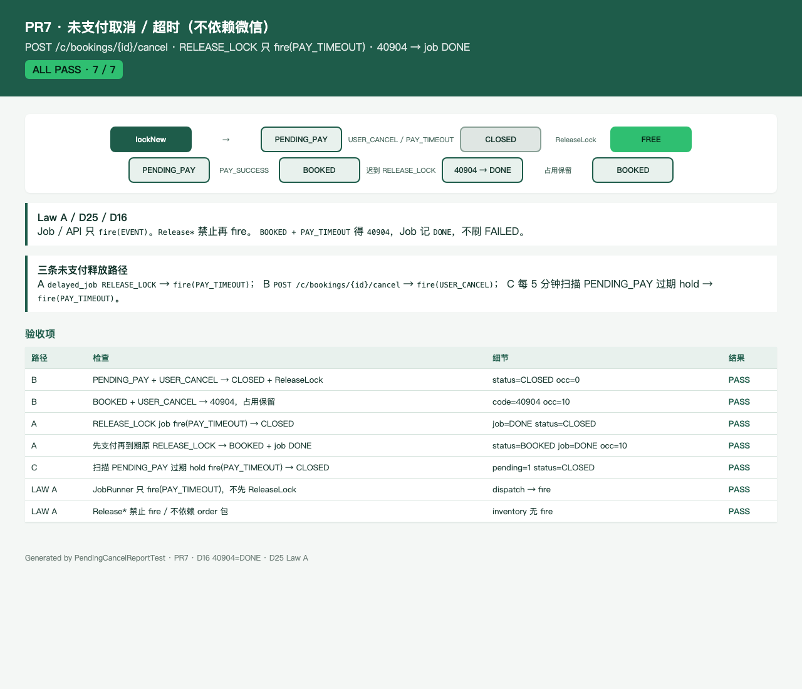

# PR7 测试用例 — feat(order): pending cancel and ReleaseLock on real orders

环境：macOS aarch64，`JAVA_HOME=/opt/homebrew/opt/openjdk@21`（21.0.12），Maven 3.9.16。无 Docker。`dev` profile 用 H2 且 Flyway=false；库存走内存 CAS 仓（`InMemorySlotOccupyStore`），夹具 ID 对齐 V3。本机 Surge 会劫持 127.0.0.1，HTTP 使用 `curl --noproxy '*'`。

Law A（D25）：Job / API **只** `fire(EVENT)`。`Release*` **禁止** `fire`。D16：`40904`（例如 `BOOKED + PAY_TIMEOUT`）记 `DONE`，禁止 FAILED 刷屏。

## TC-7-01 `POST /api/v1/c/bookings/{id}/cancel` 取消 PENDING_PAY 并释放格子

- **步骤**
  1. C JWT `POST /api/v1/c/bookings` 下单，`status=PENDING_PAY`，occupancy=10。
  2. 同一顾客 `POST /api/v1/c/bookings/{id}/cancel` `{requestId, reason}`。
- **预期**：200；`status=CLOSED`；occupancy 0；技师/床格回到 `FREE`。副作用由 `fire(USER_CANCEL)` → `ReleaseLock` 完成。同一 `requestId` 再取消一次仍 200、`CLOSED`。
- **实际结果**：PASS。`BookingApiTest.cancelPendingPayFreesSlots`；`PendingCancelTimeoutTest.cancelPendingPayClosesAndFreesSlots` / `cancelClosedOwnerReplayIs200`。

## TC-7-02 取消 BOOKED 为 40904，占用保留

- **步骤**：下单后 `fire(PAY_SUCCESS)` 成 `BOOKED`，再 `POST …/cancel`。他客 JWT 取消 PENDING_PAY。无 JWT。
- **预期**：`BOOKED + USER_CANCEL` 未列入转移表 → `40904`；occupancy 仍 10、格仍 BOOKED。他客 `40904`。无 JWT `40101`。
- **实际结果**：PASS。`BookingApiTest.cancelBookedIs40904` / `cancelOtherCustomerIs40904` / `cancelMissingJwtIs40101`。

## TC-7-03 `RELEASE_LOCK` job `fire(PAY_TIMEOUT)` 关闭未支付单

- **步骤**：`lockNew` 后把 `delayed_job.run_at` 拨到过去，`JobRunner.drainDueJobs()`。dispatch **只** `fire(PAY_TIMEOUT)`，不先 `ReleaseLock`。
- **预期**：订单 `CLOSED`；格子 FREE；occupancy 0；job `DONE`。扫描过期 PENDING_PAY hold 同样 `fire(PAY_TIMEOUT)` → `CLOSED`。一条 job 抛非 `ApiException` 时标 `FAILED` 并写 `last_error`，同批其它 job 继续。
- **实际结果**：PASS。`PendingCancelTimeoutTest.timeoutJobClosesUnpaidAndReleasesLock` / `scanExpiredPendingPayFiresTimeoutAndCloses` / `drainDueJobsIsolatesFailureAndRecordsLastError`；`SlotScanJobTest.timeoutPendingPayIsReleasedByScan`（status=`CLOSED`）。

## TC-7-04 先支付再跑原 `RELEASE_LOCK` → 仍 BOOKED、job DONE

- **步骤**：`fire(PAY_SUCCESS)`（`confirmPaidSlots` 同 TX 把 job 标 DONE）。再把 job 拨回 PENDING 到期，`drainDueJobs()`。
- **预期**：`BOOKED + PAY_TIMEOUT` → `40904`，Job 按 D16 记 `DONE`（不是 FAILED）；订单仍 `BOOKED`；occupancy 仍 10；78–81 BOOKED、末格 BUFFER。未调用 `ReleaseLock`。
- **实际结果**：PASS。`PendingCancelTimeoutTest.paidThenExpireJobIsDoneOrderStaysBooked`；`SlotReleaseServiceTest.confirmPaidThenExpireJobDoesNotRelease`。

## TC-7-05 HTML 报告 / 截图

- **步骤**：`PendingCancelReportTest` 写 `docs/test-cases/pr-7-cancel-timeout.html`；Chrome headless 截图。
- **预期**：图含三条未支付路径（A job / B cancel / C scan）；ALL PASS。
- **实际结果**：PASS。

## TC-7-06 既有用例不回归

- **步骤**：`export JAVA_HOME=/opt/homebrew/opt/openjdk@21; export PATH="$JAVA_HOME/bin:$PATH"`；`mvn -f server/pom.xml test`。
- **预期**：Surefire 全绿；`dev` 启动无 MySQL/Redis。Law A 源码扫描仍过。
- **实际结果**：PASS。`Tests run: 200, Failures: 0, Errors: 0, Skipped: 0`。
