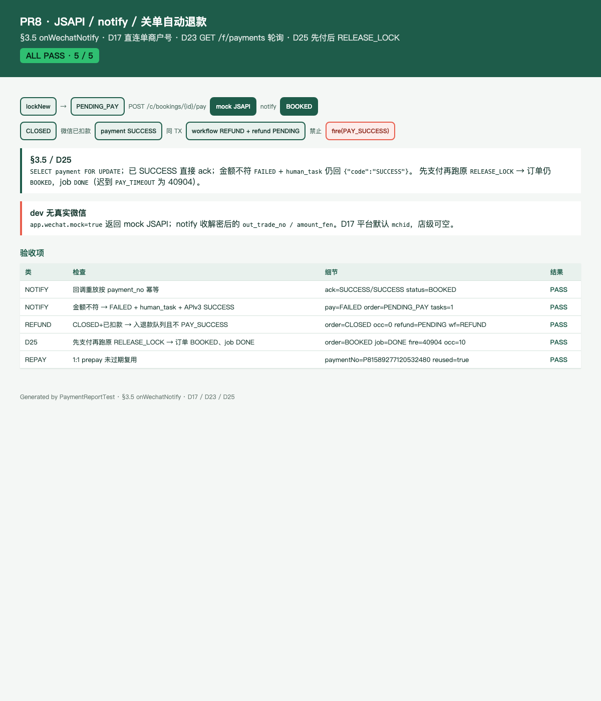

# PR8 测试用例 — feat(payment): JSAPI, notify, closed-order auto-refund

环境：macOS aarch64，`JAVA_HOME=/opt/homebrew/opt/openjdk@21`（21.0.12），Maven 3.9.16。无 Docker。`dev` profile 用 H2 且 Flyway=false；库存/支付走内存仓。本机 Surge 会劫持 127.0.0.1，HTTP 使用 `curl --noproxy '*'`。`app.wechat.mock=true`，无真实微信商户号/证书（D17 直连单商户号，店级 `wx_mchid` 可空）。

## TC-8-01 `POST /c/bookings/{id}/pay` mock JSAPI + 1:1 prepay 复用

- **步骤**：C JWT `POST /api/v1/c/bookings` 后 `POST /api/v1/c/bookings/{id}/pay` `{requestId}` 两次。
- **预期**：返回 `paymentNo`、`amountFen=19800`、`payParams`（`timeStamp/nonceStr/package=prepay_id=mock_prepay_…/signType=RSA/paySign`）。第二次 `reused=true` 且同一 `paymentNo`。非 `PENDING_PAY` → 40904；锁过期 → 40905。无 JWT → 40101。
- **实际结果**：PASS。`PaymentApiTest.payReturnsMockJsapiAndReusesUntilExpire` / `payRequiresCustomerJwt`；`PaymentNotifyTest.repayReusesPendingPrepayUntilExpire` / `repayRejectsExpiredLockAndNonPending`。

## TC-8-02 回调重放按 `payment_no` 幂等

- **步骤**：`repay` 后两次 `POST /api/v1/pay/wechat/notify` `{out_trade_no, amount_fen, transaction_id}`（无 JWT）。
- **预期**：两次 `{ "code": "SUCCESS" }`；订单 `BOOKED`；支付行仍 1 张 `SUCCESS`；无退款。
- **实际结果**：PASS。`PaymentNotifyTest.notifyReplayIsIdempotentOnPaymentNo`；`PaymentApiTest.notifyThenFrontPollAndLateReleaseLock`。

## TC-8-03 金额不符 → FAILED + human_task + APIv3 ack

- **步骤**：notify `amount_fen=1`（订单 19800）两次。
- **预期**：回 `SUCCESS`（禁止微信重试）；`payment.status=FAILED`；`human_task(AMOUNT_MISMATCH, biz_key=amt:{paymentNo})` 一行；订单仍 `PENDING_PAY`。
- **实际结果**：PASS。`PaymentNotifyTest.amountMismatchPersistsFailedAndHumanTaskThenAcks`。未知 `payment_no` → `UNKNOWN_PAYMENT` + ack，重放不刷任务。

## TC-8-04 `CLOSED`+已扣款 → 入退款队列且不 `PAY_SUCCESS`

- **步骤**：`repay` → `fire(USER_CANCEL)` 关单 → notify 金额匹配。
- **预期**：`payment SUCCESS`；同 TX `workflow_instance(REFUND, RUNNING)` + `refund(PENDING)`；订单仍 `CLOSED`；occupancy 空（未 `confirmPaidSlots`）。
- **实际结果**：PASS。`PaymentNotifyTest.closedPlusPaidEnqueuesRefundAndDoesNotFirePaySuccess`。

## TC-8-05 先支付再跑原 `RELEASE_LOCK` → 订单 BOOKED、job DONE

- **步骤**：notify 成功（`PAY_SUCCESS` 同 TX 标 `RELEASE_LOCK` DONE）后再 `JobRunner.dispatch` 原 job。
- **预期**：迟到 `fire(PAY_TIMEOUT)` 从 `BOOKED` 得 40904；Job 按 D16 记 `DONE`；订单仍 `BOOKED`；occupancy 保留。
- **实际结果**：PASS。`PaymentNotifyTest.payThenOriginalReleaseLockKeepsBookedAndJobDone`。

## TC-8-06 `GET /f/payments/{paymentNo}`（D23 轮询）

- **步骤**：店长 JWT 拉支付单。
- **预期**：`{ paymentNo, status=SUCCESS, amountFen, orderId }`。`@StoreScoped` + `frontdesk:order:*`。
- **实际结果**：PASS。`PaymentApiTest.notifyThenFrontPollAndLateReleaseLock`。

## TC-8-07 HTML 报告截图

- **步骤**：`PaymentReportTest` 写 [pr-8-notify-pay.html](pr-8-notify-pay.html)；Chrome headless 截图。
- **预期**：ALL PASS 5/5；可见回调重放、金额不符、关单退款、D25。
- **实际结果**：PASS。

## TC-8-08 既有用例不回归

- **步骤**：`export JAVA_HOME=/opt/homebrew/opt/openjdk@21; export PATH="$JAVA_HOME/bin:$PATH"`；`mvn -f server/pom.xml test`。
- **预期**：Surefire 全绿；`dev` 启动无 MySQL/Redis。
- **实际结果**：PASS。`Tests run: 198, Failures: 0, Errors: 0, Skipped: 0`。
