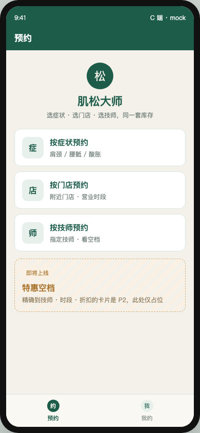
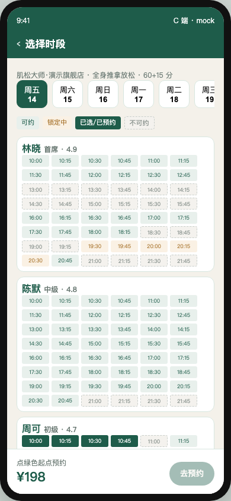
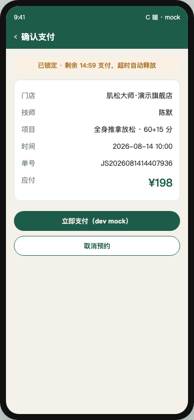
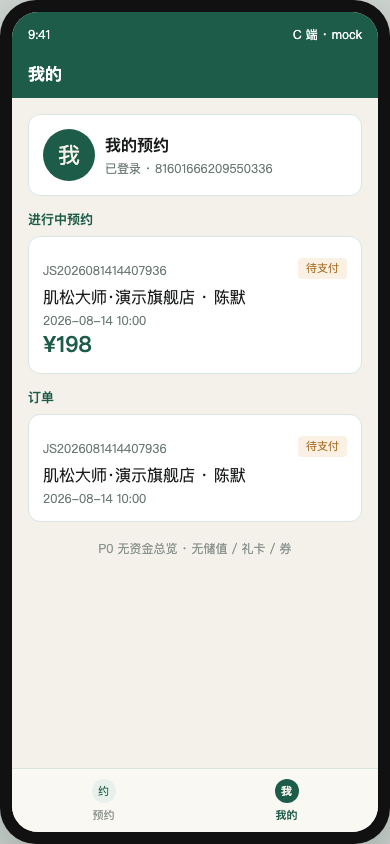

# PR9 测试用例 — feat(mini-customer): C1-C4 and C6 (orders only)

环境：macOS aarch64，`JAVA_HOME=/opt/homebrew/opt/openjdk@21`（21.0.12），Maven 3.9.16，Node v26.0.0。无 Docker。`dev` profile 用 H2 且 Flyway=false；库存/支付走内存仓。本机 Surge 会劫持 127.0.0.1，HTTP 使用 `curl --noproxy '*'`。微信开发者工具未装，截图走 [c-end-preview.html](c-end-preview.html)（打真实 API）。

C6 **无**资金总览 / 储值 / 礼卡 / 券。四态色块对齐 PRD：可约 `#E8F0EC` / 锁定中 `#FAF1E4` / 已选·已预约 `#1E5C4A` / 不可约虚线灰。

## TC-9-01 C1 首页三入口 + 特惠占位

- **步骤**
  1. `apps/mini-customer/app.json` 含 `pages/index`、`symptom`、`stores`、`therapists`、`calendar`、`confirm`、`mine`。
  2. 打开预览 `docs/test-cases/c-end-preview.html`（server `dev` 在 8080）。
- **预期**：三入口「按症状 / 按门店 / 按技师」；特惠卡标注即将上线 / P2 占位；底栏预约 + 我的。玉色导航 `#1E5C4A`。
- **实际结果**：PASS。`python3` `json.load` 7 页。截图：



## TC-9-02 C2 症状路由 + 「面诊后调整」

- **步骤**
  1. `GET /api/v1/c/symptoms`
  2. `GET /api/v1/c/symptoms/{肩颈}/projects`、`…/{其他}/projects`
  3. 预览点「按症状预约」选部位 / 不适。
- **预期**：BODY_PART 肩颈/腰骶、DISCOMFORT 酸胀/其他。肩颈映射 P60/P45；无映射返回 `hint=面诊后调整`。
- **实际结果**：PASS。现场：

```json
{"items":[{"id":"3100000000000000601","type":"BODY_PART","name":"肩颈"},{"id":"3100000000000000602","type":"BODY_PART","name":"腰骶"},{"id":"3100000000000000603","type":"DISCOMFORT","name":"酸胀"},{"id":"3100000000000000699","type":"DISCOMFORT","name":"其他"}]}
```

`GET …/699/projects` → `{"items":[],"hint":"面诊后调整"}`。

## TC-9-03 C3 技师 + slot 日历四色 `GET /c/availability?includeBusy=1`

- **步骤**：门店入口 → 演示旗舰店 → 全身推拿放松 → `date=2026-08-14`。
- **预期**：`starts[]` 仅可约起点可点。林晓 REST 虚线灰、LOCKED 琥珀；周可 10:00 BOOKED 玉色、BUFFER 虚线灰；陈默全日可约。图例四态。
- **实际结果**：PASS。截图：



## TC-9-04 C4 确认 + 15 分钟倒计时 + dev mock 支付

- **步骤**
  1. C JWT `POST /api/v1/c/auth/wechat` `{"code":"dev"}`。
  2. 选陈默 10:00 → 确认下单 `POST /api/v1/c/bookings`。
  3. `POST /c/bookings/{id}/pay` 后 `POST /pay/wechat/notify`（dev mock，无真实 JSAPI）。
  4. `POST /c/bookings/{id}/cancel` 仅 `PENDING_PAY`。
- **预期**：201 `PENDING_PAY`；`lockExpireAt` ≈ now+15min；页面倒计时 `MM:SS`；应付 ¥198。取消 → `CLOSED`。
- **实际结果**：PASS。预览锁定后倒计时 `14:59`，单号 `JS2026081414407936`。截图：



## TC-9-05 C6 我的：进行中预约 + 订单，无资金总览

- **步骤**：`GET /api/v1/c/bookings?cursor=&limit=20`（需 C JWT）。打开预览「我的」。
- **预期**：进行中 = `PENDING_PAY|BOOKED|CHECKED_IN|IN_SERVICE`；订单为全量倒序。页面无储值/礼卡/券入口。无 JWT → 40101。
- **实际结果**：PASS。`BookingApiTest.listReturnsOwnOrdersNewestFirst` / `listRequiresCustomerJwt`。现场列表含刚锁的 `PENDING_PAY` 陈默 10:00。截图底部文案「P0 无资金总览 · 无储值 / 礼卡 / 券」：



## TC-9-06 可点击 HTML 原型

- **步骤**：`python3 -m http.server 8765 --bind 127.0.0.1`（仓库根）；Chrome / Playwright 打开 `http://127.0.0.1:8765/docs/test-cases/c-end-preview.html`。`docs/test-cases/pr-9-screenshot.mjs` 截四屏。
- **预期**：server 起来时走真实 catalog / availability / bookings / pay / cancel / notify。无微信工具亦可验收。
- **实际结果**：PASS。四张 PNG 写入 `docs/test-cases/screenshots/pr-9-c{1,3,4,6}-*.png`。

## TC-9-07 既有用例不回归

- **步骤**：`export JAVA_HOME=/opt/homebrew/opt/openjdk@21; export PATH="$JAVA_HOME/bin:$PATH"`；`mvn -f server/pom.xml test`。
- **预期**：Surefire 全绿；`dev` 启动无 MySQL/Redis。
- **实际结果**：PASS。`Tests run: 217, Failures: 0, Errors: 0, Skipped: 0`（`BookingApiTest` 10/10，含 list 2 条）。
